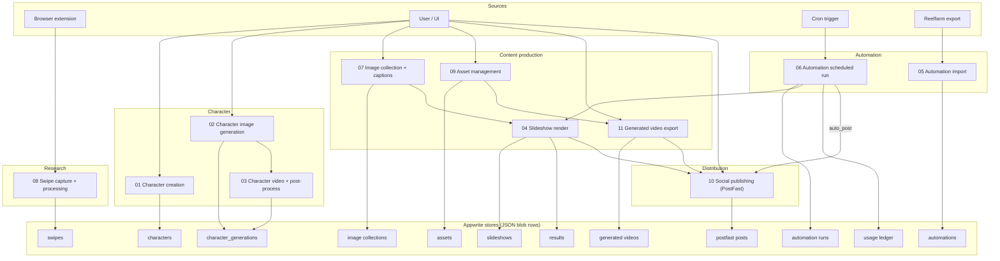

# cfarm — Workflow Overview

System map of the distinct end-to-end workflows and the stores they read/write. Each workflow has its own diagram file in this folder.

```mermaid
flowchart TB
    subgraph Inputs["Sources"]
        EXT["Browser extension"]
        USER["User / UI"]
        CRON["Cron trigger"]
        REEL["Reelfarm export"]
    end

    subgraph Char["Character"]
        W1["01 Character creation"]
        W2["02 Character image generation"]
        W3["03 Character video + post-process"]
    end

    subgraph Content["Content production"]
        W4["04 Slideshow render"]
        W7["07 Image collection + captions"]
        W9["09 Asset management"]
        W11["11 Generated video export"]
    end

    subgraph Auto["Automation"]
        W5["05 Automation import"]
        W6["06 Automation scheduled run"]
    end

    subgraph Research["Research"]
        W8["08 Swipe capture + processing"]
    end

    subgraph Publish["Distribution"]
        W10["10 Social publishing (PostFast)"]
    end

    subgraph Stores["Appwrite stores (JSON blob rows)"]
        S_CH["characters"]
        S_GEN["character_generations"]
        S_SS["slideshows"]
        S_AUTO["automations"]
        S_RUN["automation runs"]
        S_RES["results"]
        S_USE["usage ledger"]
        S_COL["image collections"]
        S_SW["swipes"]
        S_AS["assets"]
        S_GV["generated videos"]
        S_PF["postfast posts"]
    end

    USER --> W1 --> S_CH
    USER --> W2 --> S_GEN
    W2 --> W3 --> S_GEN
    USER --> W7 --> S_COL
    USER --> W9 --> S_AS
    USER --> W11 --> S_GV
    W9 --> W11

    REEL --> W5 --> S_AUTO
    CRON --> W6
    W6 --> S_RUN
    W6 --> W4
    W6 --> S_USE
    W6 -->|auto_post| W10

    W7 --> W4
    W4 --> S_SS
    W4 --> S_RES

    EXT --> W8 --> S_SW

    USER --> W10 --> S_PF
    W11 --> W10
    W4 --> W10
```
