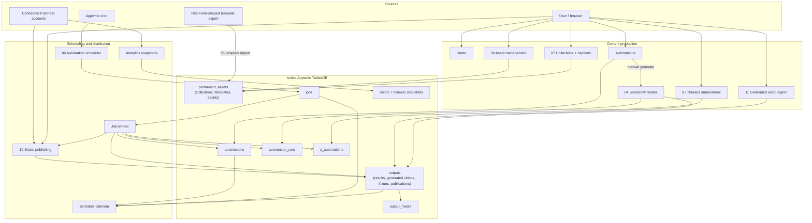

# LumenClip — workflow overview

Current end-to-end workflow map. Data boxes use active physical Appwrite tables,
with logical output categories shown in parentheses. Backend structure and the
full logical-to-physical map live in
[`docs/reference/backend-architecture.md`](../docs/reference/backend-architecture.md).

## Detailed workflows

- [04 — Slideshow render](04-slideshow-render.md)
- [05 — Automation import](05-automation-import.md)
- [06 — Automation scheduled run](06-automation-scheduled-run.md)
- [07 — Image collection and captioning](07-image-collection.md)
- [09 — Asset management](09-asset-management.md)
- [10 — Social publishing](10-social-publishing.md)
- [11 — Generated video export](11-generated-video-export.md)
