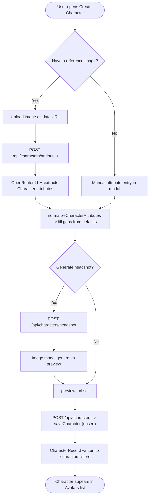

# 01 — Character Creation

Create or import a character: optionally extract attributes from a reference image, generate a headshot preview, then upsert the `CharacterRecord`.

Entry: `components/realfarm/character-create.tsx` → `/api/characters/attributes`, `/api/characters/headshot`, `/api/characters`
Core: `lib/characters.ts` (`saveCharacter`), `lib/character-model.ts` (`normalizeCharacterAttributes`)

