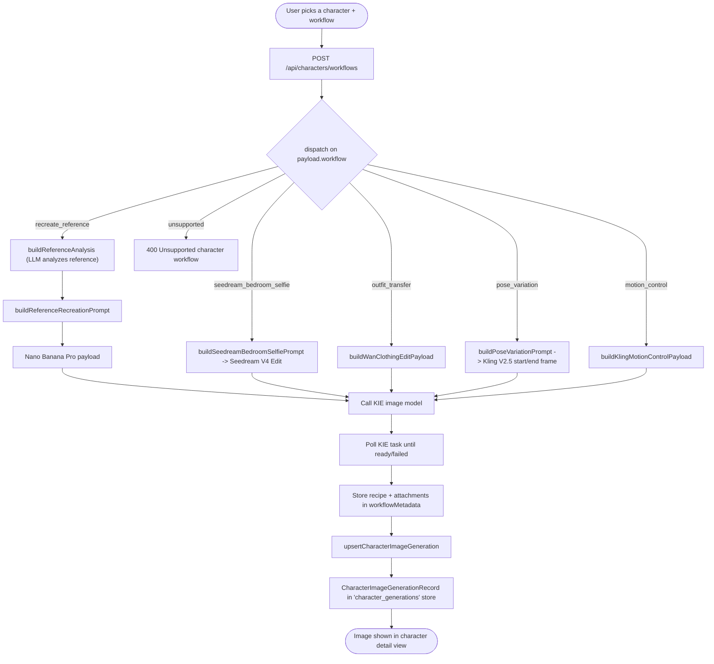

# 02 — Character Image Generation

Generate images for a character through one of several named workflows. A single POST dispatches on `payload.workflow`; each branch builds a provider-specific payload, calls KIE, polls, and upserts a generation record.

Entry: `/api/characters/image`, `/api/characters/workflows`
Core: `lib/character-workflows.ts`, `lib/kie-image.ts`, `lib/character-image-generations.ts`

