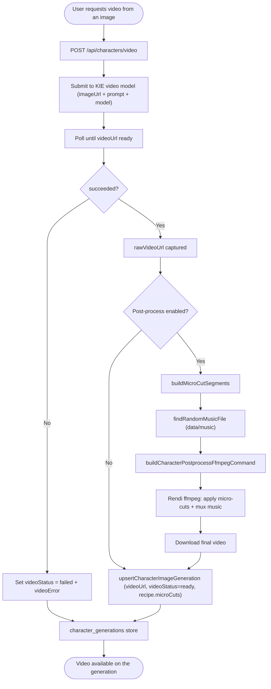

# 03 — Character Video Generation + Post-Processing

Turn a generated character image into a video via KIE, then post-process it with micro-cuts and background music through Rendi ffmpeg. Video state is stored on the same generation record as the image.

Entry: `/api/characters/video`
Core: `lib/kie-video.ts`, `lib/character-video-postprocess.ts`, `lib/rendi-ffmpeg.ts`, `lib/character-image-generations.ts`

