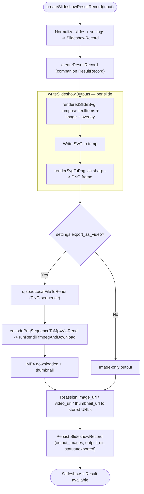

# 04 — Slideshow Render

Turn a slideshow spec (slides + settings) into rendered PNG frames and, optionally, an MP4. Creates a `SlideshowRecord` and a companion `ResultRecord`. Invoked directly via `/api/slideshows` and internally by the automation run (workflow 06).

Entry: `/api/slideshows` → `createSlideshowResultRecord`
Core: `lib/slideshows.ts` (`writeSlideshowOutputs`), `lib/slideshow-renderer.ts` (`renderedSlideSvg`), `lib/rendi-ffmpeg.ts`

