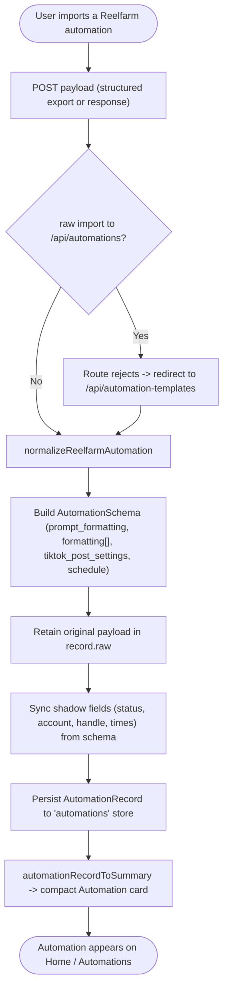

# 05 — Automation Import

Import a Reelfarm automation export (or network response) and normalize it into the local `AutomationRecord` + `AutomationSchema`. Raw automation POSTs to `/api/automations` are rejected and redirected to the templates endpoint.

Entry: `/api/automation-templates`, `/api/automations`
Core: `lib/automations.ts` (`normalizeReelfarmAutomation`), `lib/automation-templates.ts`, `lib/realfarm-automation.ts` (`defaultAutomationSchema`)

