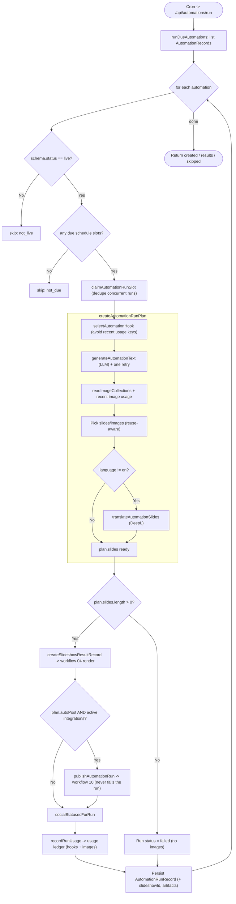

# 06 — Automation Scheduled Run

The core orchestration. A cron trigger evaluates all automations, and for each due, live automation it builds a content plan (hook + text + images + translation), renders a slideshow (workflow 04), optionally auto-publishes (workflow 10), and records usage for reuse-avoidance.

Entry: `/api/automations/run` (GET/POST)
Core: `lib/automation-runner.ts` (`runDueAutomations` → `executeAutomationRun` → `createAutomationRunPlan`)

