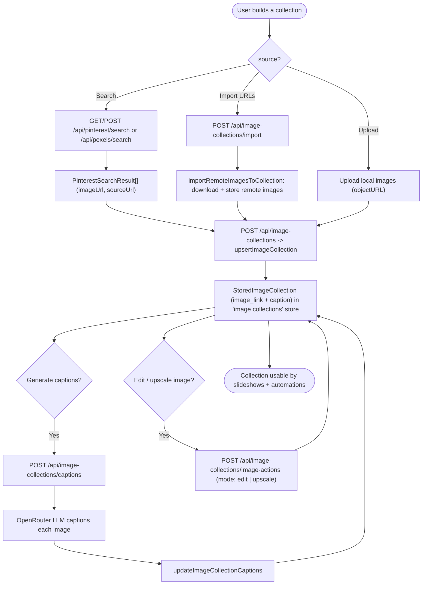

# 07 — Image Collection + Captioning

Build reusable image collections from Pinterest/Pexels search or by importing remote URLs, then generate AI captions. Collections feed the slideshow/automation image pools.

Entry: `/api/pinterest/search`, `/api/pexels/search`, `/api/image-collections`, `/api/image-collections/import`, `/api/image-collections/captions`, `/api/image-collections/image-actions`
Core: `lib/image-collections.ts`, `lib/realfarm-collections.ts`, `lib/pinterest-search.ts`

