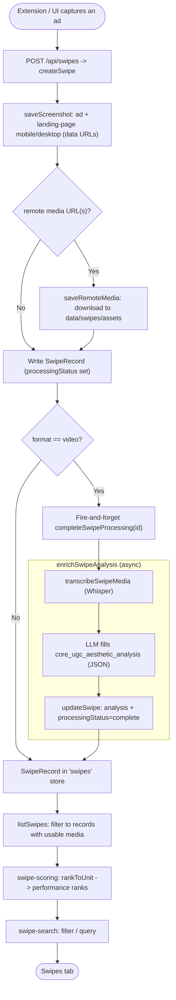

# 08 — Swipe Capture + Processing

Capture competitor ads (usually via the browser extension), persist screenshots + media, then asynchronously enrich video swipes with a Whisper transcript and an LLM aesthetic analysis. Scoring/search derive ranking from the stored record.

Entry: `/api/swipes` (POST), `/api/swipes/assets/[file]`
Core: `lib/swipes.ts` (`createSwipe`, `completeSwipeProcessing`, `enrichSwipeAnalysis`), `lib/swipe-scoring.ts`, `lib/swipe-search.ts`

