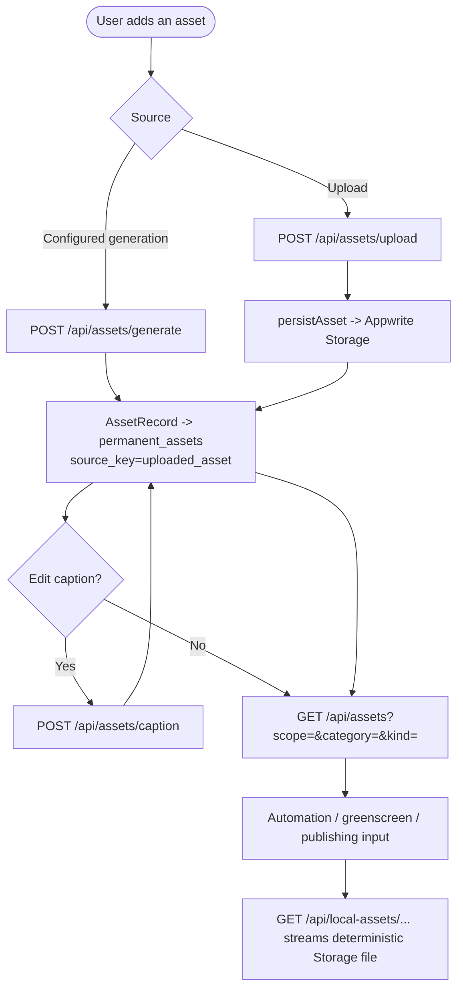

# 09 — Asset management

Create reusable asset records by upload or configured generation, edit captions,
and serve their bytes through the Storage-backed compatibility URL.

Entry: `/api/assets`, `/api/assets/upload`, `/api/assets/generate`,
`/api/assets/caption`, `/api/local-assets/**`

Core: `lib/assets.ts`, `lib/asset-storage.ts`, `lib/appwrite-stores.ts`

The removed character/reference-import workflow is not part of the current
asset API. Legacy `ugc_avatar` and `reference` enum values remain in
`AssetRecord` for compatibility with existing rows.
