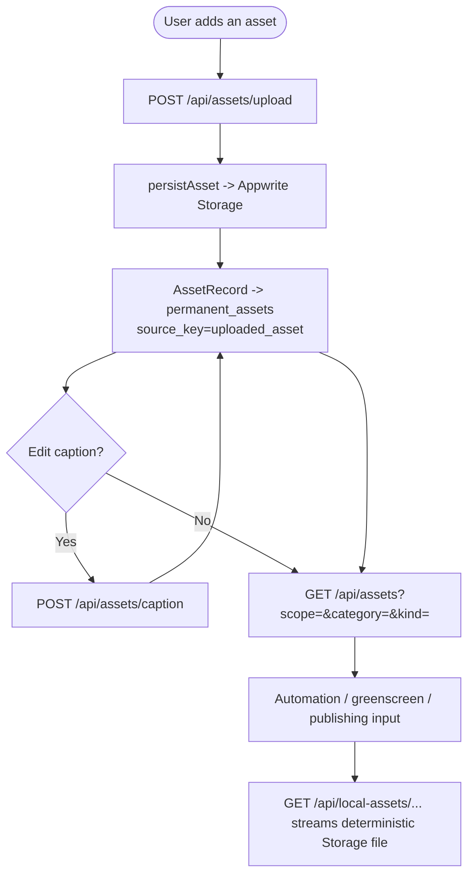

# 09 — Asset management

Create reusable asset records by upload, edit captions, and serve their bytes
through the Storage-backed asset URL.

Entry: `/api/assets`, `/api/assets/upload`, `/api/assets/caption`,
`/api/local-assets/**`

Core: `lib/assets.ts`, `lib/asset-storage.ts`, `lib/appwrite-stores.ts`

The removed placeholder-generation, character, and reference-import workflows
are not part of the current asset API.
