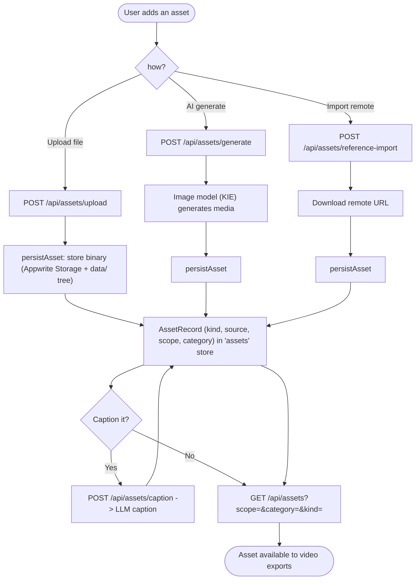

# 09 — Asset Management

Create reusable media assets by upload, AI generation, or remote import, then optionally caption them. Assets are consumed by UGC ad / greenscreen video exports (workflow 11).

Entry: `/api/assets` (GET), `/api/assets/upload`, `/api/assets/generate`, `/api/assets/reference-import`, `/api/assets/caption`
Core: `lib/assets.ts`, `lib/asset-storage.ts`, `lib/kie-image.ts`

