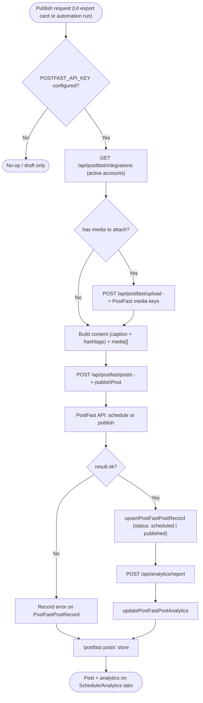

# 10 — Social Publishing (PostFast)

Publish content to social platforms through PostFast: connect integrations, upload media, create scheduled/immediate posts, and sync analytics back. Invoked directly from export cards and automatically by the automation run (workflow 06).

Entry: `/api/postfast/{integrations,connect-url,upload,posts}` and `/api/analytics/report`
Core: `lib/postfast-client.ts`, `lib/postfast-posts.ts`, `lib/publishing.ts`

