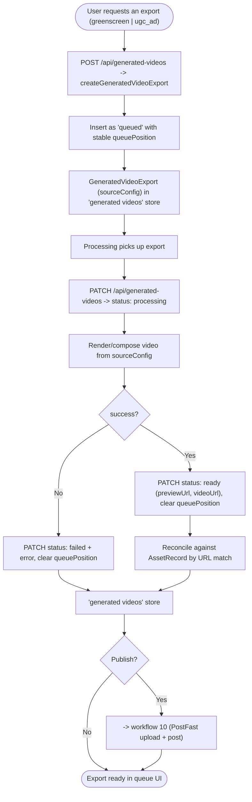

# 11 — Generated Video Export (Greenscreen / UGC Ad)

Queue and produce greenscreen-meme or UGC-ad video exports. New exports enter a queue with a stable position; on completion they flip to ready and reconcile against asset records by URL.

Entry: `/api/generated-videos` (GET/POST/PATCH/DELETE)
Core: `lib/generated-videos.ts`, `lib/assets.ts`

