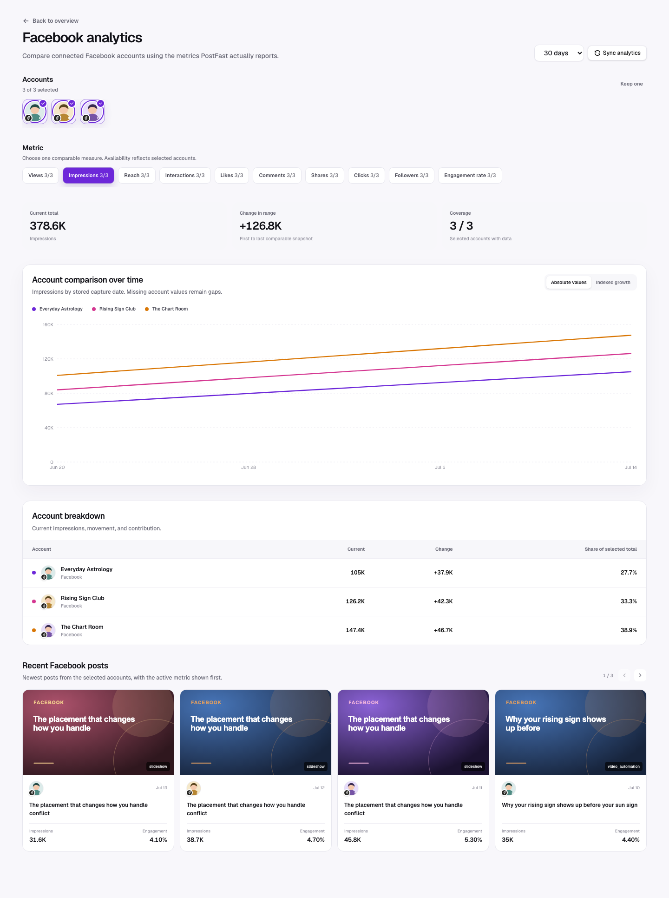

Facebook has full post-level support. Its seeded metrics are Views, Impressions, Reach, Likes, Comments, Shares, Clicks, and Interactions.

## Multi-account view

The Facebook drill-down lets users multi-select connected Facebook accounts
and compare Views, Impressions, Reach, Likes, Comments, Shares, Clicks, or
Interactions over time. Engagement rate appears when derivable, and Followers
appears when follower history exists. Account selectors use profile pictures
with a small Facebook icon overlapping the bottom-left. See
[Platform comparison](./platform-comparison.md) for the full interaction and
visualization contract.

## Available metrics

| Metric          | In metric picker           | Interpretation                                                                     |
| --------------- | -------------------------- | ---------------------------------------------------------------------------------- |
| Views           | Yes                        | Returned viewing volume; most relevant to video content.                           |
| Impressions     | Yes                        | Total content displays.                                                            |
| Reach           | Yes                        | Distinct people/accounts reached when provided.                                    |
| Likes           | Yes                        | Reactions normalized into the canonical Likes field.                               |
| Comments        | Yes                        | Direct discussion under the post.                                                  |
| Shares          | Yes                        | Redistribution to another feed, person, or group.                                  |
| Clicks          | Yes                        | Link/action intent when PostFast supplies `clicks` or `linkClicks`.                |
| Interactions    | Yes                        | Provider total or likes + comments + shares. Clicks are not added to the fallback. |
| Engagement rate | Derived in post comparison | Interactions divided by views, impressions, or reach.                              |

The interaction fallback intentionally excludes clicks. This keeps the canonical interaction definition consistent with the current registry, but it means a high-click Facebook post can show modest Interactions. Read Clicks separately for traffic-focused campaigns.

## Recommended reading order

1. Choose Reach for unique distribution or Impressions for total delivery.
2. Compare Clicks with Shares to separate off-platform intent from on-platform distribution.
3. Inspect Comments when the objective is discussion or community response.
4. Use recent posts and post detail to compare posts of the same format and objective.

## Practical decisions

- High reach + high clicks: preserve the offer/message pairing and test creative variants.
- High shares + low clicks: the idea travels socially but may not create action; inspect the CTA.
- High impressions + flat reach: frequency is increasing more than audience breadth.
- Strong engagement + weak follower growth: clarify the reason to follow beyond the individual post.

## Caveats

- Reaction subtypes are collapsed into Likes by the alias map when returned as `reactions`.
- Clicks do not contribute to fallback Interactions or the derived engagement numerator.
- Video Views and static-post Impressions are different behaviors; avoid ranking unlike formats only by one raw column.
- The chart is cumulative snapshot history assembled by LumenClip syncs.

[Back to the analytics overview](./overall.md)
