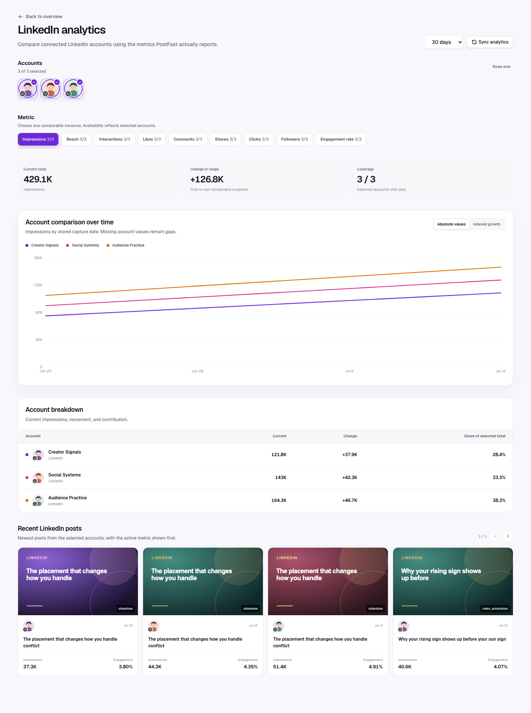

LinkedIn has full post-level support, but its primary seeded exposure metric is **Impressions**, not Views. The dashboard therefore selects Impressions automatically when a LinkedIn account is opened.

## Multi-account view

The LinkedIn drill-down lets users multi-select connected LinkedIn accounts
and compare Impressions, Reach, Likes, Comments, Shares, Clicks, or Interactions
over time. Engagement rate appears when derivable, and Followers appears when
follower history exists. Account selectors use profile pictures with a small
LinkedIn icon overlapping the bottom-left. See
[Platform comparison](./platform-comparison.md) for the full interaction and
visualization contract.

## Available metrics

| Metric          | In metric picker           | Interpretation                                                                      |
| --------------- | -------------------------- | ----------------------------------------------------------------------------------- |
| Impressions     | Yes                        | Total times the post was displayed. This is the account KPI shown first.            |
| Reach           | Yes                        | Distinct exposure when the provider supplies it.                                    |
| Likes           | Yes                        | Positive reactions normalized into Likes.                                           |
| Comments        | Yes                        | Discussion generated by the post.                                                   |
| Shares          | Yes                        | Reposts/distribution as supplied by PostFast.                                       |
| Clicks          | Yes                        | Link or action intent.                                                              |
| Interactions    | Yes                        | Provider total or likes + comments + shares. Clicks are excluded from the fallback. |
| Engagement rate | Derived in post comparison | Interactions divided by impressions when views are absent.                          |

The cross-platform overview does not add LinkedIn Impressions to a Views value.
Recent LinkedIn posts and the platform comparison instead present Impressions
directly. This avoids pretending impressions are views for a provider where the
normalizer has no such fallback.

## Recommended reading order

1. Start with Impressions for distribution volume.
2. Compare Reach, when present, to understand repeated exposure.
3. Read Clicks separately from Interactions for demand or traffic objectives.
4. Compare Comments and Shares for professional relevance and network transmission.
5. Open post detail when you need the full observed metric set for one post.

## Practical decisions

- High impressions + high clicks: the topic and CTA align; test another creative treatment.
- High impressions + low interaction: distribution exists, but the point may be too generic or passive.
- Strong comments + shares: expand the argument into a recurring series or a deeper asset.
- Strong engagement + low reach: consider a clearer first two lines, stronger timing, or better account-topic fit.

## Caveats

- Recent post cards show the active platform metric; use post detail for the
  remaining observed values.
- Clicks do not increase fallback Interactions, so evaluate traffic and social engagement separately.
- Post type differences (text, image, document, video) are not normalized into separate benchmark groups.
- The curve is repeated snapshot history, not LinkedIn’s native daily-impressions endpoint.

[Back to the analytics overview](./overall.md)
