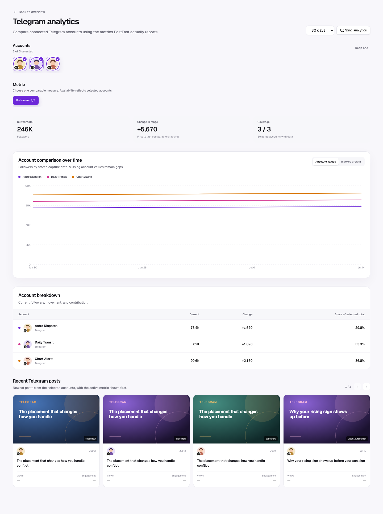
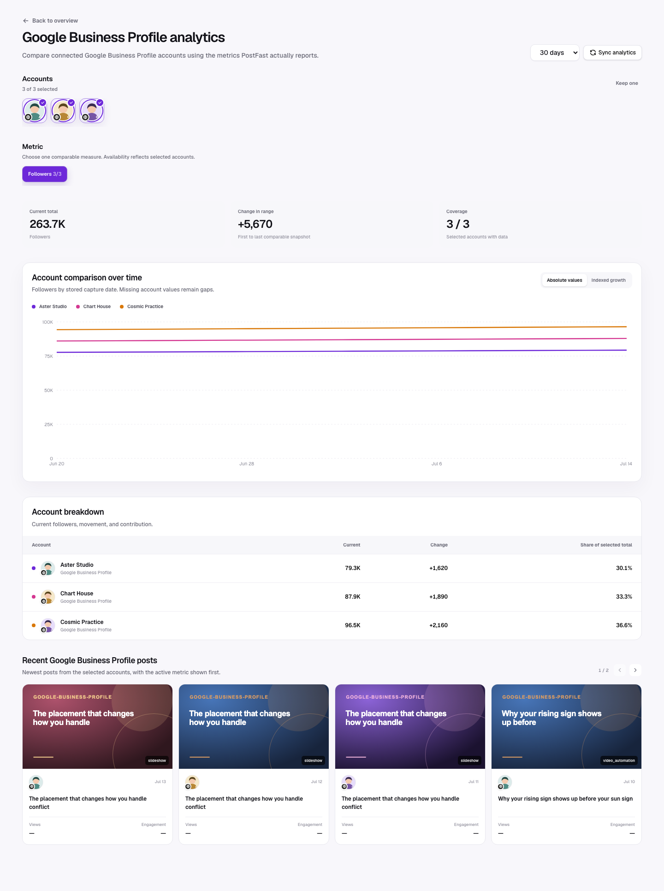
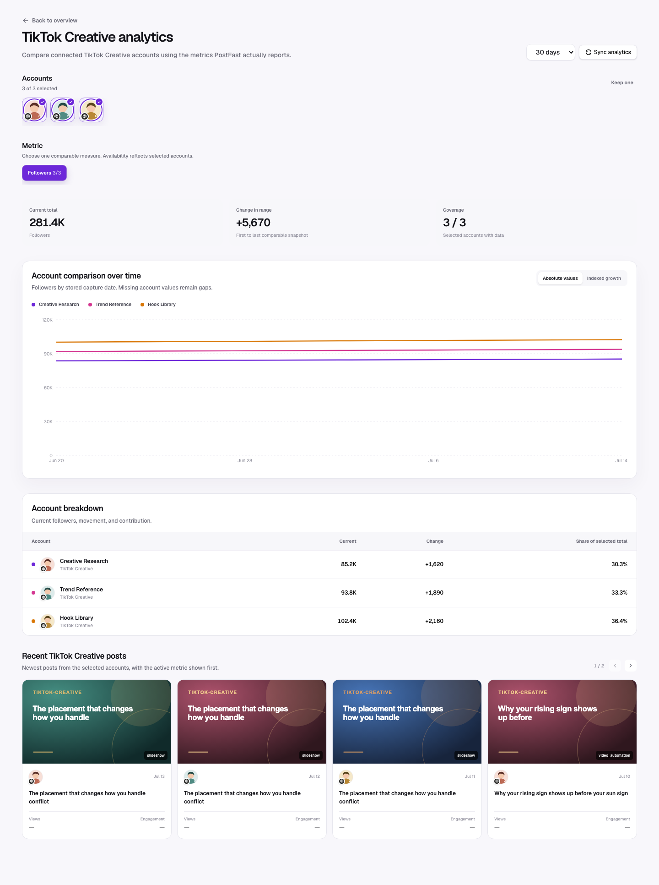
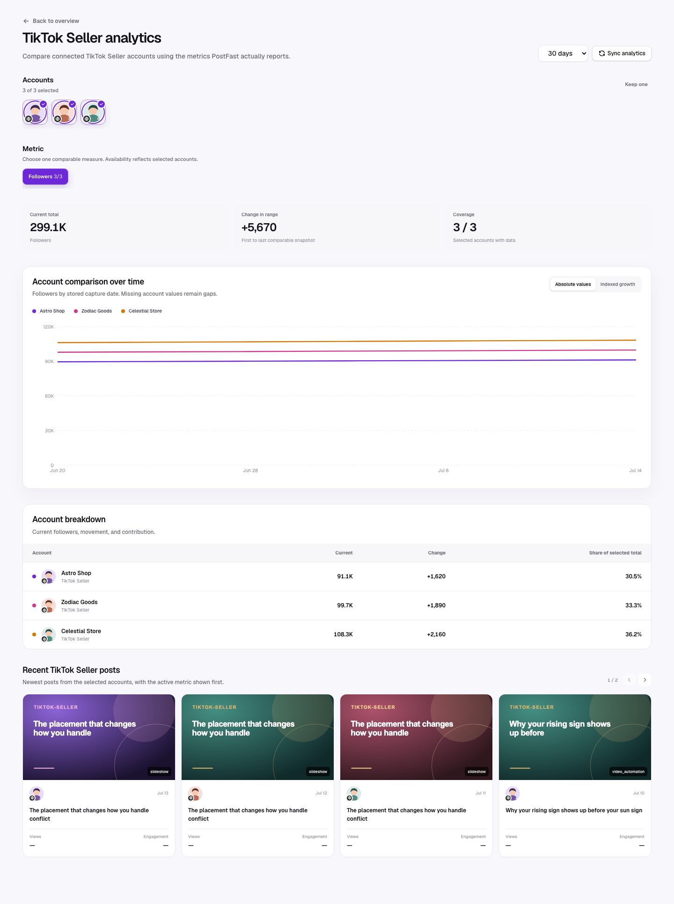

The PostFast integration type also recognizes TikTok Creative, TikTok Seller, Bluesky, Telegram, Google, and Google Business Profile identifiers. These providers are **not** enabled for post-level analytics in the current capability gate.

## Platform workspace behavior

These providers use the shared [Platform comparison](./platform-comparison.md)
shell, but metric selection and comparison charts remain unavailable until
PostFast returns validated post analytics and the capability gate is enabled.
Users may multi-select accounts to compare Follower history when it exists.
Profile pictures retain the small provider badge at the bottom-left. Missing
post metrics appear as unavailable explanations, never empty or zero-valued
series.

### Rendered provider states

| Provider identifier       | Display/role                         | Current analytics behavior                            |
| ------------------------- | ------------------------------------ | ----------------------------------------------------- |
| `tiktok-creative`         | TikTok creative/research integration | Not treated as a TikTok publishing analytics account. |
| `tiktok-seller`           | TikTok seller integration            | Not treated as a TikTok post analytics account.       |
| `bluesky`                 | Bluesky                              | Recognized name; unsupported account analytics state. |
| `telegram`                | Telegram                             | Recognized name; unsupported account analytics state. |
| `google`                  | Google Business Profile alias        | Recognized display label; unsupported post analytics. |
| `google-business-profile` | Google Business Profile              | Recognized display label; unsupported post analytics. |

If stored follower snapshots exist, these accounts can still be inferred and shown in the overview. LumenClip does not invent post capabilities from the provider name. New support requires real payload fixtures, metric normalization, an enabled capability entry, and browser verification.

The supported account screenshots in the other guides show what the same component looks like when a provider supplies multiple posts and dated snapshots. Unsupported providers use the same explicit capability state shown in [X and Threads analytics](./x-and-threads.md).

[Back to the analytics overview](./overall.md)
