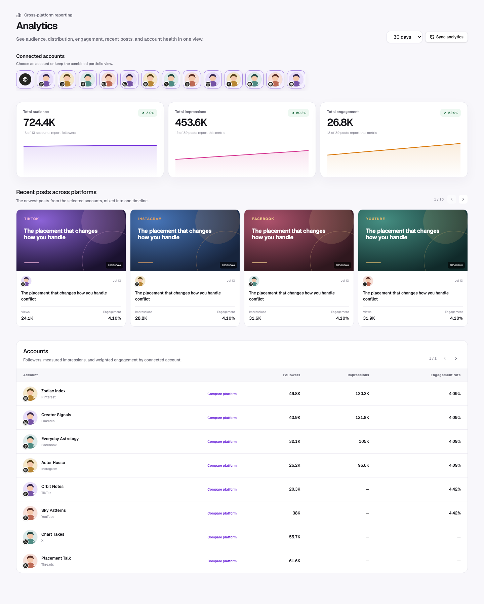

LumenClip Analytics is a single cross-platform overview. It answers three
questions in one scan:

1. How large is the combined audience, and is it moving?
2. How much distribution and engagement did the portfolio produce?
3. Which recent posts and accounts are responsible?

The user should not have to switch between Overview, Account, and Post table
tabs to answer them.



## Page anatomy

```text
Analytics                                      [30 days] [Sync analytics]

[All accounts] [avatar + platform] [avatar + platform] [...]

[Total audience chart] [Total impressions chart] [Total engagement chart]

Recent posts across all platforms
[post] [post] [post] [post]

Accounts
Account                         Followers    Impressions    Engagement rate
profile + platform + name       ...          ...            ...
```

The page is one responsive vertical flow. The account selector filters the
sections beneath it; it does not navigate to a separate analytics mode.

## Header and report controls

The header contains only the page title, report range, and Sync analytics.

- Supported windows are 7, 30, 60, and 90 days; default 30.
- Changing the range reads the stored report for that window.
- Sync analytics requests current PostFast analytics and follower history,
  appends snapshots, and then refreshes the report.
- While syncing, the action shows progress and is disabled only for that sync
  action. Existing data stays visible.

## Connected-account selector

The selector begins with All accounts and then shows every connected account.
Each account uses its profile picture as the dominant visual identity.

### Avatar anatomy

- Profile image: 44–48 px, round or softly squared to match the app.
- Platform badge: 16–18 px, overlapping the avatar at the **bottom-left**.
- The badge uses the official platform glyph on a high-contrast neutral or
  platform-appropriate surface.
- Fallback: deterministic account initials; never a broken image.
- Selected state: visible outer ring plus `aria-pressed="true"`.
- Compact selector label: account name and platform appear in a tooltip. Recent
  post headers reuse this icon-only identity; account tables keep visible names
  because the Account column is comparative data.

The small badge must never visually compete with the profile picture. This same
identity pattern is reused on recent-post cards and in the account table.

### Filtering behavior

- Default selection is All accounts.
- Selecting an account filters all three charts and the recent-post section.
- The account table remains complete so the user can compare the selected
  account with the portfolio; the selected row is highlighted.
- Selecting the active account again returns to All accounts.
- Filters do not mutate or re-sync data.

## Portfolio charts

Three chart panels sit at the top of the report content. Each panel includes a
plain-language label, current total, change for the visible stored history,
compact area chart, and availability note when some providers lack the metric.

| Chart             | Current value                                                           | Trend construction                                                                                                                                                  |
| ----------------- | ----------------------------------------------------------------------- | ------------------------------------------------------------------------------------------------------------------------------------------------------------------- |
| Total audience    | Sum of the latest follower count for each selected account.             | For each capture day, use the latest follower point at or before that day per account, then sum the accounts with data. Do not sum every follower snapshot.         |
| Total impressions | Sum of the latest canonical `impressions` value for each visible post.  | For each capture day and post, retain that day’s latest stored snapshot, then sum impressions. A provider’s `views` value is not silently relabeled as impressions. |
| Total engagement  | Sum of the latest canonical `interactions` value for each visible post. | Build the daily series with the same latest-snapshot-per-post rule. Canonical interactions use the provider value or the registry fallback.                         |

### Chart rules

- Curves use snapshot capture dates, not publication dates.
- With one data point, show the value and “Sync again to build a trend.”
- Missing metrics are excluded and disclosed as availability, not counted as
  zero.
- Deltas compare the first and last comparable points in the selected window;
  the label must say this rather than implying a previous-calendar-period
  comparison.
- Axis decoration stays minimal. Tooltips show the exact date and formatted
  value.
- Totals use tabular figures and compact notation only when needed.

## Recent posts across platforms

Recent posts occupy the middle of the page. Recency is determined by
`publishedAt`, falling back to the snapshot capture time when publication time
is unavailable. This is a recency section—not a top-performer ranking.

Each card or row shows:

- media thumbnail when available, with a composed text-only fallback;
- post excerpt;
- publication date;
- account profile picture with the small bottom-left platform badge;
- the most useful available distribution value, preferring Impressions and
  then Views;
- Engagement or Engagement rate when derivable;
- source type as quiet metadata, not a dominant badge.

The section mixes all selected platforms in one chronological sequence. It
must not group posts into platform silos. The profile icon is not followed by a
repeated account name; hovering the profile reveals the account and platform.
Clicking a post opens the existing detail drawer with canonical metrics, stored
curve, source attribution, and an Open live post action when a release URL
exists.

The overview shows four posts per page in one horizontal row. Previous and next
icon controls page through the remaining posts without creating a permanent
third navigation tab just for the full list.

## Account performance table

The table sits at the bottom and contains one row per connected account, shown
eight rows per page with shared previous/next icon controls.

| Column          | Definition                                                                                                                                                                                                          |
| --------------- | ------------------------------------------------------------------------------------------------------------------------------------------------------------------------------------------------------------------- |
| Account         | Profile picture, bottom-left platform badge, account name, and platform name.                                                                                                                                       |
| Followers       | Latest follower count in the selected report window; `—` when unavailable.                                                                                                                                          |
| Impressions     | Sum of latest canonical impressions across that account’s visible posts; `—` when the provider did not report impressions.                                                                                          |
| Engagement rate | Weighted account rate: total canonical interactions divided by total comparable exposure, multiplied by 100. Use impressions when available for the cohort; otherwise use the registry’s per-post denominator rule. |

The order is Impressions descending, with accounts lacking impressions after
measured accounts. A selected account row is visually distinct, and activating
a row applies that account to the overview. The table never converts
unavailable metrics to `0`.

## Platform-specific analysis

The platform name in an account row and a secondary “View platform analytics”
action open a dedicated drill-down for that provider. This view is for
comparing multiple accounts that share a platform and therefore have
meaningfully comparable metrics.

The drill-down preserves the report window and sync control, replaces the
portfolio account rail with a multi-select account rail, and exposes only the
canonical metrics that PostFast reports for at least one selected account.
Users can select several accounts, choose a metric, and compare their stored
series in one visualization.

See [Platform comparison](./platform-comparison.md) for the complete
UI, account-selection behavior, metric availability rules, chart modes, and
responsive states.

## Canonical metric rules

PostFast providers use different keys for similar ideas.
`lib/metric-registry.ts` normalizes the response before storage.

| Canonical metric | Accepted examples                                 | Calculation or fallback                                                                                                                                           |
| ---------------- | ------------------------------------------------- | ----------------------------------------------------------------------------------------------------------------------------------------------------------------- |
| Views            | `views`, `videoViews`, `video_views`, `playCount` | Retained independently from impressions. Some provider normalizers may explicitly copy impressions when views are absent; the UI does not invent this conversion. |
| Impressions      | `impressions`, `impressionCount`                  | Stored independently and used by the Total impressions chart.                                                                                                     |
| Likes            | `likes`, `likeCount`, `reactions`                 | Maximum recognized alias in one payload.                                                                                                                          |
| Comments         | `comments`, `commentCount`, `replies`             | Normalized to comments.                                                                                                                                           |
| Shares           | `shares`, `shareCount`, `reposts`, `retweets`     | Labeled for the provider context where needed.                                                                                                                    |
| Saves            | `saves`, `bookmarks`, `bookmarkCount`             | Available only when returned.                                                                                                                                     |
| Clicks           | `clicks`, `linkClicks`                            | Preserved separately from fallback interactions.                                                                                                                  |
| Interactions     | `totalInteractions`, `interactions`               | If absent: likes + comments + shares + saves.                                                                                                                     |
| Engagement rate  | Provider value or derived                         | Interactions divided by the first supported non-zero exposure denominator for the comparison. The UI discloses unavailable denominators.                          |

## Data flow and storage

```text
Connected PostFast accounts
  -> POST /api/analytics/report
  -> provider analytics and follower history
  -> canonical metric normalization
  -> append post and follower snapshots
  -> GET /api/analytics/report?days=N
  -> account selector
  -> three portfolio charts
  -> recent cross-platform posts
  -> account performance table
```

Each post snapshot retains post and platform IDs, integration and provider,
capture/publication timestamps, content, thumbnail, release URL, source
attribution, canonical metrics, raw numeric metrics, and observed provider
keys. Remote posts remain first-class series with `sourceType: "external"`.

## Responsive behavior

- Desktop: three charts in one row; recent posts use one horizontal row; the
  account table remains a table.
- Tablet: charts may use two columns with the third spanning the row; the
  single recent-post row scrolls horizontally when needed.
- Mobile: charts stack; account selectors and the single recent-post row scroll
  horizontally; the account table uses horizontal overflow while keeping the
  Account column legible.
- No content is hidden solely because the viewport is narrow.

## Loading, empty, and degraded states

| State                       | Required result                                                            |
| --------------------------- | -------------------------------------------------------------------------- |
| Loading                     | Skeleton account rail, three chart panels, recent posts, and account rows. |
| No integrations             | Direct the user to connect accounts in Settings.                           |
| Accounts but no snapshots   | Explain that history starts with Sync analytics and show that action.      |
| Missing avatar              | Show deterministic initials with the normal platform badge.                |
| Missing metric              | Show `—` and an availability explanation; never show zero.                 |
| One snapshot                | Show current total without a misleading curve or delta.                    |
| Integration refresh failure | Keep stored analytics visible with one inline warning.                     |
| Report failure              | Show the normalized error and a retry action.                              |

## Accessibility and interaction quality

- Account selectors and rows are keyboard operable.
- Icon-only platform badges have accessible names.
- Chart meaning is also available in text; color is not the only change cue.
- Focus rings are visible on account selectors, posts, account rows, and
  actions.
- Profile and post images have useful alternative text or are marked
  decorative when adjacent text fully duplicates them.
- Hover motion is subtle and disabled for reduced-motion preferences.

## Platform guides

These guides remain the source of truth for provider capability differences:

- [Platform comparison UX](./platform-comparison.md)
- [TikTok](./tiktok.md)
- [Instagram](./instagram.md)
- [Facebook](./facebook.md)
- [YouTube](./youtube.md)
- [LinkedIn](./linkedin.md)
- [Pinterest](./pinterest.md)
- [X and Threads](./x-and-threads.md)
- [Other recognized providers](./other-platforms.md)
