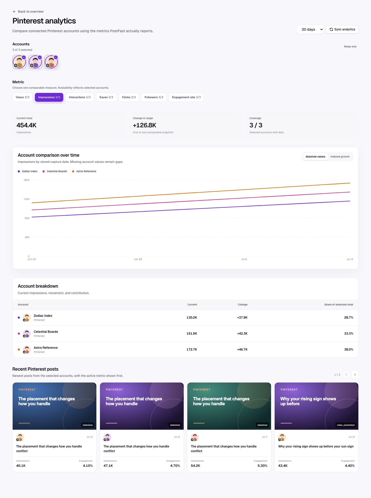

Pinterest has full post-level support. Its seeded metrics are Impressions, Views, Saves, Clicks, and Interactions.

## Multi-account view

The Pinterest drill-down lets users multi-select connected Pinterest accounts
and compare Impressions, Views, Saves, Clicks, or Interactions over time.
Engagement rate appears when derivable, and Followers appears when follower
history exists. Account selectors use profile pictures with a small Pinterest
icon overlapping the bottom-left. See
[Platform comparison](./platform-comparison.md) for the full interaction and
visualization contract.

## Available metrics

| Metric          | In metric picker           | Interpretation                                                                                |
| --------------- | -------------------------- | --------------------------------------------------------------------------------------------- |
| Impressions     | Yes                        | Total times a Pin was displayed. It is the first seeded metric and the default account chart. |
| Views           | Yes                        | Returned viewing/opening volume where available.                                              |
| Saves           | Yes                        | Strong intent to retain or reuse the idea later.                                              |
| Clicks          | Yes                        | Traffic or deeper-action intent.                                                              |
| Interactions    | Yes                        | Provider total; if absent, the generic fallback includes saves but not clicks.                |
| Engagement rate | Derived in post comparison | Interactions divided by views, impressions, or reach.                                         |

Likes, Comments, Shares, and Reach are not seeded Pinterest account metrics. Their post-table cells remain blank unless a recognized key is actually observed.

## Recommended reading order

1. Use Impressions to understand discovery volume.
2. Compare Saves for durable idea value.
3. Compare Clicks for movement beyond the Pin.
4. Read Views only when the returned Pinterest object supplies a meaningful view/open signal.
5. Compare source types to identify which automation or imported content family produces saves and clicks efficiently.

## Practical decisions

- High impressions + high saves: create closely related variants and maintain visual/topic consistency.
- High saves + weak clicks: the Pin is useful as inspiration but may not communicate the next action.
- High clicks + modest saves: the promise drives action even if the visual is not a reference object.
- Weak impressions + strong downstream intent: improve keywords, board fit, cover composition, or distribution rather than discarding the idea.

## Caveats

- Clicks are not included in the generic fallback interaction formula. Read Clicks directly.
- Pinterest content can accumulate over a long period; older posts may dominate a short report window because the window filters capture dates, not original publication age alone.
- The account curve is built from LumenClip sync snapshots and can rise as existing Pins continue accumulating activity.
- Missing social metrics are unavailable, not zero.

[Back to the analytics overview](./overall.md)
