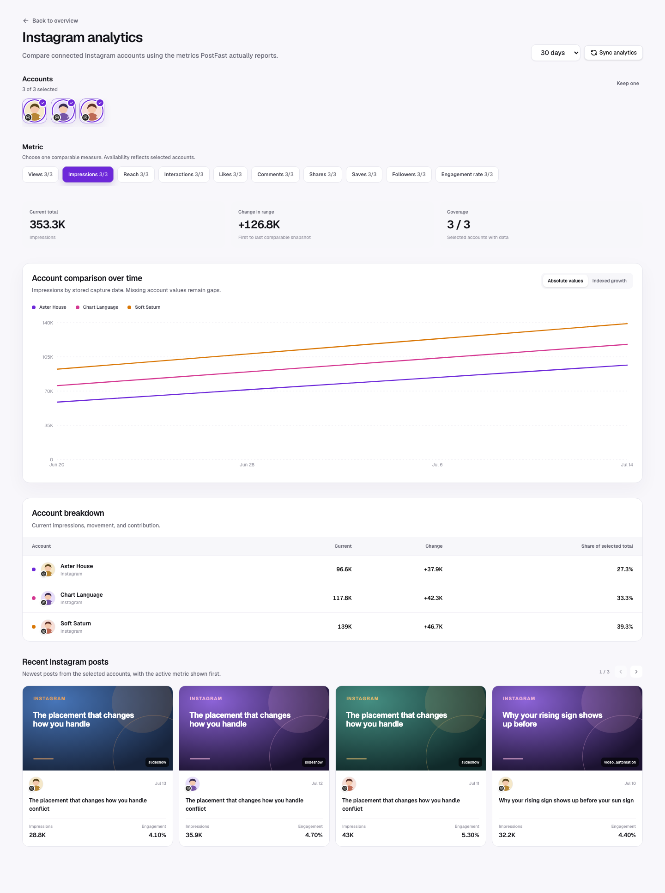

The platform-specific workspace compares accounts only when they share the
same provider. This prevents an Instagram Reach line from being presented as
equivalent to a TikTok Views line while still supporting multi-account
analysis for agencies and multi-brand portfolios.



## Entry and navigation

Users enter from the platform label or “View platform analytics” action in the
overview account table. The drill-down is local Analytics component state and
keeps the selected report window. The visible Back to overview action restores
the cross-platform dashboard.

The drill-down header is:

```text
Analytics / Instagram                         [30 days] [Sync analytics]
Compare accounts and the metrics Instagram reports through PostFast.
```

A visible Back to overview action returns to the cross-platform dashboard.
There is no Overview / Account / Posts tab bar.

## Layout

```text
Analytics / Instagram                         [30 days] [Sync analytics]

Accounts (3 selected)
[Select all] [✓ avatar] [✓ avatar] [avatar] [avatar]

Metric
[Impressions 3/3] [Reach 3/3] [Views 2/3] [Saves 3/3] [...]

[Current total] [Change in range] [Selected accounts with data]

Account comparison over time
---------------------------------------------------------------
| one line per selected account                               |
---------------------------------------------------------------
[absolute values] [indexed growth]

Account breakdown
Account              Current       Change       Share of selected total

Recent Instagram posts from selected accounts
```

## Multi-select account control

Only connected accounts for the active platform appear. Every selector reuses
the standard account identity:

- profile image as the primary 44–48 px visual;
- small platform icon overlapping the avatar at the bottom-left;
- deterministic initials fallback;
- icon-only account selectors with the account and platform name revealed on
  avatar hover;
- checkbox semantics, visible selection ring, and `aria-pressed` or native
  checked state.

Behavior:

- All accounts on the platform are selected on first entry.
- Users may select one, several, or all accounts.
- Select all selects every account. When all are selected, Keep one reduces the
  comparison to the first account. Removing the final selected account is
  blocked so the visualization never enters an accidental blank state.
- Selection changes update visualizations locally from the loaded report; they
  do not sync PostFast.
- Account selection persists while switching metrics and date ranges where the
  accounts remain available.
- Account breakdown tables use the shared pagination controls and show eight
  accounts per page.
- The UI shows the selection count explicitly.

## Metric picker

The picker is driven by `providerMetricCapabilities` plus metrics actually
observed in the selected accounts’ snapshots. It is never a hardcoded generic
list detached from provider data.

Each metric option shows availability as `accounts with data / selected
accounts`, for example `Views 2/3`.

Ordering follows `canonicalMetricOrder` with the platform’s most useful
exposure metric first:

1. provider-primary exposure metric, such as Views or Impressions;
2. Reach when available;
3. Interactions and Engagement rate;
4. Likes, Comments, Shares/Reposts, Saves, and Clicks;
5. Followers.

One metric is visualized at a time. Plotting likes, impressions, rates, and
followers on one y-axis would create a misleading chart. Switching the metric
updates the KPI summary, comparison chart, breakdown table, and explanatory
copy without changing account selection.

### Availability rules

- A metric appears if at least one selected account reports it or the platform
  capability registry seeds it.
- An unavailable account is not plotted as a zero line.
- The chart legend and breakdown table mark unavailable accounts with `—`.
- The chart states “2 of 3 selected accounts report Views” when coverage is
  incomplete.
- Observed provider values take precedence over assumptions from the platform
  name.
- Engagement rate may be derived only when both interactions and a supported
  non-zero exposure denominator exist for the same cohort.

## KPI summary

The selected metric produces three compact values above the chart:

| Value           | Meaning                                                                                                                                         |
| --------------- | ----------------------------------------------------------------------------------------------------------------------------------------------- |
| Current total   | Sum of the latest comparable value for selected accounts. For Engagement rate, show the weighted combined rate rather than summing percentages. |
| Change in range | Difference between the first and last comparable stored points, as an absolute and percentage change where mathematically valid.                |
| Coverage        | Number of selected accounts with usable data for the metric.                                                                                    |

Followers use the latest follower-history point per account. Post metrics use
the latest snapshot per `integrationId + postId`; they never sum duplicate
snapshots of the same post.

## Comparison visualization

The primary visualization is a time-series comparison with one consistently
colored line per selected account. Account colors are stable within the view
and repeated in the legend and breakdown table. Platform color is not reused
for every line because the accounts need to remain distinguishable.

### Chart modes

- **Absolute values:** shows the real metric values and is the default.
- **Indexed growth:** sets each account’s first comparable point to 100 and
  charts relative movement. This is useful when account sizes differ greatly.

Indexed growth is unavailable when an account lacks a non-zero baseline. The
UI explains the omission. It must never manufacture a baseline.

Series construction:

- For post metrics, retain the latest snapshot per post per capture day, then
  aggregate those posts by account and day.
- For Followers, use the latest follower point at or before each displayed
  capture day.
- For Engagement rate, divide the account/day interaction total by the
  account/day comparable exposure total. Do not average post percentages.
- Curves use capture dates, not post publication dates.
- Gaps remain gaps unless a follower series explicitly uses last-known-value
  carry-forward. Post metrics are not linearly interpolated.

### Many-account behavior

- One account: a single comparison line.
- Two or more accounts: overlaid comparison lines with a shared y-domain and a
  directly labeled legend.
- Legends can scroll horizontally on narrow screens and never obscure the
  plot.

Tooltips show capture date, account avatar/name, exact value, and availability.
The same information must be readable without relying only on line color.

## Account breakdown

The breakdown table follows the chart and contains the selected accounts only:

| Column                  | Definition                                                                 |
| ----------------------- | -------------------------------------------------------------------------- |
| Account                 | Profile image, small bottom-left platform badge, and account name.         |
| Current                 | Latest comparable value for the selected metric.                           |
| Change                  | First-to-last stored change in the active range.                           |
| Share of selected total | Account value divided by the comparable selected total; omitted for rates. |

Rows use the same stable series color as the chart so the table can be read
against the visualization.

## Recent posts

The bottom section shows recent posts from the selected platform and selected
accounts in one chronological sequence. Cards use the same account identity,
show the active metric prominently, and retain distribution and engagement as
secondary context when available. Clicking a card opens post detail.

Followers are account-level and therefore do not appear as a post-card metric.
When Followers is the active metric, cards show each post’s primary exposure
metric instead and explain that follower history is not attributable per post.

## Platform metric sets

These are seeded capabilities in the current registry. Observed PostFast keys
may add recognized canonical metrics at runtime.

| Platform  | Seeded selectable metrics                                                |
| --------- | ------------------------------------------------------------------------ |
| TikTok    | Views, Likes, Comments, Shares, Saves, Interactions                      |
| Instagram | Views, Impressions, Reach, Likes, Comments, Shares, Saves, Interactions  |
| Facebook  | Views, Impressions, Reach, Likes, Comments, Shares, Clicks, Interactions |
| YouTube   | Views, Likes, Comments, Shares, Interactions                             |
| LinkedIn  | Impressions, Reach, Likes, Comments, Shares, Clicks, Interactions        |
| Pinterest | Impressions, Views, Saves, Clicks, Interactions                          |

Engagement rate is displayed when derivable. Followers are displayed when
follower-history data exists. X and Threads remain unavailable for post-level
comparison while `providerSupportsPostAnalytics` excludes them.

## Responsive and state behavior

- Desktop uses a full-width chart and persistent breakdown table.
- Tablet keeps the chart full-width and allows the account selector and metric
  picker to wrap.
- Mobile uses horizontally scrolling account and metric rails, a full-width
  chart, and a horizontally scrollable table.
- Loading skeletons match the selectors, KPI row, chart, table, and posts.
- No accounts for the platform links back to the overview and Settings.
- No stored data provides Sync analytics without rendering empty axes.
- A single snapshot shows current values and explains why change is not yet
  available.
- Partial provider failure preserves successful accounts and identifies which
  selected accounts lack fresh data.

## Accessibility

- Multi-select account controls expose checked state and account/platform
  names to assistive technology.
- Metric controls are keyboard navigable and expose availability counts.
- The chart has a text summary and the account breakdown table provides the
  same essential values.
- Series are distinguished by labels and dash/marker treatment as well as
  color.
- Focus state remains visible on account, metric, legend, chart-mode, table,
  and post controls.

[Back to the analytics overview](./overall.md)
