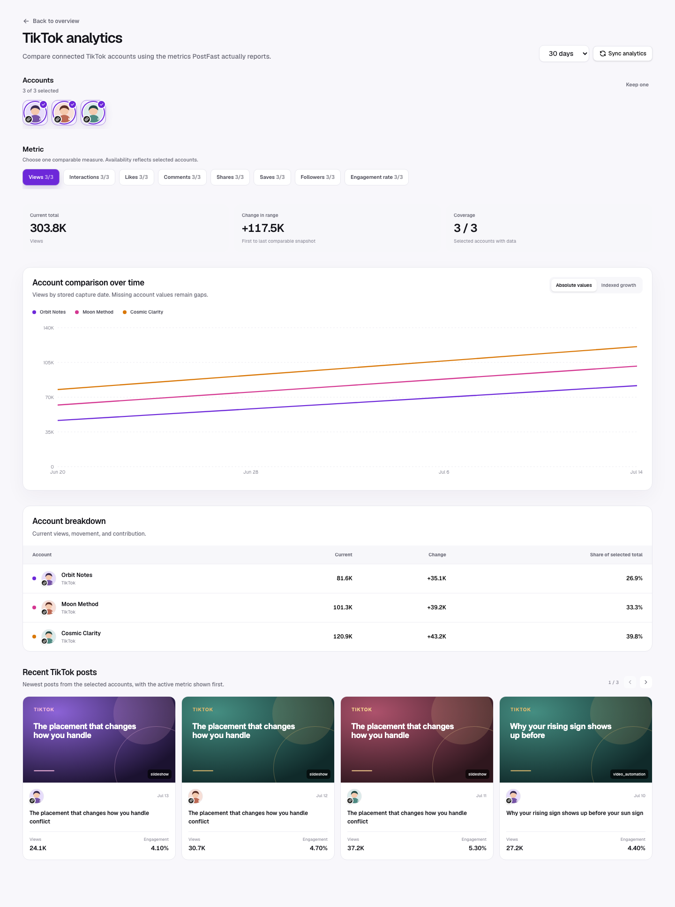

TikTok has full post-level support in the current analytics capability gate. LumenClip can store and chart Views, Likes, Comments, Shares, Saves, and Interactions for a connected TikTok integration.

## Multi-account view

The TikTok drill-down lets users multi-select connected TikTok accounts and
compare Views, Likes, Comments, Shares, Saves, or Interactions over time.
Engagement rate appears when derivable, and Followers appears when follower
history exists. Account selectors use profile pictures with a small TikTok icon
overlapping the bottom-left. See [Platform comparison](./platform-comparison.md)
for the full interaction and visualization contract.

## Available metrics

| Metric          | In metric picker                             | In recent posts/detail      | Interpretation                                                                                       |
| --------------- | -------------------------------------------- | --------------------------- | ---------------------------------------------------------------------------------------------------- |
| Views           | Yes                                          | Yes                         | Primary reach-volume signal. `impressions` fills views only if PostFast omits a separate view value. |
| Likes           | Yes                                          | Yes                         | Lightweight positive response; compare with deeper actions.                                          |
| Comments        | Yes                                          | Yes                         | Conversation generated by the post.                                                                  |
| Shares          | Yes                                          | Yes                         | Distribution by viewers to other people.                                                             |
| Saves           | Yes                                          | Yes                         | Intent to revisit; especially useful for educational or reference content.                           |
| Interactions    | Yes                                          | Yes                         | Provider total or likes + comments + shares + saves.                                                 |
| Engagement rate | Only if returned as an observed provider key | Always shown when derivable | Interactions divided by views, then multiplied by 100.                                               |

TikTok does not seed impressions, reach, or clicks as supported account-chart metrics. If PostFast begins returning one of those recognized keys, the capability registry can expose it from observed data without changing the dashboard.

## TikTok Studio slideshow detail

PostFast provides post totals but not the slide-by-slide fields available in
TikTok Studio. On a linked TikTok slideshow's detail page, choose **Import from
TikTok Studio** to add:

- retention for every slide;
- the share of likes attributed to every slide;
- TikTok's retention-drop and like-peak slides;
- traffic sources and search queries; and
- unique viewers plus age, gender, follower, and country breakdowns when the
  Viewers tab is captured.

Choose **Start automatic capture**. LumenClip connects directly to the installed
Chrome companion without displaying or copying a pairing code. The companion
opens **Overview**, then optionally **Viewers** and **Engagement**. A validated
Overview is saved immediately; later sections enrich the same snapshot.

Every accepted Overview also normalizes and saves the canonical public TikTok
post URL using the captured username, platform post ID, and post type:
`/@username/photo/{postId}` for photo posts and
`/@username/video/{postId}` for videos. This updates both the publication and
its Studio metric snapshot, including when a local capture is mirrored to cloud.

## Account-wide Studio sync

The TikTok platform page also provides **Sync TikTok Studio**. It creates one
pairing for every eligible post across the selected TikTok accounts. Choose:

- **New posts only** to skip posts that already have a Studio snapshot;
- **Posts from the last 90 days** for a bounded refresh; or
- **All linked posts** for a complete backfill.

The connected companion discovers the pending job and visits Overview, Viewers,
and Engagement sequentially for each explicitly authorized post. The LumenClip
dialog shows captured and saved counts while the batch runs. Every validated
Overview is saved automatically. Missing posts remain retryable.

The companion keeps a one-year, capture-only device credential. Individual
jobs still expire after one hour and resolve to a server-side allowlist, so the
device cannot submit analytics for arbitrary TikTok posts.

Captures received by a local LumenClip instance are saved locally first and
then mirrored to the configured cloud deployment. This makes the same Studio
snapshot available to the public MCP without giving the Chrome companion an
Appwrite API key. `TIKTOK_STUDIO_CLOUD_ORIGIN` selects the cloud deployment and
`TIKTOK_STUDIO_CAPTURE_SECRET` authenticates the server-to-server write. Cloud
captures skip the mirror because they are already in the authoritative store.

To repair older Studio records after importing or restoring data, preview the
idempotent backfill with
`pnpm tiktok-studio:backfill-urls -- --env-file .env --dry-run`, then omit
`--dry-run` to apply it. Use `.env.local` for the shared local Appwrite stack.

The companion observes TikTok's structured insight responses in the logged-in
tab. It does not read, transmit, or persist TikTok cookies, passwords, local
storage, or session tokens. The LumenClip endpoint accepts only the signed device
credential plus a pending capture ID and rejects captures whose Studio URL or
returned post ID differs from the linked TikTok post.

## Recommended reading order

1. Start with Views to identify distribution outliers.
2. Compare Saves and Shares to distinguish reusable value from casual consumption.
3. Read Comments for topic resonance or confusion.
4. Check Engagement rate so a large account does not win every comparison on scale alone.
5. Open the post and review its source type, hook, publication date, and curve before changing an automation.

## Practical decisions

- High views + high saves: reuse the information structure and test a new hook.
- High views + weak interactions: distribution worked, but the promise or payoff may be shallow.
- Modest views + strong shares/saves: consider repackaging the same idea with a stronger first frame.
- Falling follower curve despite strong post views: check whether the content promise matches the account’s long-term niche.

## Caveats

- The account chart sums the selected metric across the latest snapshot for every post on each capture day; it is not a native TikTok daily-views report.
- Older posts continue accumulating views, so a rising curve does not mean all growth came from newly published posts.
- A missing metric renders as an em dash in recent posts and breakdowns. It must not be treated as zero.
- Run at least two syncs, separated in time, before using the curve or “vs previous snapshot” change.
- TikTok Studio fields are point-in-time captures, not a permanent live
  connection. Repeat an account sync later to add another snapshot.

[Back to the analytics overview](./overall.md)
