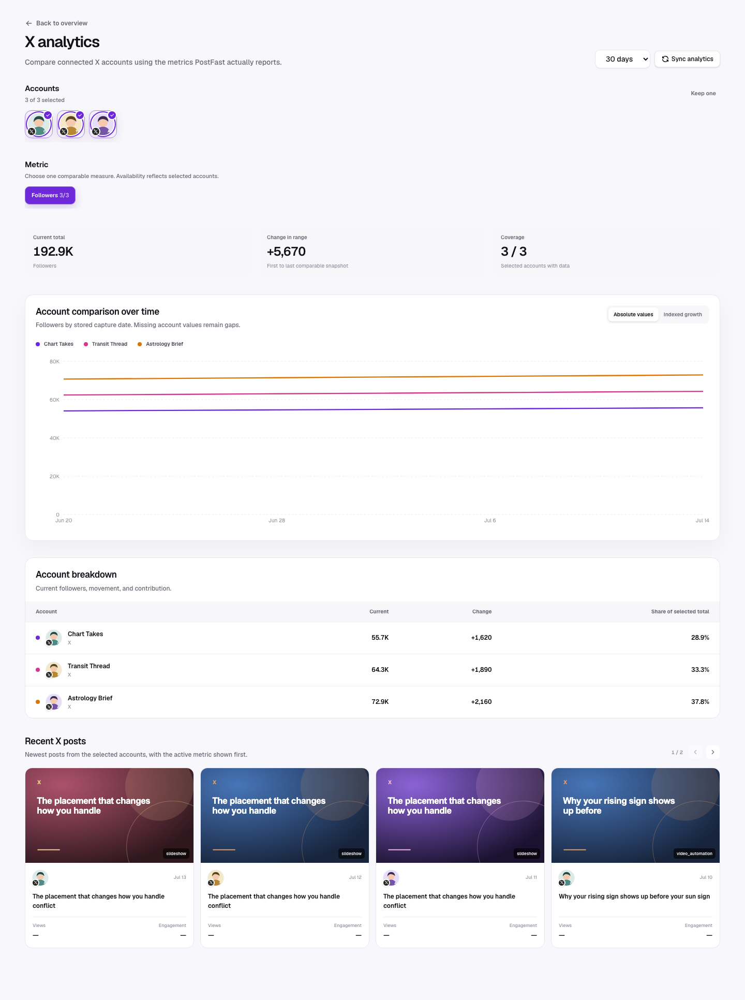
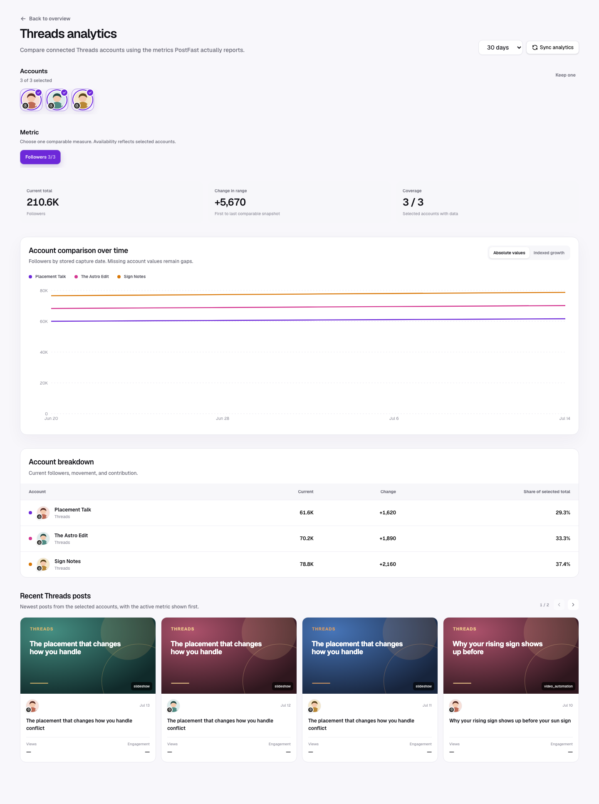

X (including the `twitter` provider alias) and Threads are recognized connected-account and publishing providers, but **post-level analytics are currently disabled by the support gate** in `providerSupportsPostAnalytics`.

## Multi-account view

X and Threads will use the same multi-select account and metric-comparison
workspace. Until PostFast post analytics are validated and the provider support
gate is enabled, their profile-picture selectors expose Follower history only;
post metrics remain unavailable. The UI does not render zero-valued comparison
lines. See [Platform comparison](./platform-comparison.md) for the shared
interaction model.

## What still works

- Connected X and Threads accounts can appear in the account selector and overview.
- Follower-history points can appear on the overview when PostFast returns them.
- The account-health card can show follower movement even when it has zero attributed analytics posts.
- X/Threads publishing and automation records can still appear in the Schedule calendar; analytics availability is a separate capability.

## What does not currently work

- No post-level X or Threads metric chart is rendered; the visible comparison
  chart is follower history.
- X/Threads posts are not expected to contribute supported post metrics through the normal analytics sync.
- Recent posts should not be used as a complete X/Threads performance inventory.
- There is no seeded X metric list. Threads has recognized metric aliases in the registry, but the provider support gate still intentionally returns the unavailable state.

## Why the unavailable state is explicit

Showing an em dash for every field would make an unsupported integration look like a set of zero-performing posts. The account view instead stops at a capability message so users do not make content decisions from missing provider data.

## Requirements to enable support later

1. Confirm PostFast exposes stable post analytics for the provider/account type.
2. Add or validate provider aliases and seeded canonical capabilities.
3. Enable the provider in `providerSupportsPostAnalytics`.
4. Add normalization fixtures for actual provider payloads.
5. Verify comparison charts, recent posts, post detail, missing-field behavior,
   and follower history with at least two syncs.

Until those steps are complete, use the platform’s native analytics for post performance and LumenClip only for the connected-account/follower context it can reliably store.

[Back to the analytics overview](./overall.md)
