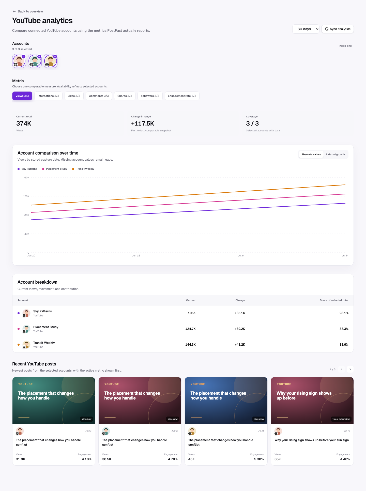

YouTube has full post-level support. The seeded metrics are Views, Likes, Comments, Shares, and Interactions.

## Multi-account view

The YouTube drill-down lets users multi-select connected YouTube accounts and
compare Views, Likes, Comments, Shares, or Interactions over time. Engagement
rate appears when derivable, and Followers appears when follower history
exists. Account selectors use profile pictures with a small YouTube icon
overlapping the bottom-left. See
[Platform comparison](./platform-comparison.md) for the full interaction and
visualization contract.

## Available metrics

| Metric          | In metric picker           | Interpretation                                                                                     |
| --------------- | -------------------------- | -------------------------------------------------------------------------------------------------- |
| Views           | Yes                        | Primary returned viewing volume. Impressions fill views only when a separate view value is absent. |
| Likes           | Yes                        | Positive response at low effort.                                                                   |
| Comments        | Yes                        | Conversation and questions generated by the video.                                                 |
| Shares          | Yes                        | Viewer-driven distribution.                                                                        |
| Interactions    | Yes                        | Provider total or likes + comments + shares.                                                       |
| Engagement rate | Derived in post comparison | Interactions divided by views (or fallback impressions/reach).                                     |

Reach, Saves, and Clicks are not seeded YouTube account metrics. Impressions are preserved if observed, but the standard capability list focuses on the fields above.

## Recommended reading order

1. Use Views to understand distribution scale.
2. Compare Likes and Comments relative to Views to judge response quality.
3. Inspect Shares for content with recommendation or reference value.
4. Use source attribution to compare generated videos, slideshows, and externally published content.

## Practical decisions

- Strong views + weak interactions: inspect whether the opening earned attention but the payoff failed.
- Strong comments + modest views: the topic may be highly relevant to a narrower audience; test a clearer title/opening.
- Strong shares: identify the concrete takeaway or emotional trigger worth repeating.
- Strong post metrics + flat follower movement: improve channel promise and series continuity.

## Caveats

- LumenClip does not currently expose watch time, average view duration, retention, subscribers gained per post, or traffic-source breakdowns.
- Shorts and other YouTube content returned by PostFast share the same canonical post model.
- The account curve sums stored post snapshots by capture day; it is not YouTube Studio’s native daily analytics series.
- A copied impression-to-view fallback should be treated as compatibility data, not an independent view measurement.

[Back to the analytics overview](./overall.md)
