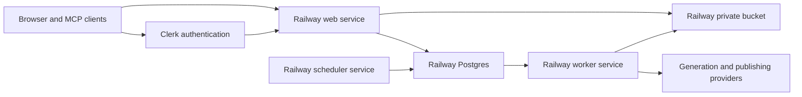

This page is the operational contract for replacing Appwrite with Railway.
Railway is now the data and asset runtime, and Clerk owns authentication.
Appwrite is retained only as an offline migration and rollback source.

## Target topology



The Railway project is named `lumenclip`. Its production environment contains
these resources:

| Resource           | Responsibility                                                            |
| ------------------ | ------------------------------------------------------------------------- |
| `Postgres`         | User profiles, domain records, jobs, migration manifests, and checkpoints |
| `lumenclip-assets` | Private S3-compatible object storage for all generated and uploaded media |
| `web`              | Next.js application and MCP HTTP surface                                  |
| `worker`           | Continuously claims and runs queued jobs                                  |
| `scheduler`        | Polls every five minutes and enqueues due automations                     |

Railway buckets are private. Application routes continue to be the stable
public media boundary; direct downloads use short-lived presigned URLs.

## Current migration state

As of 2026-08-06:

- Railway production has online `web`, `worker`, `scheduler`, Postgres, and
  private-bucket resources with both backend flags set to `railway`.
- The persistent `development` environment has isolated Postgres and bucket
  resources. Its public web service is deployed separately; its copied worker
  and scheduler stay stopped so development cannot publish production content.
- A complete cursor inventory found 5,499 Appwrite domain rows plus five users
  and 13,703 files. Appwrite's reported slideshow-bucket total stops at 5,000;
  cursor traversal found the real 10,287 files. Never use the reported total as
  an acceptance gate.
- Production and development both contain all 13,703 inventoried objects with
  zero migration failures. The final production refresh copied 5,067 objects
  that the capped inventory had previously missed.
- The Vercel deployment is legacy. Its public hostname redirects to Railway;
  the production and development public app, MCP, media, and extension origins
  use their Railway web services.
- Appwrite scheduler and worker functions must remain disabled after the final
  Railway refresh.

The foundation migration initially preserved Appwrite identities during the
copy. The canonical-template migrations then rename the relevant tables and
transactionally re-key their physical rows from the retired automation hash
namespaces to `templates`, `template_runs`, and `social_templates`. Domain IDs
inside the records stay stable because those are the identifiers referenced by
runs, publications, outputs, and public links.

- `domain_records` stores the physical Appwrite table name and row ID, the raw
  source row, and its decoded domain payload.
- `app_users` preserves user IDs, email addresses, names, preferences, and
  verification state.
- `object_manifest` maps every Appwrite bucket/file ID to a deterministic
  Railway object key.
- `migration_runs`, `migration_checkpoints`, and `migration_failures` make both
  importers resumable and auditable.
- `jobs` is a typed PostgreSQL queue with lease fields for safe concurrent
  workers.

Appwrite password hashes are not exportable. `pnpm auth:migrate:clerk --
--apply` creates Clerk identities from Railway's `app_users`, preserves every
existing owner ID as the Clerk external ID, and keeps preferences in Postgres.
Imported users authenticate with Clerk's email flow and must set a new password
if they choose password sign-in. Clerk owns verification, recovery, sessions,
and invitation email delivery; the application no longer calls Appwrite auth
or Teams at runtime.

The compatibility adapter implements the TablesDB operations and query shapes
used by the application (`equal`, `notEqual`, comparisons, ordering, limits,
offsets, and cursors) on `domain_records`. Existing repositories therefore
retain the same row and owner identities during cutover. Storage uses the same
bucket/file identity under deterministic private-bucket keys.

## Commands

All copy commands are inventory-only unless `--apply` is present.

```bash
pnpm railway:db:migrate
pnpm railway:migrate:records -- --source-env=.env
pnpm railway:migrate:records -- --apply --source-env=.env
pnpm railway:migrate:assets -- --source-env=.env
pnpm railway:migrate:assets -- --apply --source-env=.env --concurrency=8
pnpm railway:cutover:queue
pnpm railway:cutover:queue -- --apply
pnpm railway:smoke
pnpm auth:migrate:clerk
pnpm auth:migrate:clerk -- --apply
pnpm railway:worker
pnpm railway:scheduler
```

Useful controls:

| Argument             | Applies to         | Behavior                                                                        |
| -------------------- | ------------------ | ------------------------------------------------------------------------------- |
| `--only=a,b`         | records and assets | Limits the run to named tables or buckets                                       |
| `--batch-size=100`   | records and assets | Sets Appwrite page size, capped at 100                                          |
| `--concurrency=8`    | assets             | Controls parallel downloads/uploads, capped at 16                               |
| `--timeout-ms=60000` | assets             | Bounds each source or target object operation before retrying                   |
| `--verify-existing`  | assets             | Confirms a manifested object still exists before skipping it                    |
| `--restart`          | records and assets | Clears selected checkpoints and replays from the start using idempotent upserts |

Never print the output of `railway variables --json` or
`railway bucket credentials --json`; both contain secrets.

Run the queue cutover after the final record copy and before starting the
Railway worker. It inventories first, then marks copied `queued` or `processing`
jobs as `dead` with a cutover reason when `--apply` is supplied. This preserves
history while preventing notifications, generations, or publications from
being replayed merely because their queue rows were migrated.

## Cutover sequence

1. Apply the PostgreSQL schema and complete the initial records and object copy.
2. Traverse every source table and bucket with cursors. Confirm every source
   row and object exists in Railway and resolve every migration failure. Railway
   may legitimately contain additional records created after its worker became
   active, so target counts can exceed Appwrite counts.
3. Exercise the TablesDB-compatible PostgreSQL adapter and the S3-compatible
   asset adapter behind `LUMENCLIP_DATA_BACKEND` and
   `LUMENCLIP_ASSET_BACKEND`.
4. Import Railway users into Clerk. Confirm their Clerk external IDs match the
   existing Railway owner IDs, then exercise sign-up, sign-in, recovery, and
   sign-out.
5. Deploy `web`, `worker`, and `scheduler` with Railway private-network
   references to Postgres and the bucket.
6. Pause Appwrite schedulers and workers, run both importers with `--restart`
   for a final idempotent refresh, and perform generation, publishing,
   analytics, public-preview, download, Telegram, and MCP smoke tests against
   Railway.
7. Move the companion extension, capture origin, MCP clients, and user-facing
   links to the Railway production domain. Keep the development scheduler and
   worker stopped.
8. Keep Appwrite offline through the rollback window. Deployed Railway services
   have no Appwrite credentials; source-only migration scripts can be removed
   after the rollback window.

## Acceptance gates

- Every imported domain record exists in Railway `domain_records`; canonical
  template rows intentionally use re-keyed Railway/Appwrite-compatible row IDs,
  while target-only rows are retained as Railway-native writes.
- Every Appwrite file found by full cursor traversal exists in the Railway
  bucket and verified `object_manifest`; target-only files are retained.
- No migration run has unresolved failures.
- Existing owner IDs still resolve to the same templates, collections,
  outputs, publications, and analytics.
- Worker leases prevent duplicate execution under concurrency.
- A generated slideshow renders, opens publicly, downloads as a ZIP, appears in
  MCP output, and reaches Telegram when notifications are enabled.
- Appwrite can be disabled without changing the observable application or MCP
  contract.
