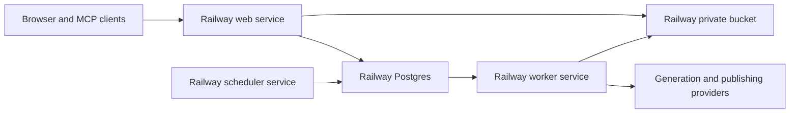

This page is the operational contract for replacing Appwrite with Railway. The
migration is additive until the final cutover: Appwrite remains the production
source of truth while Railway is populated, verified, and exercised in shadow
mode.

## Target topology



The Railway project is named `lumenclip`. Its production environment contains
these resources:

| Resource           | Responsibility                                                              |
| ------------------ | --------------------------------------------------------------------------- |
| `Postgres`         | Users, sessions, domain records, jobs, migration manifests, and checkpoints |
| `lumenclip-assets` | Private S3-compatible object storage for all generated and uploaded media   |
| `web`              | Next.js application and MCP HTTP surface                                    |
| `worker`           | Continuously claims and runs queued jobs                                    |
| `scheduler`        | Polls every five minutes and enqueues due automations                       |

Railway buckets are private. Application routes continue to be the stable
public media boundary; direct downloads use short-lived presigned URLs.

## Current migration state

The foundation migration preserves Appwrite identities instead of translating
them during the copy:

- `domain_records` stores the physical Appwrite table name and row ID, the raw
  source row, and its decoded domain payload.
- `app_users` preserves user IDs, email addresses, names, preferences, and
  verification state.
- `object_manifest` maps every Appwrite bucket/file ID to a deterministic
  Railway object key.
- `migration_runs`, `migration_checkpoints`, and `migration_failures` make both
  importers resumable and auditable.
- `jobs` is a typed PostgreSQL queue with lease fields for safe concurrent
  workers.

Appwrite password hashes are not exportable through its server API. The
Railway auth adapter preserves user IDs and promotes an existing Appwrite
session, or validates an imported user's first password login against Appwrite
once before storing a Railway `scrypt` hash. All subsequent sessions are stored
in PostgreSQL. This temporary sign-in bridge is the only remaining Appwrite
dependency after the data and asset flags move to Railway; keep the Appwrite
auth variables until every imported account has been promoted. Native Railway
registrations do not yet have a configured transactional-email provider, so
verification and recovery delivery must be configured before the bridge is
removed.

The compatibility adapter implements the TablesDB operations and query shapes
used by the application (`equal`, `notEqual`, comparisons, ordering, limits,
offsets, and cursors) on `domain_records`. Existing repositories therefore
retain the same row and owner identities during cutover. Storage uses the same
bucket/file identity under deterministic private-bucket keys.

## Commands

All copy commands are inventory-only unless `--apply` is present.

```bash
pnpm railway:db:migrate
pnpm railway:migrate:records -- --source-env=.env
pnpm railway:migrate:records -- --apply --source-env=.env
pnpm railway:migrate:assets -- --source-env=.env
pnpm railway:migrate:assets -- --apply --source-env=.env --concurrency=8
pnpm railway:cutover:queue
pnpm railway:cutover:queue -- --apply
pnpm railway:smoke
pnpm railway:worker
pnpm railway:scheduler
```

Useful controls:

| Argument             | Applies to         | Behavior                                                                        |
| -------------------- | ------------------ | ------------------------------------------------------------------------------- |
| `--only=a,b`         | records and assets | Limits the run to named tables or buckets                                       |
| `--batch-size=100`   | records and assets | Sets Appwrite page size, capped at 100                                          |
| `--concurrency=8`    | assets             | Controls parallel downloads/uploads, capped at 16                               |
| `--timeout-ms=60000` | assets             | Bounds each source or target object operation before retrying                   |
| `--verify-existing`  | assets             | Confirms a manifested object still exists before skipping it                    |
| `--restart`          | records and assets | Clears selected checkpoints and replays from the start using idempotent upserts |

Never print the output of `railway variables --json` or
`railway bucket credentials --json`; both contain secrets.

Run the queue cutover after the final record copy and before starting the
Railway worker. It inventories first, then marks copied `queued` or `processing`
jobs as `dead` with a cutover reason when `--apply` is supplied. This preserves
history while preventing notifications, generations, or publications from
being replayed merely because their queue rows were migrated.

## Cutover sequence

1. Apply the PostgreSQL schema and complete the initial records and object copy.
2. Compare source and target counts for every table and bucket. Resolve every
   migration failure before proceeding.
3. Exercise the TablesDB-compatible PostgreSQL adapter and the S3-compatible
   asset adapter behind `LUMENCLIP_DATA_BACKEND` and
   `LUMENCLIP_ASSET_BACKEND`.
4. Exercise Railway sessions. Imported users retain their owner IDs and are
   promoted on their first valid session or password login.
5. Deploy `web`, `worker`, and `scheduler` with Railway private-network
   references to Postgres and the bucket.
6. Run shadow reads and dual writes long enough to prove row, object, queue, and
   generated-output parity.
7. Pause Appwrite schedulers and workers, run both importers with `--restart`
   for a final idempotent refresh, switch both backend flags to `railway`, and
   perform generation, publishing,
   analytics, public-preview, download, Telegram, and MCP smoke tests.
8. Keep Appwrite read-only through the rollback window. Remove its SDK,
   functions, schema scripts, auth bridge, and infrastructure only after the
   window closes and transactional email is configured.

## Acceptance gates

- Every Appwrite table count equals its Railway `domain_records` count.
- Every Appwrite bucket count equals its verified `object_manifest` count.
- No migration run has unresolved failures.
- Existing owner IDs still resolve to the same automations, collections,
  outputs, publications, and analytics.
- Worker leases prevent duplicate execution under concurrency.
- A generated slideshow renders, opens publicly, downloads as a ZIP, appears in
  MCP output, and reaches Telegram when notifications are enabled.
- Appwrite can be disabled without changing the observable application or MCP
  contract.
