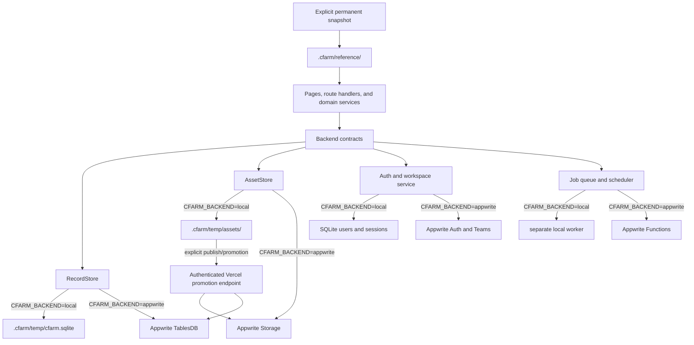

# Local Backend / Appwrite Deployment Migration Plan

Status: proposed  
Scope: application persistence, authentication, binary assets, workspace data, demos, jobs, and scheduled work  
Target rule: local testing is temporary and must not contact Appwrite directly; reusable reference assets and deployed/published outputs are permanent and canonical in Appwrite.

## 1. Outcome and invariants

The application will expose one backend contract to its domain code and select exactly one implementation at process startup:

- **Local development:** a temporary testing workspace in SQLite and a gitignored filesystem tree, plus a read-only local snapshot of permanent reference assets.
- **Vercel Preview and Production:** Appwrite TablesDB, Storage, Auth/Teams, and the existing Appwrite Functions. Anything generated there is permanent by origin.
- There will be **no automatic fallback**, **no dual-write**, and **no background synchronization** between local state and Appwrite.
- Optional snapshot commands may contact Appwrite only when a developer explicitly invokes them. An explicit publish/promotion action may send a local artifact to a trusted deployed endpoint, which persists it in Appwrite before publishing; local code never receives Appwrite credentials.
- The three bundled read-only datasets under `data/` stay application fixtures, not mutable backend state.

This means local slideshow output will live under `.cfarm/temp/assets/slideshows/...`, not `data/slideshows`. Permanent assets copied down for testing live separately under `.cfarm/reference/` and are never confused with local generations.



### 1.1 Data lifecycle

The backend choice and the data lifecycle are related but not identical. Every record or asset must have a lifecycle classification:

| Class | Meaning | Canonical location |
|---|---|---|
| `reference` | Deliberately curated input reused across many generations | Appwrite; read-only snapshot under `.cfarm/reference` for local testing |
| `temporary` | Local test output, draft, intermediate, run, log, or unpublished generation | `.cfarm/temp` only |
| `permanent` | Output created by the deployed app or successfully published to social media | Appwrite |

Classification rules:

- Curated collections, music, media libraries, automation templates, word collections, product collections, reusable characters, and other intentional inputs are `reference`.
- Local automations that are not templates, automation runs, slideshow generations, generated images/videos, results, drafts, queue history, usage ledgers, and test analytics are `temporary` by default.
- Records and assets created while `CFARM_BACKEND=appwrite` are `permanent` by origin.
- A local artifact becomes `permanent` only through a completed promotion transaction associated with a real social publication. Merely previewing, exporting, or marking it ready does not promote it.
- Failed or cancelled publication leaves the local artifact temporary.
- Absence of verifiable publication evidence means temporary. The migration must not assume that an old `completed` generation was published.

Persist lifecycle provenance on generated records:

- `storageClass`: `reference | temporary | permanent`
- `origin`: `local | vercel | imported`
- `publishedAt` and `publicationProviderId`, when applicable
- `promotedAt` and `sourceTemporaryId`, when applicable
- `retentionExpiresAt` for temporary data

These fields prevent physical location from being the only evidence of whether something deserves permanent retention.

## 2. Current coupling audit

The current backend is not confined to `data/` or slideshow storage:

- `lib/json-store.ts` routes **26 logical stores** directly to Appwrite TablesDB.
- `lib/asset-storage.ts` is Appwrite-only for binary persistence and staging.
- `app/api/local-assets/[...assetPath]/route.ts` serves directly from Appwrite Storage.
- `lib/auth.ts` uses Appwrite Users and Account for accounts, sessions, preferences, and verification.
- `lib/workspace-members.ts` uses Appwrite TablesDB and Teams.
- `lib/demos.ts` uses Appwrite TablesDB and Storage.
- `lib/queue.ts`, `lib/calendar-summary.ts`, and `lib/local-automation-job-worker.ts` query the Appwrite `jobs` table directly.
- `lib/knowledge-bases.ts` bypasses the asset abstraction when deleting uploaded source files.
- `scripts/check-env.mjs` currently requires Appwrite credentials for local development.
- `instrumentation.ts` starts a so-called local worker that still consumes Appwrite jobs.
- Many integration tests create and delete Appwrite rows directly.

The retained `data/` files are read-only fixtures:

- `data/realfarm.json`
- `data/seeds/demo-realfarm.json`
- `data/viral-hooks/hooks.jsonl`

They should remain outside the mutable backend and continue to be committed.

### Proposed classification of current cloud data

This is the starting policy for the cleanup inventory, not authorization to delete rows immediately:

| Current data | Measured count | Proposed class |
|---|---:|---|
| Automation templates | 29 rows | Reference |
| Word collections | 12 rows | Reference |
| Media library catalog | 529 rows | Reference |
| Image collections | 120 rows | Reference |
| Product collections | 5 rows | Reference |
| Reusable character definitions | 1 row | Reference |
| Benchmark corpora | 130 rows | Reference if deliberately curated; otherwise review |
| Knowledge bases, swipes, generic assets | Varies | Review individually: curated input is reference; generated/import scratch is temporary |
| Local automations | 16 rows | Temporary unless proven Vercel-origin |
| Automation runs and template example runs | 202 rows | Temporary unless an example was deliberately approved as part of a template |
| X automations and runs | 4 rows | Temporary unless proven Vercel-origin/published |
| Results and character generations | 41 rows | Temporary unless proven Vercel-origin/published |
| Generated video exports | 9 rows | Temporary unless proven Vercel-origin/published |
| Usage ledger and follower snapshots | 684 rows | Temporary testing/operational history |
| Slideshow benchmark scores and X scores | 59 rows | Temporary evaluation output; corpus inputs remain reference |
| Slideshow Storage objects | 4,003 files with 0 slideshow rows | Temporary/orphan candidates requiring a reachability audit |

Social-provider publication IDs and deployed-origin provenance override the temporary default. Status names such as `completed`, `ready`, or `exported` do not prove publication.

## 3. Backend boundary

Add a single server-only composition root:

```text
lib/backend/
  config.ts
  index.ts
  types.ts
  appwrite/
    records.ts
    assets.ts
    auth.ts
    workspaces.ts
    demos.ts
    jobs.ts
  local/
    database.ts
    migrations/
    records.ts
    assets.ts
    auth.ts
    workspaces.ts
    demos.ts
    jobs.ts
```

`lib/backend/types.ts` should define these contracts:

1. `RecordStore`: list, replace, upsert, append-if-absent, delete, and transactional update.
2. `AssetStore`: put, read, delete, stat, range-read/stream, list by prefix, and stage to a temporary path.
3. `AuthStore`: create user, authenticate, resolve session, revoke session, read/update preferences, and local verification behavior.
4. `WorkspaceStore`: list, invite, accept, and return owners whose records a member may read.
5. `DemoStore`: list, create, and read demo media with ownership checks.
6. `JobStore`: enqueue, claim with lease, complete, retry/dead-letter, list, get, and aggregate status.

The existing public modules should initially remain facades so the migration does not force a broad domain rewrite:

- `lib/json-store.ts` delegates to `backend.records`.
- `lib/asset-storage.ts` delegates to `backend.assets`; its Appwrite-named exports are replaced with neutral names.
- `lib/auth.ts`, `lib/workspace-members.ts`, `lib/demos.ts`, and `lib/queue.ts` delegate to their backend contracts.
- The rest of the application must not import `node-appwrite` or `lib/appwrite.ts` directly.

Only `lib/backend/appwrite/**`, Appwrite deployment scripts/functions, explicit migration CLIs, and Appwrite integration tests may import the Appwrite SDK.

## 4. Backend selection and environment safety

Use an explicit server-only variable:

```dotenv
CFARM_BACKEND=local|appwrite
CFARM_LOCAL_ROOT=.cfarm
```

Do not use a `NEXT_PUBLIC_` variable and do not infer the backend merely from `NODE_ENV`. The selection must be fixed before a request is handled.

Environment matrix:

| Runtime | `CFARM_BACKEND` | Appwrite credentials | Mutable state |
|---|---|---|---|
| `next dev` on a developer machine | `local` | absent | `.cfarm/` |
| `vercel dev` on a developer machine | `local` | absent | `.cfarm/` |
| Unit and local E2E tests | `local` | absent | temporary directory per test worker |
| Vercel Preview | `appwrite` | Preview-scoped | Preview Appwrite resources |
| Vercel Production | `appwrite` | Production-scoped | Production Appwrite resources |
| Appwrite integration tests | `appwrite` | test-only | isolated test owner/database |

Validation rules in `lib/backend/config.ts` and `scripts/check-env.mjs`:

- `local` requires a writable `CFARM_LOCAL_ROOT` and rejects any attempt to initialize an Appwrite backend.
- `appwrite` requires all four Appwrite variables.
- a real Vercel build/runtime must fail closed unless `CFARM_BACKEND=appwrite`.
- a Vercel deployment must never accept `CFARM_LOCAL_ROOT` as its persistent store.
- `APPWRITE_*` must be removed from the local required-variable set.
- Appwrite secrets belong in Vercel Preview/Production environment scopes, not the repository `.env` used by `pnpm dev`.

Keep local overrides in `.env.development.local`. Do not use `vercel env pull` into the normal local development file after this change, because that would reintroduce cloud credentials. If an explicit migration command needs them, use a separate ignored file such as `.env.appwrite-migration.local`.

## 5. Local data design

### 5.1 Directory layout

```text
.cfarm/
  reference/
    manifest.json
    assets/
      music/
      image-collections/
      automation-template-assets/
      ...
  temp/
    cfarm.sqlite
    cfarm.sqlite-shm
    cfarm.sqlite-wal
    assets/
      slideshows/
      generated-videos/
      character-generations/
      ...
    scratch/
  exports/
```

Add `/.cfarm/` to `.gitignore`. Do not reopen the broad `data/` ignore rules; `data/` remains for committed fixtures only.

### 5.2 SQLite

Use SQLite through `better-sqlite3` in the Node.js runtime. Next 16 already treats this package as a server external dependency. Load it only from `lib/backend/local/**`, never from Edge code or a Client Component.

Database startup settings:

- WAL journal mode.
- foreign keys enabled.
- a bounded busy timeout.
- all multi-row updates in transactions.
- schema migrations recorded in `schema_migrations`; never mutate the schema ad hoc at runtime.

The generic Appwrite row shape maps cleanly to one local table:

```sql
records(
  store TEXT NOT NULL,
  owner_id TEXT NOT NULL,
  rid TEXT NOT NULL,
  storage_class TEXT NOT NULL,
  origin TEXT NOT NULL,
  name TEXT,
  status TEXT,
  created_raw TEXT,
  ord INTEGER NOT NULL,
  data TEXT NOT NULL,
  updated_at TEXT NOT NULL,
  PRIMARY KEY (store, owner_id, rid)
)
```

Use a reserved owner such as `__public__` for the five public logical stores. Add indexes on `(store, owner_id, ord)`, `(store, owner_id, status)`, and `(store, created_raw)`.

Use dedicated tables where generic records are not sufficient:

- `users` and `user_preferences`
- `sessions` with only a hash of the session token
- `workspace_members`
- `workspace_invites`
- `demos`
- `jobs`, including priority, attempts, availability, lease owner/expiry, dedupe key, result, and error
- `schema_migrations`

The record-store adapter must preserve the current row ordering, deterministic IDs, owner scoping, public-store behavior, shared-workspace reads, and catastrophic-shrink guard. Local writes default to `temporary`; only snapshot import may create local `reference` rows, and local application code may not mark a record permanent directly.

### 5.3 Local assets

The local asset adapter stores temporary bytes and reference snapshots in separate roots while retaining the same logical relative paths used for Appwrite bucket/file derivation. Requirements:

- resolve every path beneath either `.cfarm/temp/assets` or `.cfarm/reference/assets` and reject traversal or symlink escape;
- make the reference root read-only to normal application writes;
- write to a same-directory temporary file, fsync if needed, then rename atomically;
- delete missing files idempotently;
- support HTTP byte ranges for audio/video;
- return content length, type, ETag/checksum, and modification time;
- stage files into `.cfarm/tmp` only when a third-party tool requires a physical scratch path;
- remove staged scratch files after the operation.

`app/api/local-assets/[...assetPath]/route.ts` should call `backend.assets` in both modes. The route URL remains unchanged, so persisted domain records do not need URL rewriting.

Media catalog writes and asset writes should be coordinated: write bytes atomically first, upsert the catalog row second, and remove the new file if the catalog transaction fails. A locally uploaded/generated item enters the temporary catalog unless it is an explicit reference-library import.

## 6. Local authentication and workspaces

Local use cannot call Appwrite Account, Users, or Teams, so authentication must be part of the backend boundary.

Recommended local behavior:

- Keep the existing login/register/logout routes and `lumenclip-session` cookie contract.
- Store local users in SQLite and hash passwords with a memory-hard/salted password hash.
- Generate cryptographically random session tokens; store only token hashes and expiry timestamps.
- Mark new local users as email-verified immediately. No local route should attempt to send Appwrite verification email.
- Preserve user IDs and owner IDs so all existing ownership checks continue to work.
- Implement local workspace invites as signed, expiring invite tokens stored in SQLite. The UI may display/copy the local acceptance URL instead of sending email.
- Keep cookie security behavior unchanged except that local HTTP does not set `Secure`; deployed cookies remain secure.

An optional `CFARM_LOCAL_AUTO_LOGIN=true` may create/use one development user, but it must be rejected when `CFARM_BACKEND=appwrite` or on Vercel. It should not be the only local auth path, because register/login behavior still needs parity tests.

## 7. Local job queue and scheduling

The existing local worker is not local: it polls Appwrite. Replace it with a backend-neutral worker using the `JobStore` contract.

Implementation rules:

- Claim jobs in a SQLite transaction so only one worker can acquire a lease.
- Preserve priority, `available_at`, dedupe keys, retries, exponential backoff, lease expiry, and dead-letter status.
- Move job handlers out of the Appwrite Function entrypoint into backend-neutral domain functions where practical. Appwrite Functions and the local worker should dispatch to equivalent handlers, not maintain two business implementations.
- Run the local scheduler/worker as a separate process. Do not run the durable worker inside the Next dev server, because hot reload can create duplicate pollers.
- Add `pnpm dev:local` to run `next dev` and the worker together, plus `pnpm local:worker` for debugging it independently.
- The local scheduler should enqueue due automation and knowledge-base refresh work using the same slot/dedupe rules as the Appwrite scheduler.
- Appwrite Functions remain the scheduler/worker for Vercel/Appwrite mode.

External generation and publishing providers are separate from the storage backend. Local mode may still call OpenRouter, KIE, Rendi, PostFast, Apify, and other configured providers. If completely offline development is later required, add a separate `CFARM_EXTERNALS=stub` feature; do not overload `CFARM_BACKEND`.

## 8. Explicit local bootstrap and cloud snapshot

Provide three distinct workflows. Normal development uses only the first two; promotion is an explicit user action.

### Clean local start

`pnpm local:init`

- creates `.cfarm/` and applies SQLite migrations;
- seeds only versioned public fixtures needed for the UI and creates the empty `.cfarm/temp` workspace;
- creates a local development user if requested;
- never reads Appwrite credentials or contacts Appwrite;
- is idempotent.

The current cloud media catalog has records whose binary media was intentionally removed from `data/`. A clean local start therefore has an empty/sample reference library until a snapshot is explicitly pulled. It must not silently fetch missing media from Appwrite.

### Explicit one-time Appwrite snapshot

`pnpm local:pull-reference -- --include templates,collections,music`

- copies only `reference` data into `.cfarm/reference`;
- requires a separate `.env.appwrite-migration.local` file or explicit shell environment;
- exports rows and blobs into a temporary directory first;
- validates row counts, file counts, byte sizes, and SHA-256 checksums;
- imports in transactions, preserves logical IDs, and records the Appwrite revision/checksum in the reference manifest;
- never copies runs, generated outputs, analytics, usage history, jobs, drafts, or unpublished automations into the reference snapshot;
- makes reference files and rows read-only to the normal local application;
- writes a manifest to `.cfarm/exports/` with source project/database, timestamp, counts, and checksums;
- never runs as part of `predev`, `dev`, application startup, or a request.

### Recover current unpublished test data

The current Appwrite project already contains historical test data that should now be treated as temporary. Recover it before deleting anything:

1. Build an inventory that joins record references, storage paths, publication IDs, and provider status.
2. Classify reference tables first; they remain in Appwrite and become eligible for local snapshots.
3. Classify a generated record as permanent only when there is positive evidence it originated on Vercel or was published successfully.
4. Export all remaining generated/test records and referenced files into `.cfarm/temp/imported-legacy-<date>/` with a manifest and checksums.
5. Verify row counts, file counts, total bytes, checksums, and representative media playback locally.
6. Produce a deletion manifest and leave a review/quarantine window before deleting the cloud copies.
7. Delete only manifest-listed rows/files and run an orphan scan afterward.

This must explicitly inspect storage independently of database rows. The current project has thousands of slideshow objects despite no corresponding slideshow rows, so a row-only cleanup would miss substantial test output.

### Promote on real publication

Local development must not contain Appwrite credentials. If publishing from the local UI is supported, use this transaction:

1. Package the temporary record, all referenced files, checksums, and a client-generated idempotency key.
2. Send the package to an authenticated Vercel promotion/publish endpoint.
3. The deployed endpoint validates ownership/checksums and places the payload in short-lived staging, not in the permanent tables or asset namespace.
4. Publish to the social provider from that staging payload.
5. Only after the provider confirms publication, persist the permanent Appwrite rows/files with `sourceTemporaryId`, provider post ID, and `publishedAt`.
6. If Appwrite finalization fails after provider success, retain the local package and retry the idempotent finalization; do not publish a duplicate social post.
7. If publication fails, discard cloud staging and leave the local artifact temporary.
8. Return the permanent ID to the local app and mark the local copy as promoted. Local cleanup can remove it after a retention window.

Publishing from local should be disabled by default during early testing. There is no generic local-to-cloud sync or bulk push command; promotion is artifact-specific, authenticated, idempotent, and tied to a real publish action.

## 9. Phased implementation

### Phase 0 — Classification, recovery, and guardrails

1. Approve the reference/temporary/permanent classification matrix for every mapped store and bucket.
2. Inventory existing publication evidence and produce a dry-run cloud retention/deletion manifest.
3. Capture contract tests for record ordering, ownership, public stores, shared-owner reads, idempotent append, deletion, lifecycle transitions, and bulk-shrink protection.
4. Capture asset tests for deterministic logical paths, replacement, deletion, range responses, staging, and separation of reference versus temporary roots.
5. Capture auth and job state-machine behavior before changing implementations.
6. Add an import-boundary test that enumerates every permitted `node-appwrite` importer.

Exit gate: every existing cloud object has a proposed classification, nothing has been deleted, and current Appwrite behavior is covered well enough to compare a second adapter.

### Phase 1 — Configuration and composition root

1. Add backend types, config validation, and one cached server-only `getBackend()` composition root.
2. Move Appwrite client creation behind `lib/backend/appwrite/**`.
3. Change `.env.example`, `scripts/check-env.mjs`, README setup, and Vercel environment documentation.
4. Add a deployment assertion that refuses `CFARM_BACKEND=local` on Vercel.

Exit gate: local mode can start the composition root without importing or initializing Appwrite.

### Phase 2 — Record persistence

1. Add SQLite migrations and the local `RecordStore`.
2. Move the existing TablesDB logic into the Appwrite `RecordStore` adapter.
3. Make `lib/json-store.ts` backend-neutral while retaining its public API.
4. Run the same contract suite against both implementations.

Exit gate: all mapped stores pass CRUD, ordering, ownership, lifecycle, and concurrency tests locally; local domain writes cannot produce `permanent` rows.

### Phase 3 — Binary assets and media

1. Add the local filesystem `AssetStore` and adapt the current Appwrite Storage code.
2. Replace Appwrite-specific function names in `lib/asset-storage.ts` with backend-neutral names.
3. Refactor the local-assets route, demos, knowledge-base uploads/deletes, slideshow output, generated videos, characters, swipes, and media uploads to the contract.
4. Add range and large-file streaming tests.

Exit gate: generating/uploading/deleting test assets creates files only under `.cfarm/temp/assets`, reference assets remain read-only under `.cfarm/reference`, and no `data/slideshows` directory appears.

### Phase 4 — Auth, preferences, workspaces, and demos

1. Implement the SQLite user/session/preference tables and local auth adapter.
2. Refactor auth routes and `proxy.ts` to use the auth contract without changing their HTTP contract.
3. Implement local workspace membership/invites and demo metadata/assets.
4. Keep the Appwrite implementation behavior unchanged for deployments.

Exit gate: register, login, logout, session expiry, preferences, sharing, and demo upload/read work with Appwrite credentials absent.

### Phase 5 — Queue, worker, scheduler, and summaries

1. Implement the SQLite `jobs` table and leasing operations.
2. Refactor `lib/queue.ts` and `lib/calendar-summary.ts` onto backend contracts.
3. Replace `lib/local-automation-job-worker.ts` with the separate local worker.
4. Extract/share job handlers and add the local scheduling loop.
5. Keep Appwrite Functions deployed and consuming only Appwrite jobs.

Exit gate: local automation/knowledge jobs complete, retry, expire leases, and dead-letter without Appwrite traffic.

### Phase 6 — Bootstrap, snapshot tool, and developer workflow

1. Add `local:init`, `local:status`, `local:pull-reference`, and guarded `local:reset-temp` commands.
2. Add `.cfarm/` ignore rules and document backup/reset behavior.
3. Remove Appwrite credentials from the normal local setup path.
4. Update `pnpm dev` or add `pnpm dev:local` as the standard local command.

Exit gate: a fresh clone can initialize, register/login, and use core CRUD/upload flows without any Appwrite variable; an explicit reference snapshot never includes generation history.

### Phase 7 — Cloud parity, cutover, and cleanup

1. Run the contract suite against a disposable Appwrite environment.
2. Deploy Preview with `CFARM_BACKEND=appwrite`; verify auth, CRUD, assets, jobs, and Functions.
3. Run local E2E with Appwrite DNS/network blocked.
4. Export and verify current unpublished test generations locally, then execute the approved cloud deletion manifest after its quarantine window.
5. Add and verify the deployed promotion/publish endpoint if local publishing remains supported.
6. Remove obsolete Appwrite fallbacks/direct imports and stale documentation.
7. Remove Appwrite secrets from local environment files and rotate the API key if it has been broadly distributed to developer machines.

Exit gate: local and deployed acceptance matrices both pass, with network evidence showing zero Appwrite requests in local mode.

## 10. Test and enforcement matrix

Required automated coverage:

- Parameterized backend contract tests: local SQLite/filesystem on every test run; Appwrite in isolated integration CI.
- Local E2E: register/login, create/edit/delete records, upload/read/range/delete media, generate a slideshow, enqueue/complete a job, and restart the app to prove persistence.
- Lifecycle E2E: local generations are temporary, reference snapshots are read-only, deployed generations are permanent, and failed publication never promotes a record.
- Promotion E2E: an idempotent local publish request creates one permanent Appwrite artifact, records the provider publication ID, and tolerates retries without duplicate rows/files/posts.
- Cloud E2E: the same critical paths against a Preview deployment, plus Appwrite Function scheduling.
- Concurrency: simultaneous upserts, dedupe enqueues, competing worker claims, and asset replacement.
- Isolation: two local users cannot read each other's private records/assets; accepted workspace sharing matches current behavior.
- Failure recovery: process termination during a write, expired job lease, corrupt JSON payload, missing asset, and database migration rollback/backup.
- Static enforcement: fail CI if `node-appwrite` or `lib/appwrite` is imported outside the allowlist.
- Network enforcement: in local E2E, mock/deny the configured Appwrite hostname and fail on any attempted request.
- Filesystem enforcement: assert local mutations appear only beneath `.cfarm/temp`, never beneath `.cfarm/reference` or committed `data/`.
- Cleanup enforcement: a dry-run retention manifest can never include a reference asset, a Vercel-origin generation, or an item with verified publication evidence.

## 11. Suggested pull-request sequence

1. **Lifecycle classifier and cloud inventory** — retention/deletion dry run only.
2. **Backend contracts and mode validation** — no behavior change in Appwrite mode.
3. **SQLite record adapter** — all stores, lifecycle provenance, and shared contract tests.
4. **Separated reference/temp asset adapters** — serving, ranges, media, and slideshow paths.
5. **Local auth/workspaces/demos** — retain route contracts.
6. **SQLite queue and separate worker** — scheduler and handler parity.
7. **Reference snapshot and legacy-temp recovery tooling**.
8. **Promotion/publish transaction** — only if local publishing remains enabled.
9. **E2E, cloud cleanup, deployment cutover, and direct-import cleanup**.

Each PR should leave `CFARM_BACKEND=appwrite` working so the deployed application is never forced through a half-migrated local path.

## 12. Definition of done

The migration is complete only when all of the following are true:

- `pnpm dev` succeeds with every `APPWRITE_*` variable absent.
- Local login, persistence, uploads, slideshow generation, queue processing, and restart persistence work.
- Network monitoring shows zero Appwrite requests from the local app and local worker.
- Local mutable state is contained under `.cfarm/temp` and ignored by Git; `.cfarm/reference` is a read-only snapshot.
- `data/` still contains only the three committed fixtures and local use does not recreate `data/slideshows`.
- Every Vercel Preview and Production process is configured with `CFARM_BACKEND=appwrite` and fails closed otherwise.
- Appwrite auth, TablesDB, Storage, and Functions continue to work on Vercel.
- Curated collections, music, automation templates, and other reference inputs remain canonical in Appwrite and can be explicitly snapshotted locally.
- Local automations, runs, generations, results, drafts, jobs, and analytics remain temporary unless a verified promotion rule applies.
- Every deployed generation is permanent by origin, and every published artifact has verifiable provider evidence.
- Current unpublished test generations have been exported and verified locally before their cloud copies are deleted.
- Local publishing, if enabled, goes through the deployed promotion endpoint; local processes never receive or call Appwrite credentials directly.
- No domain module or route handler imports the Appwrite SDK directly.
- Local and Appwrite adapters pass the same backend contracts.
- The snapshot command is explicit, auditable, checksummed, and never invoked by the application runtime.
