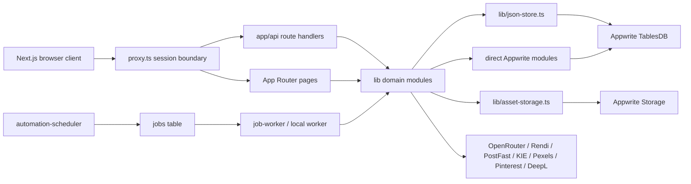
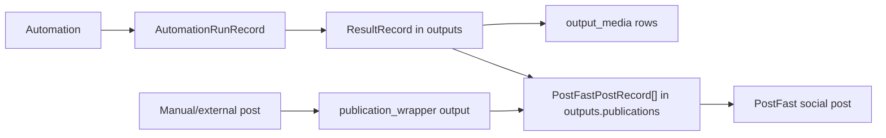

This is the canonical map of LumenClip's server-side architecture as it exists in
the repository. Domain object shapes are in [data-objects.md](data-objects.md),
the HTTP surface is in [backend-endpoints.md](backend-endpoints.md), and the
queue lifecycle is in [Backend scheduling](../scheduling/backend.md).

## Runtime topology



The HTTP layer is an adapter, not a separate backend. Most route handlers call
modules under `lib/`; scheduled work calls the same domain modules where
possible. The scheduled slideshow worker still contains a parallel JavaScript
pipeline, documented as a drift risk in [STATE.md](../STATE.md).

## Request and ownership boundary

`proxy.ts` protects `/app/**` and every `/api/**` route except `/api/auth/**`.
Authenticated requests use the HTTP-only `lumenclip-session` cookie. Domain
stores resolve the current Appwrite user again before reading or writing private
data; the proxy is not the only authorization check.

Ownership rules:

- Private rows have an `owner_id` Appwrite column.
- Serialized domain records normally also contain `ownerId` after persistence.
- Deterministic private row IDs hash physical table, `source_key` where
  applicable, owner ID, and domain record ID.
- Worker requests use `systemOwnerId()` so queued work remains attributed to the
  user who owns the automation.
- Shareable output categories may be read by accepted workspace collaborators;
  automations and mutable reference collections remain owner-only.
- Public reference categories are rows with a public store route, not separate
  globally public tables.

See [auth-and-multitenancy.md](auth-and-multitenancy.md) for the full contract.

## Persistence layers

### 1. Compatibility JSON-store API

Most domain modules still present a historical `rootDir + fileName + key`
interface through `lib/json-store.ts`. Despite the filesystem-looking API,
mapped mutable stores are Appwrite-only. There is no JSON-file fallback.

The mapping in `lib/appwrite-stores.ts` resolves each logical store to:

```ts
type StoreRoute = {
  table: string
  sourceKey: string
  public: boolean
  shareable?: boolean
}
```

`sourceKey` is required because multiple logical record types now share the
same physical table. Reads always filter it for consolidated tables.

### 2. Consolidated physical tables

Reusable inputs and generated outputs are polymorphic:

| Physical table     | Purpose                                                             | Discriminator                   |
| ------------------ | ------------------------------------------------------------------- | ------------------------------- |
| `permanent_assets` | Reusable collections, uploaded assets, and media-library entries    | `source_key`                    |
| `outputs`          | Results, generated videos, X/Threads runs, and publication wrappers | `source_key`                    |
| `output_media`     | Normalized media references belonging to an `outputs` row           | `output_id`, `role`, `position` |

Both consolidated parent tables retain the full serialized domain record in
`data` while projecting commonly queried fields into columns. The projected
columns are indexes/search aids; the TypeScript object serialized in `data` is
the compatibility source for domain hydration.

Common consolidated row fields:

```ts
type ConsolidatedRow = {
  rid: string
  owner_id?: string
  source_key: string
  name?: string
  status?: string
  created_raw?: string
  data: string
  ord: number
  // permanent_assets and outputs add category-specific projected columns
  // outputs project source ids, publication status, kind, and has_video
  // for targeted reads and aggregate counts
}
```

`output_media` is deleted and recreated when its parent output is updated. The
JSON-store hydrates normalized media rows back into the domain object before its
normalizer runs.

### 3. Dedicated physical tables

High-churn or operational records keep dedicated tables:

| Table                        | Record                                          | Access path              |
| ---------------------------- | ----------------------------------------------- | ------------------------ |
| `automations`                | Slideshow/video automation definitions          | JSON-store               |
| `automation_runs`            | Interactive and scheduled automation executions | JSON-store               |
| `x_automations`              | X/Threads automation definitions                | JSON-store               |
| `usage_ledger`               | Hook/image reuse events                         | JSON-store append/delete |
| `postfast_metric_snapshots`  | Per-post analytics snapshots                    | JSON-store append        |
| `account_follower_snapshots` | Per-account follower snapshots                  | JSON-store               |
| `jobs`                       | Scheduler/worker queue                          | Direct TablesDB queries  |
| `workspace_members`          | Team invitation and access records              | Direct TablesDB queries  |
| `demos`                      | Settings demo-video metadata                    | Direct TablesDB queries  |

Tables such as `characters`, `character_generations`, `postfast_posts`,
`results`, and `generated_video_exports` may still exist in cloned Appwrite
schemas from earlier versions. They are not the active physical store for the
current app. Current results and generated videos use `outputs`; PostFast
publication records are embedded in an output's `publications` field.

## Logical-to-physical store map

This table mirrors `STORE_ROUTES` in `lib/appwrite-stores.ts`.

| Logical store                    | Physical table               | `source_key`                  | Visibility               | State  |
| -------------------------------- | ---------------------------- | ----------------------------- | ------------------------ | ------ |
| Image collections                | `permanent_assets`           | `image_collection`            | Owner-only               | Active |
| Uploaded/generated asset records | `permanent_assets`           | `uploaded_asset`              | Owner-only               | Active |
| Word/variable collections        | `permanent_assets`           | `word_collection`             | Owner-only               | Active |
| Product collections              | `permanent_assets`           | `product_collection`          | Owner-only               | Active |
| Media-library catalog            | `permanent_assets`           | `media_library_asset`         | Public reference         | Active |
| Automation templates             | `permanent_assets`           | `automation_template`         | Public local reference   | Active |
| Template example runs            | `permanent_assets`           | `automation_template_example` | Public local reference   | Active |
| Results/slideshows               | `outputs`                    | `result`                      | Workspace-shareable read | Active |
| Generated video exports          | `outputs`                    | `generated_video`             | Workspace-shareable read | Active |
| X/Threads runs                   | `outputs`                    | `x_automation_run`            | Workspace-shareable read | Active |
| Publication-only wrappers        | `outputs`                    | `publication_wrapper`         | Owner-only               | Active |
| Slideshow/video automations      | `automations`                | `automations_automations`     | Owner-only               | Active |
| Automation runs                  | `automation_runs`            | `automations_runs`            | Owner-only               | Active |
| X/Threads automations            | `x_automations`              | `x-automations_automations`   | Owner-only               | Active |
| Usage records                    | `usage_ledger`               | `usage-ledger`                | Owner-only               | Active |
| Post analytics snapshots         | `postfast_metric_snapshots`  | `postfast-metric-snapshots`   | Owner-only               | Active |
| Follower snapshots               | `account_follower_snapshots` | `account-follower-snapshots`  | Owner-only               | Active |

For dedicated tables, `source_key` is compatibility metadata rather than a
cross-type discriminator.

Automation template definitions and curated example runs live in local
Appwrite as public reference categories. Creating a user automation writes a
separate owner-scoped row to `automations`.

## Output and publication model

Generated content and its social publication state are related but not the same
record lifecycle:



- `ResultRecord.status` describes generation: `succeeded | failed`.
- Slideshow render status is `exported | failed`.
- `PostFastPostRecord.status` describes distribution: draft, awaiting manual
  posting, review, scheduled, published, or failed.
- Marking something published writes publication evidence; it does not rename a
  generation status to "completed".
- A publication that does not match an existing output receives a small
  `publication_wrapper` output so publication history still has an owner and a
  stable parent.

## Binary storage

`lib/asset-storage.ts` persists files to Appwrite Storage. Some generation and
render paths also require local working files for ffmpeg/sharp before mirroring
or after downloading provider output.

`/api/local-assets/**` is a compatibility URL namespace, not proof that the
bytes live only on local disk. The route derives a deterministic Storage bucket
and file ID from the data-relative path and streams the Appwrite object, with
range support for video/audio.

| Path prefix            | Bucket                             |
| ---------------------- | ---------------------------------- |
| `music/`               | `music`                            |
| `image-collections/`   | `image_collections`                |
| `greenscreen_memes/`   | `greenscreen`                      |
| `slideshows/`          | `slideshows`                       |
| `ugc_avatar_videos/`   | `ugc_videos`                       |
| `backgrounds/`         | `backgrounds`                      |
| `assets/`              | `assets`                           |
| `product-collections/` | `product_images`                   |
| any other mapped path  | `misc`                             |
| settings demo videos   | `demos` (direct, not path-derived) |

Removed path categories such as `characters/`, knowledge-base files, and
benchmark images now fall through to `misc` if an old URL is requested; their
former dedicated mappings are no longer part of `bucketForPath()`.

File IDs use `sha256(relativePath).slice(0, 36)`. Do not add a second lookup
table for path-derived files unless the storage contract itself changes.

## External providers

| Provider                 | Server responsibility                                                  |
| ------------------------ | ---------------------------------------------------------------------- |
| OpenRouter               | Slideshow text, hooks, captions, X/Threads and LinkedIn copy           |
| Rendi                    | ffmpeg rendering and downloadable video outputs                        |
| PostFast                 | Connected accounts, uploads, drafts, scheduling, publishing, analytics |
| KIE                      | Image actions and generated images used by supported flows             |
| Pinterest / Pexels       | Collection discovery/import inputs                                     |
| DeepL                    | Optional automation translation                                        |
| Apify / FAL / DataForSEO | Optional discovery/generation branches                                 |

Provider credentials stay server-side. API responses return provider IDs,
status, and safe media references, never API keys or Appwrite credentials.

## Source-of-truth rules

1. `lib/appwrite-stores.ts` is authoritative for logical store routing.
2. Type definitions in `lib/` are authoritative for serialized domain shapes.
3. `app/api/**/route.ts` is authoritative for the internal HTTP contract.
4. Provisioning scripts define physical columns and indexes.
5. `data/realfarm.json` and `data/seeds/**` are read-only seed/fixture inputs,
   not mutable production stores.
6. Roadmap documents describe intended changes and must not be read as current behavior.
