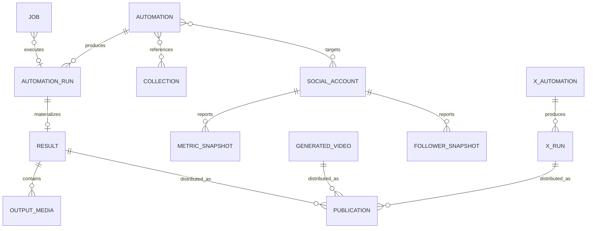

Canonical guide to LumenClip's serialized domain objects and their relationships.
Physical tables, store routing, and buckets are documented in
[backend-architecture.md](backend-architecture.md); HTTP request contracts are
in [backend-endpoints.md](backend-endpoints.md).

The TypeScript definitions in `lib/` remain the executable source of truth. This
document records the stable fields, lifecycle meanings, and persistence
relationships developers need before changing them.

## Conventions

- Domain objects usually use `camelCase`; older ReelFarm-shaped automation
  schema fields intentionally use `snake_case`.
- Appwrite projected columns use `snake_case`.
- Timestamps are ISO 8601 strings unless a type explicitly uses `Date` during
  in-memory editing.
- `id` is the domain identifier. Appwrite `$id` is a deterministic physical row
  identifier and should not leak into UI contracts.
- Private serialized records may contain `ownerId`; callers never select an
  owner by submitting this field.
- Mutable mapped records are Appwrite-only. Filesystem-looking `rootDir` and
  `fileName` arguments are compatibility routing keys, not a JSON fallback.
- A generation status and a publication status are different lifecycles.

## Entity map



The Appwrite `outputs` table is polymorphic: results, X runs, generated videos,
and publication-only wrappers share it and are distinguished by `source_key`.

## Static seed data

### `RealFarmData`

Source: `lib/realfarm-data.ts` and `data/realfarm.json`.

This is read-only seed/configuration data used to bootstrap brand copy, sample
cards, defaults, and local media catalogs. `loadRealFarmData()` adds runtime
assets from the media library.

```ts
type RealFarmData = typeof realfarmData & {
  assets: {
    music: LocalAsset[]
    greenscreenMemes: LocalAsset[]
    ctas: LocalAsset[]
    ugcAvatarVideos: LocalAsset[]
    demoVideos: LocalAsset[]
  }
}
```

The exact asset keys are derived by `loadRealFarmData()` and media-library
normalization. Seed projects/automations are fallbacks and examples, not mutable
workspace records.

### `LocalAsset` / `MediaLibraryAsset`

Sources: `lib/realfarm-data.ts`, `lib/media-library.ts`.

```ts
type MediaLibraryAsset = {
  id: string
  name: string
  path: string
  url: string
  kind: "audio" | "video" | "text"
  collection:
    "music" | "ugc_avatar_videos" | "demo_videos" | "greenscreen_memes" | "ctas"
  text?: string
}
```

Persistence: `permanent_assets` with `source_key=media_library_asset`.
The `url` uses `/api/local-assets/**`, which streams the corresponding Appwrite
Storage file.

## Automation definitions

### `AutomationRecord`

Source: `lib/automations.ts`.

Persistence: dedicated `automations` table.

```ts
type AutomationRecord = {
  ownerId?: string
  id: string
  sourceAutomationId?: string
  sourceUrl?: string
  name: string
  status: "live" | "paused" | "unknown"
  account: string
  handle: string
  times: string[]
  favorite: boolean
  theme: string
  importedAt?: string
  updatedAt: string
  schema: AutomationSchema
  raw?: Record<string, unknown>
}
```

`account`, `handle`, and `times` are summary/compatibility fields. The canonical
account targets and schedule live in `schema.social_integrations` and
`schema.schedule`; `automationRecordToSummary()` derives the UI summary from
them.

### `AutomationSchema`

Source: `lib/realfarm-automation.ts`.

The schema intentionally retains ReelFarm-compatible names because it is both
an editor model and an import format.

```ts
type AutomationSchema = {
  automationKind: "slideshow" | "video"
  aspect_ratio: "9:16" | "4:5" | "3:4" | "3:2" | "1:1"
  font: string
  title: string
  status: "live" | "paused"
  created_at: Date
  language: string
  image_fit: "cover" | "contain" | "fit"
  prompt_formatting: PromptFormatting
  hooks: AutomationHookItem[]
  image_collection_ids: ImageCollectionConfig
  hook_slots?: Record<string, string>
  hook_no_duplicate_slots?: boolean
  distinct_variable_draws?: boolean
  tone: AutomationToneSection
  formatting: AutomationFormattingItem[]
  video_format?: AutomationVideoFormat
  social_integrations: AutomationSocialIntegration[]
  tiktok_post_settings: TikTokPostSettings
  social_post_settings: AutomationSocialPostSettings
  social_publish_as: AutomationSocialPublishAs
  schedule: AutomationSchedule
  posting_mode?: "manual" | "review" | "auto"
  generation_lead_minutes?: number
  web_search_enabled?: boolean
  reuse_policy?: AutomationReusePolicy
  content_strategy?: AutomationContentStrategy
}
```

Important nested contracts:

- `hooks[]` contains stable automation-owned `{ id, text, enabled, createdAt,
updatedAt? }` items. Disabled items remain stored but are not selected.

- `formatting[]` contains canonical `hook`, `body`, and `cta` sections with
  content direction, word/count limits, text styling, layout, and per-section
  overlay choices. `slideCountMode: "varying"` is the persisted dynamic mode
  and uses `slideCountMin`/`slideCountMax`. Per-slide `slideOverrides` and
  `imageOverrides` are active generation inputs.
- `image_collection_ids` selects first-slide, all-slide, CTA, and optional demo
  media. Collection IDs are logical collection identifiers/names, not Storage
  bucket IDs.
- `schedule` contains timezone, posting days/times, and enabled state.
- `social_integrations` contains safe PostFast account metadata and per-target
  enablement.
- `tiktok_post_settings` retains the legacy name but contains general post
  caption/music/publish behavior used by supported social targets.
- Runtime variables such as `CURRENT_YEAR` are evaluated at generation time;
  `YEAR` is retired and filtered from word collections.

### `AutomationTemplateRecord`

Source: `lib/automation-templates.ts`.

Persistence: local Appwrite `permanent_assets` rows with
`source_key=automation_template`. Curated examples use
`source_key=automation_template_example`.

Template records store a normalized schema, presentation metadata, and curated
hooks. Creating a user automation clones/normalizes the template; subsequent
template changes do not mutate existing user automations.

## Automation execution and generated output

### `AutomationRunRecord`

Source: `lib/automation-runner.ts`.

Persistence: dedicated `automation_runs` table.

```ts
type AutomationRunRecord = {
  id: string
  automationId: string
  automationTitle: string
  scheduledFor: string
  generationSource?: "manual" | "scheduled"
  requestId?: string
  status: "running" | "succeeded" | "failed"
  postfastRecordId?: string
  slideshowId?: string
  videoUrl?: string
  thumbnailUrl?: string
  outputImages?: string[]
  outputDir?: string
  socialStatuses?: AutomationRunSocialStatus[]
  manuallyPublishedAt?: string
  renderedSlides?: AutomationRunRenderedSlide[]
  plan: AutomationRunPlan
  createdAt: string
  updatedAt: string
  error?: string
}
```

`scheduledFor` is the content slot even for a manual run. `generationSource`
states whether the scheduler or an explicit user action initiated it. A manual
generation has no automatic publication date unless the user separately
publishes/schedules it.

### `AutomationRunPlan`

The plan is the reproducible generation decision captured with the run:

```ts
type AutomationRunPlan = {
  title: string
  caption: string
  hashtags: string
  hook: string
  hookId?: string
  hookTemplate?: string
  hookSubstitutions?: Record<string, string>
  imageCollectionIds: string[]
  slides: AutomationRunSlide[]
  slideCount: { mode: string; count?: number; min?: number; max?: number }
  publishType: string
  autoMusic: boolean
  autoPost: boolean
  language: string
  textModel?: string
  reuseWarnings?: AutomationRunReuseWarning[]
  contentStrategy?: { routeId: string; format: string; ctaStrategy: string }
  debug?: Record<string, unknown>
}
```

Each slide records its role, chosen image and image key, caption, text,
placement/style payload, duration, and optional overlay. The hook ID preserves
catalog attribution even when variables expand the displayed hook text.

### `ResultRecord`

Source: `lib/results.ts`.

Persistence: `outputs` with `source_key=result`; related media is normalized to
`output_media`.

```ts
type ResultRecord = {
  ownerId?: string
  id: string
  automationId: string
  runId: string
  workflowType: "slideshow" | "video"
  title: string
  status: "succeeded" | "failed"
  createdAt: string
  updatedAt: string
  artifacts: {
    slideshowId?: string
    videoUrl?: string
    thumbnailUrl?: string
    outputImages: string[]
    outputDir?: string
  }
  payload?: ResultSlideshowPayload | ResultVideoPayload
  destinationAccountIds: string[]
}
```

There is at most one current result per run: creating a result removes older
records with the same `runId`.

### Slideshow structures

Sources: `lib/slideshows.ts`, `lib/slideshow-renderer.ts`.

```ts
type SlideshowDraft = {
  id: string
  automationId?: string
  title: string
  caption: string
  hashtags: string
  prompt: string
  image_collection: string
  slideshow_type: string
  created_at: string
  updated_at: string
  settings: SlideshowSettings
  images: SlideshowSlide[]
}

type SlideshowRenderOutputs = {
  status: "exported" | "failed"
  output_dir?: string
  output_images: string[]
  video_url?: string
  thumbnail_url?: string
}

type SlideshowRecord = SlideshowDraft & SlideshowRenderOutputs
```

Slideshow records are compatibility views over `ResultRecord` payloads; there
is no active `slideshows` metadata table. Rendered files live in the
`slideshows` Storage bucket.

`SlideshowSettings` is global to the slideshow: duration, aspect ratio, font,
background color, transition, video-export flag, and sound metadata. Individual
slides contain source image, rendered image, text items, overlays, and layout.

### `GeneratedVideoExport`

Sources: `lib/generated-video-types.ts`, `lib/generated-videos.ts`.

Persistence: `outputs` with `source_key=generated_video`.

```ts
type GeneratedVideoExport = {
  ownerId?: string
  id: string
  type: "greenscreen" | "ugc_ad" | "template_video"
  status: "queued" | "processing" | "ready" | "failed"
  createdAt: string
  updatedAt: string
  title: string
  description: string
  hashtags: string[]
  sourceConfig: Record<string, unknown>
  queuePosition?: number
  previewUrl?: string
  videoUrl?: string
  error?: string
  manuallyPublishedAt?: string
}
```

Ready/failed records do not retain a queue position. `manuallyPublishedAt` is
publication evidence used to prevent deletion; it is not a generation status.

## X and Threads automation

### `XAutomationRecord`

Source: `lib/x-automation.ts`.

Persistence: dedicated `x_automations` table.

The record groups all user-editable policy instead of scattering it across
separate settings tables:

```ts
type XAutomationRecord = {
  id: string
  ownerId?: string
  platform: "x" | "threads"
  name: string
  status: "live" | "paused"
  createdAt: string
  updatedAt: string
  niche: NicheConfig
  brief: XAutomationBrief | null
  excludedTopics: string[]
  proofBank: ProofEntry[]
  output: OutputPolicy
  generation: GenerationPolicy
  media: MediaPolicy
  discovery: DiscoveryPolicy
  benchmarks: XAutomationBenchmark[]
  publishing: {
    integrations: PostFastSocialIntegration[]
    autoPost: boolean
  }
  schedule: AutomationSchedule
  usage: RecentUseMemory
}
```

One automation targets one platform. `usage` stores bounded recent archetype,
hook, and body memory to reduce repetition.

### `XAutomationRun`

Persistence: `outputs` with `source_key=x_automation_run`.

```ts
type XAutomationRun = {
  id: string
  ownerId?: string
  automationId: string
  automationName: string
  topic: string
  platform: "x" | "threads"
  contentType: "single" | "thread" | "article"
  hook: string
  setup: string
  content: string[]
  proof: string
  curiosityGap: string
  cta: string
  posts: XGeneratedPost[]
  imagePrompt?: string
  imageUrls: string[]
  benchmark: XAutomationBenchmarkScore
  status: "draft" | "approved" | "scheduled" | "published" | "failed"
  scheduledFor?: string
  createdAt: string
  updatedAt: string
  publishing?: { attemptedAt: string; published: number; failed: number }
  needsReview?: boolean
  reviewErrors?: string[]
}
```

## Collections and reusable inputs

The canonical lifecycle and product-usage reference is
[Collections](../collections/overview.md). This section retains the serialized
contracts used alongside the other backend data objects.

### `StoredImageCollection`

Source: `lib/image-collections.ts`.

Persistence: `permanent_assets` with `source_key=image_collection`; imported
bytes use the `image_collections` Storage bucket.

```ts
type StoredImageCollection = {
  ownerId?: string
  name: string
  created_at: string
  pinned?: boolean
  mediaType?: "image" | "video"
  images: Array<{
    image_link: string
    caption: string
    hash?: string
    last_used_at?: string
  }>
}
```

The field is still named `images` for compatibility even when
`mediaType="video"`. Collection names are currently the effective identity for
upsert; deletion uses `{ name, created_at }`.

### `WordCollectionRecord`

Source: `lib/word-collections.ts`.

Persistence: `permanent_assets` with `source_key=word_collection`.

```ts
type WordCollectionRecord = {
  id: string
  name: string
  description?: string
  words: string[]
  source: "manual" | "ai"
  created_at: string
  updated_at: string
}
```

The ID is the runtime hook-variable tag. The retired `YEAR` record is ignored;
use the built-in `CURRENT_YEAR` runtime variable.

### `ProductCollection`

Source: `lib/product-collections.ts`.

Persistence: `permanent_assets` with `source_key=product_collection`; product
images use `product_images` Storage.

```ts
type ProductCollection = {
  ownerId?: string
  id: string
  name: string
  description: string
  items: ProductCollectionItem[]
  createdAt: string
  updatedAt: string
  commissionDisclaimer: string
  commissionSourceUrl?: string
}
```

Items contain marketplace URL, name, SGD price, commission estimate, source and
generated image URLs, use case, and sourcing timestamp. The current route is
read-only; import scripts populate these records.

### `AssetRecord`

Source: `lib/assets.ts`.

Persistence: `permanent_assets` with `source_key=uploaded_asset`; bytes normally
use the `assets` Storage bucket.

```ts
type AssetRecord = {
  id: string
  kind: "image" | "video" | "audio" | "text"
  source: "upload" | "ai_generated"
  status: "processing" | "ready" | "failed"
  scope: "ugc_ad" | "ugc_demo" | "greenscreen" | "global"
  category?:
    | "outfit"
    | "accessory"
    | "background"
    | "product"
    | "reference"
    | "sound"
    | "other"
  name: string
  caption: string
  prompt?: string
  model?: string
  mimeType?: string
  fileName?: string
  fileUrl?: string
  thumbnailUrl?: string
  createdAt: string
  updatedAt: string
  metadata?: Record<string, unknown>
  error?: string
}
```

Some category values, such as `reference`, remain for backward compatibility
after removal of the standalone character workspace.

## Publishing, calendar, and analytics

### `PostFastPostRecord`

Source: `lib/postfast-posts.ts`.

Persistence: serialized inside the parent output's `publications` JSON column.
Unmatched manual/external publications receive an `outputs` row with
`source_key=publication_wrapper`.

```ts
type PostFastPostRecord = {
  id: string
  sourceType:
    | "automation"
    | "x_automation"
    | "generated_video"
    | "asset"
    | "greenscreen"
    | "ugc_ad"
    | "image"
    | "slideshow"
    | "manual"
    | "external"
  sourceId: string
  postfastPostId?: string
  integrationId: string
  provider: string
  status:
    | "awaiting_manual_post"
    | "ready_for_review"
    | "draft"
    | "scheduled"
    | "published"
    | "failed"
  scheduledAt?: string
  publishedAt?: string
  releaseUrl?: string
  externallyManaged?: boolean
  externalPostId?: string
  content: string
  media: PostFastMedia[]
  createdAt: string
  updatedAt: string
  error?: string
}
```

The `outputs` row also projects a summary into `publication_status`,
`scheduled_at`, `published_at`, `primary_post_id`, and
`primary_release_url` for efficient calendar/status queries.

### `CalendarItem`

Source: `lib/calendar-items.ts`.

`CalendarItem` is a computed API view, not a persisted record. It merges:

- projected future automation slots;
- queued/processing/failed jobs;
- local output publication records; and
- remote PostFast scheduled/published posts.

Its lifecycle status is one of `planned`, `generating`, `needs_action`,
`ready_for_review`, `scheduled`, `published`, `generation_failed`, or `failed`.
Items contain targets, source identity, optional automation/content/live/cancel
links, preview/excerpt, and lifecycle timestamps.

### Analytics snapshots

Source: `lib/postfast-metric-snapshots.ts`.

```ts
type PostFastMetricSnapshot = {
  id: string
  postId: string
  platformPostId?: string
  integrationId: string
  provider: string
  capturedAt: string
  publishedAt?: string
  content?: string
  thumbnailUrl?: string
  releaseUrl?: string
  sourceType?: string
  sourceId?: string
  metrics: Partial<Record<CanonicalMetric, number>>
  latestMetric: Record<string, unknown>
  rawMetrics: Record<string, number>
  observedKeys: string[]
  source?: "postfast" | "tiktok_studio"
  tiktokStudio?: TikTokStudioAnalytics
}

type TikTokStudioAnalytics = {
  schemaVersion: 1
  studioUrl: string
  capturedSections: ("overview" | "viewers" | "engagement")[]
  slides: Array<{
    slideIndex: number
    retentionPercent?: number
    likeDistributionPercent?: number
    isRetentionDropPeak?: boolean
    isLikePeak?: boolean
  }>
  trafficSources: Record<string, number>
  searchTerms: Array<{ term: string; percent: number }>
  audience?: {
    uniqueViewers?: number
    newViewerPercent?: number
    returningViewerPercent?: number
    followerPercent?: number
    nonFollowerPercent?: number
    agePercent: Record<string, number>
    genderPercent: Record<string, number>
    countryPercent: Record<string, number>
  }
}

type AccountFollowerSnapshot = {
  id: string
  integrationId: string
  provider: string
  capturedAt: string
  followers: number
  netChange?: number
}
```

Metric snapshots are append-only with deterministic `(postId, capturedAt)`
IDs. Follower snapshots deduplicate per integration/day and retain at most
10,000 records through the current update path.

TikTok Studio captures first exist as short-lived
`TikTokStudioImportRecord` rows under the consolidated
`tiktok_studio_analytics_import` source key. Linking converts the derived
fields into a normal metric snapshot. The raw Studio response, TikTok
credentials, cookies, and signed image URLs are never stored.

Account-wide sync adds a `TikTokStudioBatchRecord` under
`tiktok_studio_analytics_batch`. It stores selected integration IDs, scope,
expiry, and an explicit list of child import IDs. Its API view adds per-post
status plus `total`, `captured`, and `linked` counts. The batch token authorizes
only those child post IDs.

## Operations and account data

### `Job`

Source: `lib/queue.ts` and Appwrite function workers.

Persistence: dedicated `jobs` table with structured columns; payload/result are
JSON strings.

```ts
type Job = {
  id: string
  type: string
  status: "queued" | "processing" | "completed" | "failed" | "dead"
  payload: unknown
  result: unknown
  error: string | null
  attempts: number
  maxAttempts: number
  availableAt: string | null
  createdAt: string | null
  updatedAt: string | null
  ownerId: string
}
```

`dedupe_key`, priority, lease/claim timestamps, and worker metadata also exist in
the physical row. Queue behavior is documented in
[Backend scheduling](../scheduling/backend.md).

### `UsageRecord`

Source: `lib/usage-ledger.ts`.

```ts
type UsageRecord = {
  id?: string
  automation_id: string
  account_key?: string
  hook_id?: string
  kind:
    | "hook_published"
    | "hook_combination_published"
    | "image"
    | "text"
  key: string
  run_id: string
  used_at: string
}
```

Append-style records let published hook combinations, images, and generated
text avoid recent reuse. New hook records are written only from confirmed
publication evidence; generation alone writes image/text reuse. The optional
`hook_id` provides stable catalog attribution.

### `WorkspaceMember`

Source: `lib/workspace-members.ts`.

Persistence: dedicated `workspace_members` table plus Appwrite Teams.

```ts
type WorkspaceMember = {
  id: string
  email: string
  status: "pending" | "accepted"
  memberUserId?: string
  createdAt: string
}
```

Physical rows additionally store owner/team/membership IDs. Accepted members
can read shareable output categories belonging to a workspace owner; they do
not own or mutate the owner's automations.

### `DemoVideo`

Source: `lib/demos.ts`.

```ts
type DemoVideo = {
  id: string
  title: string
  createdAt: string
  url: string
}
```

Metadata uses the `demos` table; bytes use the private `demos` bucket and are
served only after owner verification.

## Removed and legacy structures

The character/AI UGC-avatar workspace, knowledge bases, swipes, standalone
benchmark/research stores, and their API routes were removed from the current
product. Appwrite schemas cloned from older environments may still contain
their tables, but `lib/appwrite-stores.ts` no longer routes active domain calls
to them. Do not build new code against those legacy structures.

Likewise, old one-table-per-type names such as `results`,
`generated_video_exports`, `postfast_posts`, `automation_templates`, and
`media_library` may exist physically. Current generated records route through
`outputs`/`permanent_assets`; automation templates use the local
`permanent_assets` reference categories described above.

When removing another feature, delete or update its route reference, tab doc,
workflow diagram, data structure entry, and physical-store note together.
