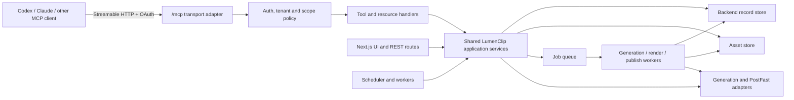

> **Status: Partially implemented.** The authenticated Streamable HTTP adapter,
> local stdio transport, automation/collection/output/account discovery,
> image/video collection bootstrapping and HTTPS imports,
> slideshow/X/Threads manual runs, safe automation updates, output status,
> confirmed PostFast publishing/manual linking, stored analytics reads, and
> three TikTok publication-reconciliation tools are shipped. Resources, OAuth
> scopes, template/create contracts, server-side video-automation execution,
> and saved LinkedIn automations remain future work · Updated: 2026-07-19

The implemented tools intentionally follow this roadmap's architecture: MCP
calls the same owner-scoped automation, schedule, generation, analytics, and
TikTok publication services used by the app. See
[Manual TikTok publication linking](/docs/roadmap/manual-tiktok-publication-linking).

## 1. Decision

Build a remote Model Context Protocol server named `lumenclip` that lets an AI
client discover a user's content system, create or update automations, generate
slideshows, work with collections, inspect outputs, and explicitly publish an
approved output.

The server should be a thin, tenant-aware interface over LumenClip's domain
services. It must not mirror every REST route, call the browser UI, expose raw
Appwrite access, or create a second implementation of generation and publishing
logic.

Primary transport:

```text
https://<lumenclip-host>/mcp
```

- Production: remote Streamable HTTP with OAuth.
- Local development: the same HTTP endpoint on the local app, plus an optional
  stdio bridge for clients that cannot connect to local HTTP.
- Server identity: `lumenclip`. Public tool names, OAuth scopes, and resource
  URIs use the same LumenClip namespace.

## 2. Why this shape

Two products provide useful but different reference points:

| Reference                                   | What to copy                                                                                                                                                  | What not to copy                                                                                               |
| ------------------------------------------- | ------------------------------------------------------------------------------------------------------------------------------------------------------------- | -------------------------------------------------------------------------------------------------------------- |
| [ReelFarm API](https://reel.farm/api-docs)  | Separate natural-language generation from direct-control slideshow creation; explicit automation/schedule contracts; lightweight asynchronous status polling. | A one-to-one API wrapper with a large CRUD surface and vendor-shaped internal fields.                          |
| [Higgsfield MCP](https://higgsfield.ai/mcp) | Task-oriented tools, OAuth, asynchronous generations, generation history, and the ability to reuse prior outputs as inputs.                                   | Model-specific tools for each provider or an MCP server that merely exposes a generation vendor.               |
| LumenClip today                             | Existing automation schemas, collections, slideshow/result records, PostFast accounts, job queue, ownership checks, and local/Appwrite backend split.         | Calling Next.js route handlers from MCP handlers or allowing MCP clients to bypass existing policy boundaries. |

The result is deliberately smaller than LumenClip's REST surface. An agent should
express a content task in one or two calls, receive an operation handle, and use
stable resources to inspect the result. It should not need to understand
`prompt_formatting`, Appwrite row shapes, storage buckets, or provider-specific
posting clients.

This follows MCP's intended separation: tools perform actions, resources provide
read-only context, and prompts package reusable user-invoked workflows. See the
[MCP server concepts](https://modelcontextprotocol.io/docs/learn/server-concepts).

## 3. Product use cases

The first release should make these conversations possible:

1. "Show my interior-design automations and the collections each one uses."
2. "Create a seven-slide post about making a small living room look expensive,
   using my `interior-design-general` collection."
3. "Show me the slideshow templates, open the editorial one, and adapt its
   hooks, collections, and slide directions for astrology beginners."
4. "Turn this brief into an automation that generates three times a week, but
   leave it paused for review."
5. "Generate one draft from that automation now."
6. "Use output `out_123` as the visual reference for another slideshow."
7. "What happened to the generation I started?"
8. "Publish the approved output to the selected TikTok account at 8:30 PM."
9. "I posted this manually; mark it published and save the public URL."

The first seven are normal agent operations. The last two are externally visible
mutations and require explicit user intent in the same interaction.

## 4. Principles

### 4.1 Task-oriented, not route-oriented

A tool is justified when it represents a complete user task. Do not add tools
such as `table_query`, `bucket_upload`, `patch_prompt_formatting`, or a separate
tool for every image/video provider. Provider choice is an implementation detail
unless the user explicitly requests a model and the automation schema permits
one.

### 4.2 One source of business logic

MCP, REST routes, the scheduler, and the UI must call shared application
services. Route handlers remain transport adapters. This prevents differences in
ownership checks, credit charging, defaults, generation behavior, and publish
status.

### 4.3 Asynchronous by default

Generation, rendering, imports, and publishing can outlive an MCP request. These
tools return an operation immediately. Agents poll a small operation record or
subscribe to its resource where the client supports resource subscriptions.

### 4.4 References instead of large media payloads

Tool results return resource URIs, metadata, thumbnails, and short-lived signed
HTTPS URLs. They never return an entire video as base64. A previous output can be
passed to another generation as `lumenclip://outputs/{id}`.

### 4.5 Safe defaults match the product

- A manually invoked generation creates an unpublished draft with no
  `scheduledAt` value.
- Scheduled automation runs continue to use the automation's configured
  auto-publish behavior.
- Creating an automation through MCP defaults to `paused`; enabling it is a
  deliberate update.
- Publishing and scheduling are separate explicit tools. Generation must never
  silently publish because an account happens to be connected.
- "Completed" means generation finished. It does not mean published. The public
  status is `not_published` until there is verified publication evidence.

## 5. Architecture



Target module boundary:

```text
app/mcp/route.ts                 # Streamable HTTP transport only
lib/mcp/
  server.ts                     # capability registration
  auth.ts                       # principal + OAuth scopes
  policy.ts                     # ownership, approvals, limits
  schemas.ts                    # public MCP schemas
  errors.ts                     # stable error mapping
  tools/
  resources/
  prompts/
lib/services/
  automations.ts                # shared by REST, MCP, workers
  collections.ts
  content-generation.ts
  operations.ts
  outputs.ts
  publishing.ts
scripts/lumenclip-mcp-stdio.mjs      # optional local bridge
```

`app/mcp/route.ts` should contain no domain decisions. Before implementation,
read the matching Next.js 16.2.6 route-handler documentation under
`node_modules/next/dist/docs/`, as required by this repository's `AGENTS.md`.

## 6. Public model

MCP should expose a small stable vocabulary even if internal record shapes
change:

| Public object | Purpose                                                                    | Backed by today                                         |
| ------------- | -------------------------------------------------------------------------- | ------------------------------------------------------- |
| `Automation`  | Reusable content recipe, schedule, media strategy, and publishing policy   | automation records and runtime schemas                  |
| `Collection`  | Curated reusable images, video clips, products, words, or media            | image/product/word collections and media library        |
| `Output`      | Generated slideshow, video, image, or social post draft                    | slideshows, results, generated video exports, X results |
| `Operation`   | Long-running generation, import, render, or publish attempt                | jobs and automation runs                                |
| `Account`     | Safe connected social-account metadata                                     | PostFast integrations, with tokens removed              |
| `Template`    | Immutable catalog starting point with editable-field metadata and examples | automation templates and presets                        |

Every object includes `id`, `owner_id` only when useful to the caller, `created_at`,
`updated_at`, and a `resource_uri`. Internal table names, bucket IDs, API tokens,
and provider credentials are never public fields.

## 7. Version-one tools

Use a stable `lumenclip_` prefix in raw MCP tool names. Some clients add their own
server prefix, but raw names must still be collision-resistant and readable.

### 7.1 Discovery and inspection

| Tool                         | Purpose                                                                                     | Required scope   | MCP hints                         |
| ---------------------------- | ------------------------------------------------------------------------------------------- | ---------------- | --------------------------------- |
| `lumenclip_workspace_get`    | Return the current user/workspace, limits, defaults, and enabled capabilities.              | `lumenclip:read` | read-only, idempotent             |
| `lumenclip_templates_list`   | Search template summaries by automation kind, platform, format, tags, or capability.        | `lumenclip:read` | read-only, idempotent             |
| `lumenclip_template_get`     | Return one full template, examples, required capabilities, and its allowed override schema. | `lumenclip:read` | read-only, idempotent             |
| `lumenclip_automations_list` | Search/filter automations by kind, status, platform, or collection.                         | `lumenclip:read` | read-only, idempotent             |
| `lumenclip_automation_get`   | Return a normalized automation plus linked collections/accounts.                            | `lumenclip:read` | read-only, idempotent             |
| `lumenclip_collections_list` | Search collections by media type, name, tags, and minimum item count.                       | `lumenclip:read` | read-only, idempotent             |
| `lumenclip_outputs_list`     | Find generated outputs by automation, status, type, date, or platform.                      | `lumenclip:read` | read-only, idempotent             |
| `lumenclip_accounts_list`    | List safe connected-account metadata and supported publishing capabilities.                 | `lumenclip:read` | read-only, idempotent, open-world |
| `lumenclip_operation_get`    | Return lightweight status, progress, warnings, costs, and result resource URIs.             | `lumenclip:read` | read-only, idempotent             |

List tools use cursor pagination. They return concise summaries rather than full
schemas or media lists; the corresponding resource provides full detail.

### 7.2 Configuration and asset tools

| Tool                                        | Purpose                                                                                                                                  | Required scope    | Default behavior                                             |
| ------------------------------------------- | ---------------------------------------------------------------------------------------------------------------------------------------- | ----------------- | ------------------------------------------------------------ |
| `lumenclip_automation_save`                 | Create a new automation from a normalized brief when no catalog template fits.                                                           | `lumenclip:write` | Creates a paused user-owned automation.                      |
| `lumenclip_automation_create_from_template` | Clone an immutable catalog template into a user-owned automation and apply validated overrides.                                          | `lumenclip:write` | Creates a paused automation and records template provenance. |
| `lumenclip_automation_preview`              | Resolve template overrides, a new brief, or an existing-automation patch and return the effective configuration and diff without saving. | `lumenclip:read`  | No mutation, generation, or credit charge.                   |
| `lumenclip_automation_update`               | Apply an approved patch to a caller-owned automation using an update mask and expected version.                                          | `lumenclip:write` | Rejects stale versions and immutable fields.                 |
| `lumenclip_collection_save`                 | Create/update a typed collection and its description/tags.                                                                               | `lumenclip:write` | Does not delete omitted items.                               |
| `lumenclip_collection_add_assets`           | Import uploaded/resource/HTTPS assets, deduplicate them, and optionally caption them.                                                    | `lumenclip:write` | Asynchronous above a small item threshold.                   |

The collection import tool accepts only trusted MCP resource URIs, existing
LumenClip output URIs, or validated HTTPS URLs. It must apply SSRF protection, MIME
validation, size limits, hashing, and per-item error reporting.

Catalog templates are read-only. An agent never edits a shared template record
in place. It calls `lumenclip_automation_create_from_template` to create a
user-owned automation, then uses preview/update tools to customize that copy.
This matches the app: later catalog changes do not mutate existing user
automations.

### 7.3 Generation and publishing tools

| Tool                              | Purpose                                                                                            | Required scope       | Default behavior                                                         |
| --------------------------------- | -------------------------------------------------------------------------------------------------- | -------------------- | ------------------------------------------------------------------------ |
| `lumenclip_slideshow_generate`    | Turn a natural-language brief plus optional collection/template references into a slideshow draft. | `lumenclip:generate` | Asynchronous, unpublished, unscheduled.                                  |
| `lumenclip_slideshow_create`      | Create a deterministic slideshow from explicit slide text/media/layout inputs.                     | `lumenclip:generate` | Asynchronous only when media generation or rendering is requested.       |
| `lumenclip_automation_run`        | Generate one draft using an existing automation.                                                   | `lumenclip:generate` | Manual run: unpublished and unscheduled, even if the automation is live. |
| `lumenclip_output_publish`        | Publish now or schedule an existing ready output to explicit account IDs.                          | `lumenclip:publish`  | Requires confirmation fields; asynchronous.                              |
| `lumenclip_output_mark_published` | Record a manual publication URL/provider ID without sending anything to a provider.                | `lumenclip:publish`  | Verifies ownership and URL shape; idempotent.                            |

Do not expose the internal scheduler's "run due automations" operation. It is an
infrastructure action, not an end-user task.

### 7.4 Proposed import, merge, analytics, and export tools

These tool families are specified for the public contract but remain deferred
until the corresponding product capability, authorization scope, and data model
are stable.

| Tool                                 | Purpose                                                                                                                               | Proposed scope     | Availability                |
| ------------------------------------ | ------------------------------------------------------------------------------------------------------------------------------------- | ------------------ | --------------------------- |
| `lumenclip_external_assets_search`   | Search approved external sources such as Pinterest or Pexels and return preview metadata plus a short-lived selection token.          | `lumenclip:read`   | Proposed                    |
| `lumenclip_collection_merge_preview` | Resolve source and destination versions, duplicates, caption conflicts, attribution, dependencies, and final counts without mutation. | `lumenclip:read`   | Proposed                    |
| `lumenclip_collection_merge`         | Apply an approved preview idempotently while keeping source deletion off by default.                                                  | `lumenclip:import` | Proposed                    |
| `lumenclip_collection_delete`        | Soft-delete one collection for 30 days, blocking references by default and requiring explicit confirmation.                           | `lumenclip:write`  | Implemented focused subset  |
| `lumenclip_analytics_report`         | Read latest-per-post totals and follower movement from owner-scoped stored analytics snapshots.                                       | `lumenclip:read`   | Implemented focused subset  |
| `lumenclip_export_create`            | Export selected public objects, analytics reports, or generated media as JSON, CSV, or a manifest-backed ZIP.                         | `lumenclip:export` | Deferred beyond version one |

The canonical task-family contracts are documented under [MCP tools and
workflows](/docs/workflows/mcp).

### 7.5 Deferred tools

Do not include these in version one:

- Account connection/disconnection. OAuth linking is safer in the LumenClip UI and
  requires a browser flow.
- Destructive bulk deletion.
- Raw analytics queries until the snapshot/capability redesign is fully shipped.
- Character training and faceless-video workflows until their contracts are
  stable enough to expose without provider leakage.
- Arbitrary provider/model invocation.
- Direct X/Threads-specific tools. They should converge on the same `Automation`
  and `Output` model first.

## 8. Resource catalog

Resources are canonical read-only views. Tools should return resource links so
the client can fetch detail only when it needs it.

| URI or template                       | MIME type                 | Contents                                                                              |
| ------------------------------------- | ------------------------- | ------------------------------------------------------------------------------------- |
| `lumenclip://workspace/current`       | `application/json`        | Workspace identity, quotas, locale, timezone, and capabilities.                       |
| `lumenclip://automations/{id}`        | `application/json`        | Normalized automation, schedule, content recipe, linked IDs, and last-run summary.    |
| `lumenclip://collections/{id}`        | `application/json`        | Collection metadata and paginated item summaries.                                     |
| `lumenclip://outputs/{id}`            | `application/json`        | Output metadata, slide manifest, publication state, previews, and signed media links. |
| `lumenclip://operations/{id}`         | `application/json`        | Current operation state, progress, warnings, costs, and output links.                 |
| `lumenclip://templates/{id}`          | `application/json`        | Stable template configuration and accepted variables.                                 |
| `lumenclip://templates/{id}/examples` | `application/json`        | Curated example outputs and the template version that produced them.                  |
| `lumenclip://schemas/automation`      | `application/schema+json` | Current public automation input schema.                                               |
| `lumenclip://schemas/slideshow`       | `application/schema+json` | Current direct-control slideshow schema.                                              |
| `lumenclip://analytics/reports/{id}`  | `application/json`        | Attributed metrics, unavailable fields, filters, source snapshots, and warnings.      |
| `lumenclip://exports/{id}`            | `application/json`        | Export manifest, format, checksum, item counts, expiry, and signed download link.     |

Operation and output resources should support change notifications where the
client supports subscriptions. Polling remains the compatibility baseline.

## 9. Prompts

Prompts are user-invoked workflow starters, not hidden system behavior.

| Prompt                     | Arguments                                                      | Resulting workflow                                                                                                                         |
| -------------------------- | -------------------------------------------------------------- | ------------------------------------------------------------------------------------------------------------------------------------------ |
| `build_content_automation` | goal, niche, platforms, cadence, optional collection/template  | Inspect matching templates, show the resolved configuration and diff, then create or update a paused user-owned automation after approval. |
| `generate_content_batch`   | automation or brief, count, optional date range                | Generate multiple drafts with controlled hook/media diversity; never schedule or publish implicitly.                                       |
| `repurpose_output`         | source output URI, target format/platform, optional collection | Read the prior output and generate a new draft while retaining source provenance.                                                          |

These prompts should remain short. The product's actual hooks, style rules,
runtime variables, and collection metadata belong in resources and application
services, not duplicated inside MCP prompt text.

## 10. Core contracts

### 10.1 Operation envelope

Every asynchronous mutation returns the same structured payload:

```json
{
  "operation": {
    "id": "op_01J...",
    "kind": "slideshow.generate",
    "status": "queued",
    "progress": 0,
    "created_at": "2026-07-16T10:00:00.000Z",
    "next_poll_after_ms": 5000,
    "resource_uri": "lumenclip://operations/op_01J..."
  },
  "outputs": [],
  "warnings": []
}
```

Operation states:

```text
queued -> running -> rendering -> succeeded
                  \-> failed
queued/running    \-> cancelled
```

Publishing is an operation kind, not an output generation status. A generated
output has its own publication state:

```text
not_published -> publishing -> published
                         \-> publish_failed
```

`operation_get` is intentionally cheap: it does not return slide manifests,
binary data, or full logs.

### 10.2 Natural-language slideshow generation

Representative input:

```json
{
  "brief": "7-slide post: small living-room changes that look expensive",
  "collection_ids": ["interior-design-general"],
  "template_id": "interior-design-editorial-v1",
  "slide_count": 7,
  "aspect_ratio": "9:16",
  "language": "en",
  "render_video": false,
  "idempotency_key": "client-task-123"
}
```

The service resolves hooks, runtime variables, media selection, caption rules,
and layout defaults. If a request conflicts with the selected template, the tool
returns warnings and the resolved plan; it does not silently discard the user's
constraints.

### 10.3 Direct-control slideshow creation

Representative input:

```json
{
  "title": "Small living room — 5 fixes",
  "aspect_ratio": "9:16",
  "slides": [
    {
      "text": "Your living room isn't too small.\nYour layout is fighting it.",
      "media": {
        "resource_uri": "lumenclip://collections/col_123/items/img_4"
      },
      "layout": "centered-highlight"
    }
  ],
  "render_video": false,
  "idempotency_key": "client-task-124"
}
```

Media is referenced, not copied into the request. Text highlighting uses the
same per-line fitted background implementation as the slideshow editor; MCP
does not invent a parallel rendering style system.

### 10.4 Explicit publish contract

Representative input:

```json
{
  "output_id": "out_123",
  "targets": [
    {
      "account_id": "acct_456",
      "mode": "schedule",
      "scheduled_at": "2026-07-18T12:30:00+08:00"
    }
  ],
  "caption": "Optional approved override",
  "confirm_publish": true,
  "idempotency_key": "publish-out-123-acct-456-20260718"
}
```

The server rejects the call if the account, timestamp/timezone, output readiness,
or confirmation is missing. It returns the resolved provider/account names so
the client can show exactly where the content is going.

### 10.5 Template discovery and customization

`lumenclip_templates_list` returns concise summaries, not full template payloads:

```json
{
  "filters": {
    "automation_kind": "slideshow",
    "format": "9:16",
    "tags": ["education"]
  },
  "cursor": null,
  "limit": 20
}
```

Each result includes the template ID, name, automation kind, supported output
types, required capabilities, tags, current version, example resource URI, and
template resource URI. `lumenclip_template_get` returns the full normalized
template and an `allowed_overrides_schema`; it never returns storage-specific
Appwrite fields.

Creating a customized automation from a catalog template is explicit:

```json
{
  "template_id": "interior-design-editorial-v1",
  "template_version": "3",
  "name": "Astrology Basics",
  "overrides": {
    "topic": "astrology education for beginners",
    "hooks": [
      "why your sun moon and rising signs can feel completely different"
    ],
    "collection_ids": ["astrology-editorial"],
    "sections": {
      "content": {
        "content_direction": "Explain one concept plainly; qualify it as astrology rather than scientific fact."
      }
    }
  },
  "idempotency_key": "create-astrology-basics-v1"
}
```

The result contains a paused, user-owned automation plus provenance:

```json
{
  "automation": {
    "id": "auto_123",
    "status": "paused",
    "source_template": {
      "id": "interior-design-editorial-v1",
      "version": "3"
    },
    "resource_uri": "lumenclip://automations/auto_123"
  },
  "applied_overrides": [
    "topic",
    "hooks",
    "collection_ids",
    "sections.content.content_direction"
  ],
  "warnings": []
}
```

Customization is a preview-then-apply flow. `lumenclip_automation_preview` accepts
exactly one source: a template ID/version plus overrides, a normalized brief,
or an automation ID/version plus patch. It returns validation issues,
compatibility warnings, a field-level diff, and the full effective
configuration. For a template source the diff compares the catalog template to
the proposed user-owned copy. For an automation source the diff compares the
saved version to the proposed edit. After the user approves that diff, the
agent calls `lumenclip_automation_create_from_template`, `lumenclip_automation_save`, or
`lumenclip_automation_update` with an idempotency key.

Representative preview input for an existing automation:

```json
{
  "source": {
    "automation_id": "auto_123",
    "expected_version": 4
  },
  "update_mask": [
    "hooks",
    "collection_ids",
    "sections.content.content_direction"
  ],
  "patch": {
    "hooks": [
      "why your sun moon and rising signs can feel completely different"
    ],
    "collection_ids": ["astrology-editorial"],
    "sections": {
      "content": {
        "content_direction": "Explain one placement plainly and avoid predictive certainty."
      }
    }
  }
}
```

Representative preview result:

```json
{
  "valid": true,
  "base_version": 4,
  "diff": [
    {
      "path": "collection_ids",
      "before": ["interior-design-general"],
      "after": ["astrology-editorial"]
    }
  ],
  "effective_automation": {
    "resource_uri": "lumenclip://previews/automation-edit/preview_123"
  },
  "warnings": []
}
```

The apply call repeats the approved patch and adds mutation controls:

```json
{
  "automation_id": "auto_123",
  "expected_version": 4,
  "update_mask": [
    "hooks",
    "collection_ids",
    "sections.content.content_direction"
  ],
  "patch": {
    "hooks": [
      "why your sun moon and rising signs can feel completely different"
    ],
    "collection_ids": ["astrology-editorial"],
    "sections": {
      "content": {
        "content_direction": "Explain one placement plainly and avoid predictive certainty."
      }
    }
  },
  "preview_id": "preview_123",
  "idempotency_key": "update-auto-123-v4-astrology"
}
```

Editable fields include the name, topic/niche, audience, hooks, section content
directions, prompt/style settings, collection IDs, media-selection policy,
platform settings, schedule, and publishing policy when supported by that
automation kind. Immutable fields include ownership, catalog template records,
historical run snapshots, generated outputs, and provider credentials.

Removing a field requires an explicit update-mask entry and `null` only where
the public schema marks the field nullable. Omitted fields are preserved. A
stale `expected_version` returns `VERSION_CONFLICT` with the latest automation
resource URI; the server never silently overwrites concurrent UI changes.

## 11. Authentication and authorization

Remote HTTP uses the MCP authorization flow with LumenClip as the protected resource
server and an OAuth 2.1-compatible authorization server. Publish narrow scopes:

| Scope                | Allows                                                                                   |
| -------------------- | ---------------------------------------------------------------------------------------- |
| `lumenclip:read`     | Workspaces, safe accounts, automations, collections, operations, outputs, and templates. |
| `lumenclip:write`    | Create/update automations and collections; never publish.                                |
| `lumenclip:generate` | Start billable generation/render operations.                                             |
| `lumenclip:publish`  | Publish, schedule, or mark outputs published.                                            |

Clients should request scopes incrementally. A client used only to audit content
does not need write, generation, or publish authority. The remote server exposes
protected-resource metadata and never accepts tokens in query strings. The
[MCP authorization specification](https://modelcontextprotocol.io/specification/2025-11-25/basic/authorization)
is the implementation baseline.

For local stdio, credentials come from the local environment/session adapter,
not the HTTP OAuth flow. The adapter must refuse to start against a production
host unless the user explicitly opts in.

Authorization rules:

- Resolve the principal before listing capabilities or tool results.
- Apply the same owner/workspace visibility checks used by the app.
- Never trust an `owner_id` supplied by a tool caller.
- Check ownership again in the service that performs the mutation, not only in
  the MCP adapter.
- Do not expose PostFast tokens, Appwrite keys, signed provider requests, auth
  cookies, or disconnected accounts.
- Audit actor, client ID, tool, object IDs, operation ID, scopes, duration,
  outcome, and estimated/actual credits. Redact prompts only where product
  privacy policy requires it; always redact credentials and authorization
  headers.

## 12. Safety, cost, and reliability

### 12.1 Tool risk classes

| Class                | Examples                                      | Policy                                                                                                  |
| -------------------- | --------------------------------------------- | ------------------------------------------------------------------------------------------------------- |
| Read                 | list/get tools and resources                  | No special confirmation.                                                                                |
| Internal write       | create/update automation or collection        | Validate, preview diff, expected version, idempotency key; destructive changes require explicit fields. |
| Billable generation  | generate/create/run/import with AI captioning | Return estimate when possible; enforce workspace quota and concurrency limit.                           |
| External side effect | publish/schedule                              | Require `confirm_publish`, explicit accounts and time, idempotency, and audit trail.                    |

Use MCP tool annotations (`readOnlyHint`, `destructiveHint`, `idempotentHint`, and
`openWorldHint`) accurately, while treating them as UI hints rather than security
controls.

### 12.2 Idempotency and retries

- All mutation tools accept `idempotency_key`.
- The key is scoped to principal + tool + workspace and retained long enough to
  cover normal agent retries.
- Reusing a key with the same normalized input returns the original operation or
  result.
- Reusing it with different input returns `IDEMPOTENCY_CONFLICT`.
- Provider retries happen in workers with bounded backoff; an MCP request never
  waits through provider retry loops.
- Publishing records a provider request ID before retrying so a timeout cannot
  cause duplicate posts.

### 12.3 Media and URL handling

- Maximum counts and byte sizes are enforced before enqueueing.
- Remote URLs allow only `https`, resolve DNS safely, reject private/link-local
  addresses, cap redirects, and re-check every redirect target.
- MIME is detected from content, not trusted from a file extension.
- Imported media is hashed for deduplication and scanned before it becomes a
  collection item.
- Signed output URLs are short-lived. Durable references use `lumenclip://` URIs.

## 13. Errors and observability

Tool failures return a stable machine code, a concise message, retry guidance,
and an operation/resource ID where one exists:

```json
{
  "error": {
    "code": "COLLECTION_TOO_SMALL",
    "message": "The selected collection has 4 usable images; this template requires 7.",
    "retryable": false,
    "details": {
      "collection_id": "col_123",
      "required": 7,
      "usable": 4
    }
  }
}
```

Initial stable codes:

- `UNAUTHENTICATED`, `FORBIDDEN`, `NOT_FOUND`
- `INVALID_INPUT`, `INVALID_RESOURCE_URI`, `UNSUPPORTED_CAPABILITY`
- `QUOTA_EXCEEDED`, `RATE_LIMITED`, `CONCURRENCY_LIMIT`
- `COLLECTION_EMPTY`, `COLLECTION_TOO_SMALL`, `MEDIA_UNAVAILABLE`
- `OUTPUT_NOT_READY`, `PUBLISH_CONFIRMATION_REQUIRED`
- `IDEMPOTENCY_CONFLICT`, `PROVIDER_UNAVAILABLE`, `OPERATION_FAILED`
- `TEMPLATE_VERSION_UNAVAILABLE`, `OVERRIDE_NOT_ALLOWED`, `VERSION_CONFLICT`

Metrics should cover tool calls, latency, failures by code, queue delay,
generation/render duration, provider retry count, credits, and publish outcomes.
Logs correlate `mcp_request_id`, `operation_id`, existing run IDs, and provider
request IDs without logging credentials.

## 14. Delivery plan

### Phase 0 — domain boundary and contract tests

1. Extract application services from route-specific code for automation reads,
   collection reads, output reads, operation status, generation, and publishing.
2. Keep existing API responses unchanged while switching route handlers to those
   services.
3. Define public Zod schemas independently of Appwrite and ReelFarm-shaped
   storage records.
4. Add contract tests proving REST and MCP adapters produce the same domain
   result and enforce the same owner boundary.

This phase is the prerequisite. Building MCP directly over the current route
handlers would preserve route coupling and make background operations fragile.

### Phase 1 — read-only remote MCP

Ship Streamable HTTP, OAuth, resource metadata, the nine read tools, resource
templates, pagination, redaction, and audit logs. Validate with at least two MCP
clients and the MCP Inspector.

### Phase 2 — generation

Ship collection writes, slideshow generate/create, automation manual run, the
template-to-automation clone flow, preview/update flow, operation envelope,
signed previews, idempotency, quota checks, and subscriptions where supported.
Manual generations must remain unscheduled and `not_published`.

### Phase 3 — publishing and prompts

Ship explicit publish/schedule, mark-published, narrow publish scope,
provider-safe retries, and the three workflow prompts. Run duplicate-publish and
wrong-tenant failure tests before enabling this scope for normal users.

### Phase 4 — convergence

Move X/Threads and later video/character workflows onto the common public object
model, then add tools only for stable end-user tasks. Add analytics resources
after the snapshot redesign is the source of truth.

## 15. Acceptance criteria

The initial MCP feature is ready when:

- A user can connect a remote client through OAuth without copying an Appwrite or
  PostFast secret.
- A read-only token cannot invoke write, generate, or publish tools.
- Cross-owner IDs return `NOT_FOUND` or `FORBIDDEN` without leaking object
  metadata.
- An agent can discover an automation and collection, start a slideshow draft,
  poll one operation resource, and receive an output resource with a working
  preview.
- An agent can list templates, inspect the full editable schema and examples,
  clone a selected version, preview a customization diff, and save the approved
  user-owned automation without mutating the catalog template.
- The same prior output can be referenced in a second generation without
  downloading and re-uploading it.
- Retrying any mutation with the same idempotency key cannot create a duplicate
  operation or social post.
- A manual generation has no publication date and displays as
  `not_published` in the app.
- Publishing cannot occur without explicit target account IDs and
  `confirm_publish: true`.
- Tools never return credentials, internal Appwrite configuration, raw auth
  cookies, or large base64 media.
- MCP and the existing UI/API pass shared service contract tests.
- A local stdio client works against the one-command local development stack
  without cloud Appwrite credentials.

## 16. Explicit non-goals

- Replacing LumenClip's UI or public HTTP API.
- Letting agents manage infrastructure, Appwrite tables, workers, or secrets.
- Exposing every generation provider as a first-class MCP concept.
- Automatically publishing content merely because generation succeeded.
- Treating MCP prompts as the source of truth for content quality rules.
- Returning full media binaries inside normal JSON tool results.
