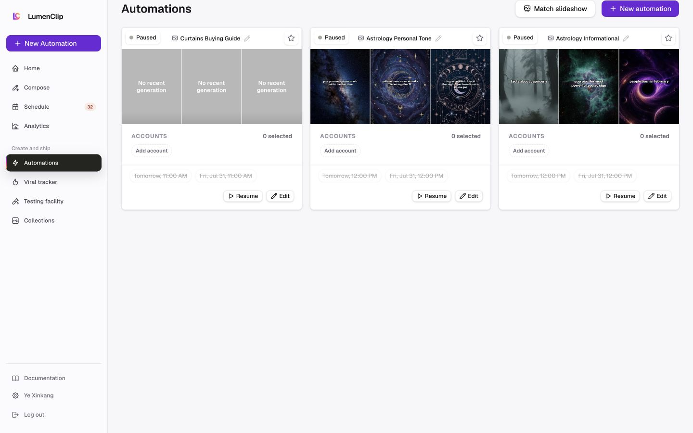

# Automations

Route: `/app?view=automations`

## Purpose

Manage saved content automations, their status, connected accounts, recent output, and upcoming runs.

## Desktop layout

- Automations is the active destination in the persistent sidebar.
- Match slideshow and New automation sit beside the H1.
- Cards form a three-column grid.
- Each card contains pause/resume state, favorite, inline rename, three recent previews, account selection, upcoming runs, Resume, and Edit.

## Mobile layout

- The shell becomes a compact header and the action pair remains at the top.
- Automation cards stack into a single column.
- The production mobile capture did not finish resolving card data, so the loading skeleton is excluded from canonical documentation.

## Interactions

- Create an automation or match an existing slideshow.
- Pause/resume, favorite, rename, edit, and configure accounts.
- Open recent generated output.

## MCP support

The automation area has strong MCP parity: list, get, create, clone, update, delete, run, schedule, and template tools cover the core record and execution lifecycle. Preview viewing and inline card presentation remain browser-only.

## Audit notes

- Card density is high but the grouping is coherent on desktop.
- Cancelled upcoming times remain visible with strike-through while paused, which preserves schedule context.
- The mobile card should prioritize name/status and move lower-frequency actions into a scoped menu.
