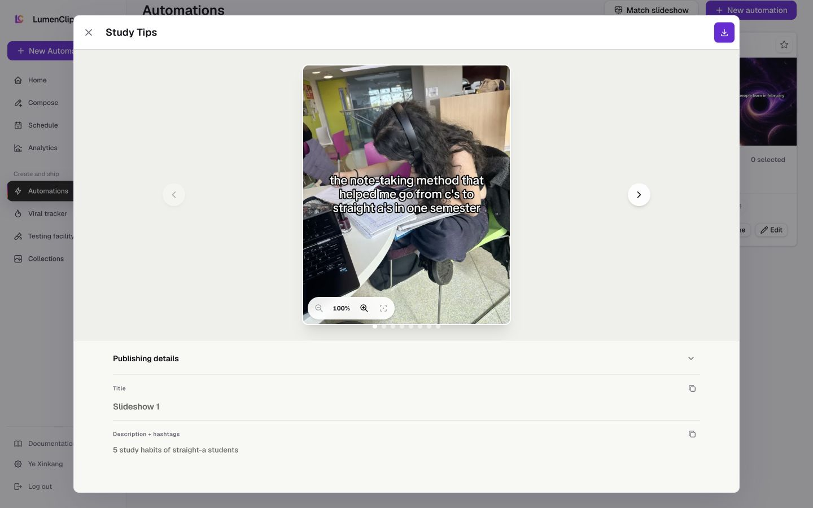

# Automation template browser

Parent route: `/app?view=automations`

## Purpose

Find a proven automation package, inspect its example output, and add it to the workspace.

## Desktop layout

- A large modal contains search, media/type filters, sorting, and a create-new action.
- Templates use a two-column card grid with preview, name, type, Open, and Add.
- Open launches a nested slideshow-detail viewer with slide navigation, zoom, export, and publishing metadata.

## Mobile layout

- The catalog becomes a single internal column and is several screens tall.
- Filters require horizontal compression/scrolling.
- A clean mobile screenshot remains pending because the production workspace became stuck in its loading state before the modal could be reopened.

## Interactions

- Search, filter, and sort templates.
- Open examples for inspection.
- Add/clone a template into the workspace.
- Navigate and export example slides from the nested viewer.

## MCP support

Template list and automation clone/create tools cover discovery and installation. Example-viewer navigation, zoom, and PNG export are browser presentation actions.

## Audit notes

- The modal's semantic title is visually hidden, so users encounter controls before identity.
- Open and Add communicate distinct outcomes well, but Add should confirm the created automation name.
- The nested slideshow viewer creates a second modal layer and must preserve an obvious return path.
