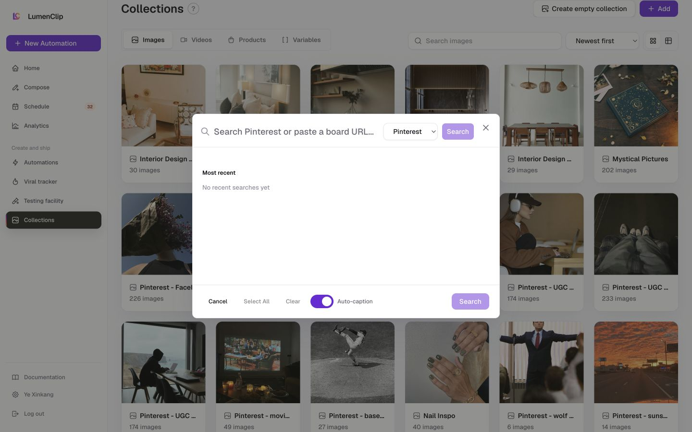
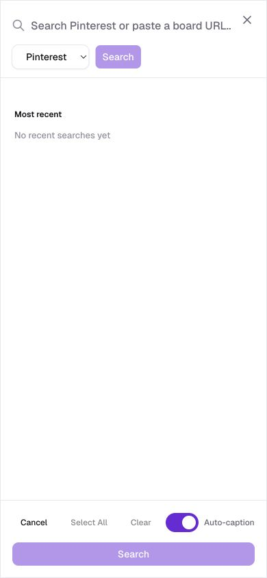

# Collection asset importer

Parent route: `/app/collections`

## Purpose

Search Pinterest or Pexels and import selected images into a collection, optionally with automatic captions.

## Desktop layout

- The dialog title is “Search for collection images”.
- Search input, source selector, and Search action occupy the top row.
- Results/recent searches occupy the central scrollable area.
- Cancel, Select All, Clear, Auto-caption, and the primary Search action form the footer.

## Mobile layout

- The dialog fills most of the viewport.
- Search and source controls stack or compress while the footer remains the decision area.
- The footer carries five separate controls, so the stable primary action can become visually crowded.

## Interactions

- Enter a query or Pinterest board URL.
- Choose Pinterest or Pexels.
- Search, select results, select all, or clear.
- Toggle automatic captions.
- Cancel or confirm the import.

## MCP support

The current MCP can add existing owned assets to a collection, but it does not expose the production Pinterest/Pexels search-and-select experience as a matching tool. That is an MCP parity gap for agent-driven collection import.

## Audit notes

- The primary footer action is labelled Search even after selection, so the result of the final action is ambiguous.
- Auto-caption is a valuable import-time behavior and should be documented as affecting stored collection metadata.
