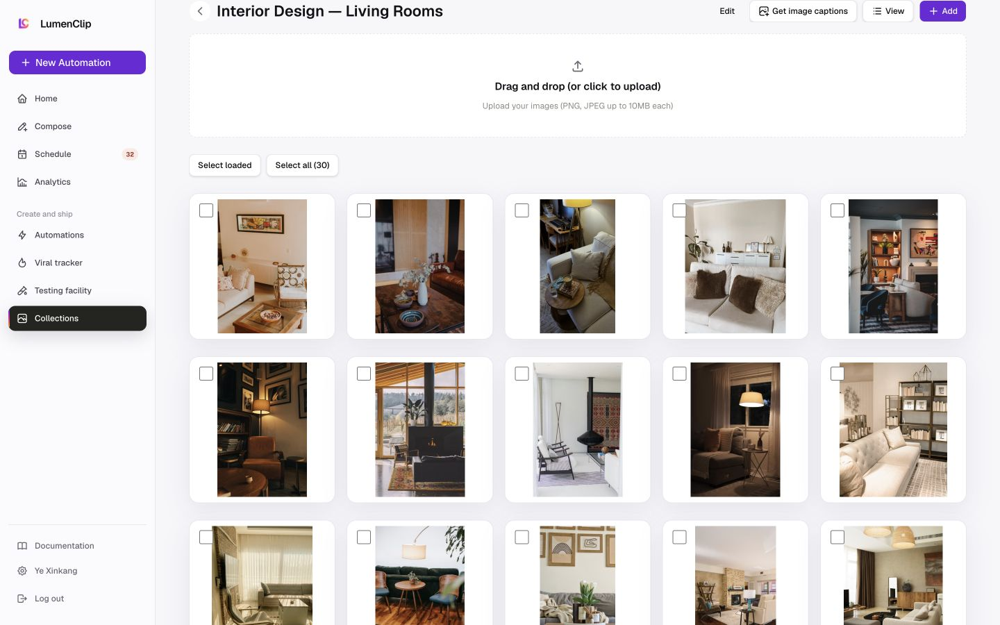
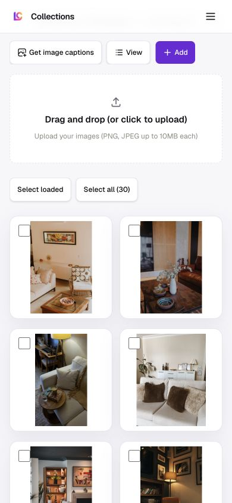
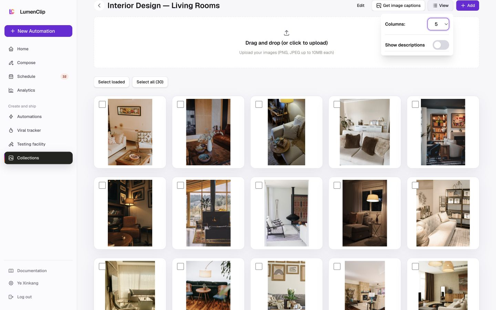
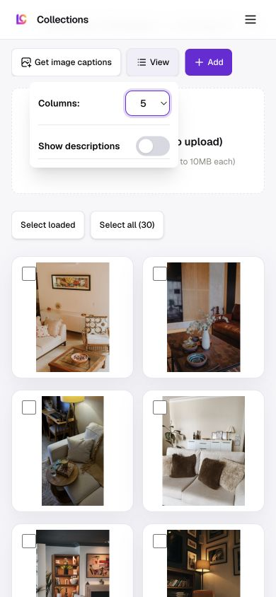

# Collection detail

Route pattern: `/app/collections/[id]`

## Purpose

Inspect and maintain the assets in one collection.

## Desktop layout

- Back to collections precedes the collection name.
- Edit, Get image captions, View, and Add form the action group.
- A drag/drop uploader sits above bulk selection controls.
- Assets use a five-column image grid with per-image checkboxes and Load more.
- View opens a compact floating panel for three-to-six columns and description visibility.

## Mobile layout

- Header actions wrap under the collection title.
- The grid collapses to fewer columns while preserving per-image selection.
- The view-options panel overlays the image feed and retains native select/switch controls.

## Interactions

- Rename/edit the collection.
- Generate image captions.
- Add/upload files.
- Select loaded/all assets and act on selections.
- Change grid column count and description visibility.
- Load more assets.

## MCP support

Collection and asset list/add/delete tools cover record management. Caption generation and view preferences do not have equivalent MCP presentation tools in the current registry.

## Audit notes

- “View” is generic; “Grid settings” would predict the resulting panel more precisely.
- Bulk-selection state should remain visible as the user scrolls a long collection.
