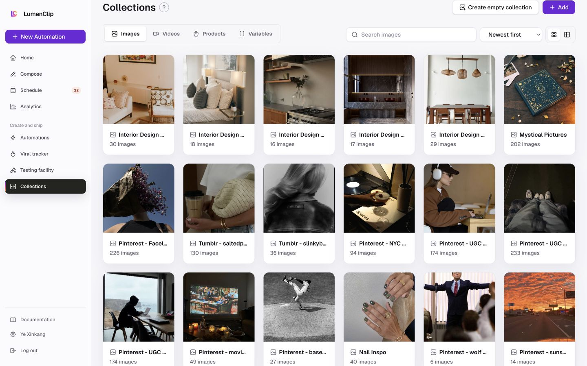

# Collections

Route: `/app/collections`

## Purpose

Organize reusable images, videos, products, and variables for automations.

## Desktop layout

- The workspace sidebar remains fixed at the left.
- The page header combines Collections, contextual help, Create empty collection, and Add.
- Images, Videos, Products, and Variables are peer tabs.
- Search, sort, and grid/table controls form the filter row.
- Collection cards use a dense six-column grid and reveal select, pin, and delete controls over the visual.

## Mobile layout

- The shell becomes a top bar with a menu button.
- Create empty collection and Add remain side by side.
- Type tabs form a horizontally constrained strip; Variables extends beyond the initial viewport.
- Search, sort, and view controls compress into one row, and the grid becomes two columns.

The initial mobile screenshot caught the real page chrome but unresolved collection-card skeletons, so it is intentionally not used as the canonical screenshot.

## Interactions

- Switch asset type, search, sort, and change grid/table mode.
- Open a collection card.
- Select, pin, or delete a collection.
- Create an empty collection or open the asset importer.

## MCP support

| UI action | MCP support |
| --- | --- |
| List collections | Collection list tools |
| Create/update collection | Collection save tools |
| Delete collection | Collection delete tools |
| Add owned assets | Collection add-assets tools |
| Read/write/delete variables | Collection variable get/save/delete tools |
| Search, sort, grid/table presentation | Browser-only |

## Audit notes

- “Create empty collection” and “Add” do not clearly describe their different outcomes.
- Mobile type navigation needs an explicit scroller treatment or compact selector.
- Overlay card actions are discoverable on desktop hover but need persistent touch affordances on mobile.
