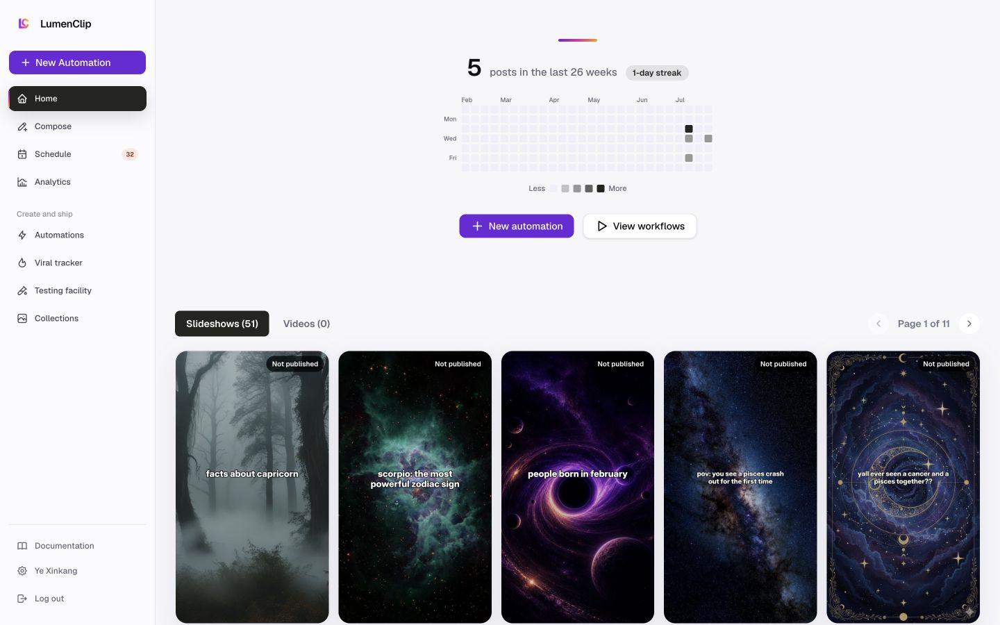

# Dashboard

Route: `/app`

## Purpose

Summarize publishing activity, expose recent generated output, and provide the fastest routes into automations and proven workflow templates.

## Desktop layout

- A persistent 223 px sidebar contains workspace navigation, Documentation, account identity, and Log out.
- The content begins with a 26-week posting heatmap and streak summary.
- New automation and View workflows form the main action row.
- Slideshows and Videos tabs sit above generated-output cards and pagination.
- “Start from a proven workflow” is a separate template carousel below recent output.

## Mobile layout

- The sidebar becomes a 56 px header with a menu button.
- Heatmap, summary, actions, output tabs, and cards stack vertically.
- Output cards use a two-column feed; template cards continue beneath the initial viewport.
- The production mobile capture also shows the email-verification banner, which consumes significant top-of-screen space.

## Interactions

- New automation opens the automation template browser.
- View workflows switches to the automation list.
- Slideshows/Videos filter recent output.
- Clicking a generated card opens the slideshow viewer.
- Pagination changes the visible output or template page.

## MCP support

| UI action | MCP support |
| --- | --- |
| List automations | `lumenclip_automations_list` |
| List generated outputs | `lumenclip_outputs_list` |
| Read one output | `lumenclip_output_get` |
| Browse templates | Automation template list tools |
| Create from a template | Automation clone/create tools |
| Heatmap/streak presentation | No direct MCP presentation equivalent |

## Audit notes

- The page has no visible H1; activity appears before a statement of the page's purpose.
- Empty/single-page output still renders disabled pagination.
- Mobile month labels and the heatmap are very compact and give little indication that the detail can overflow.
