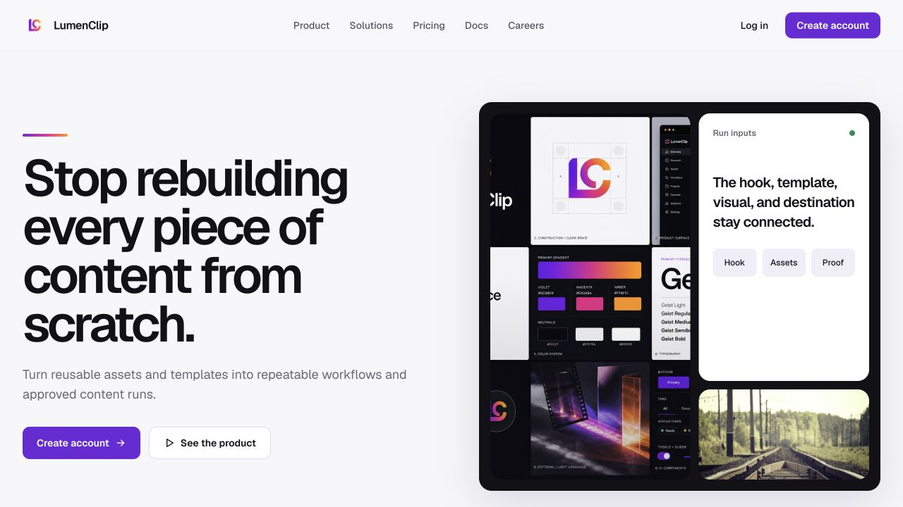
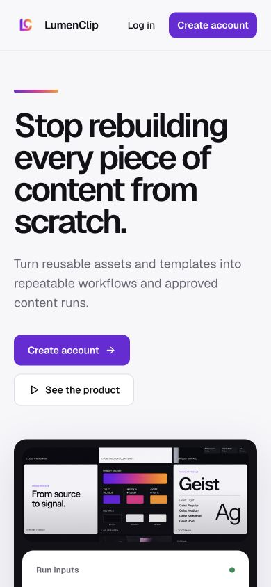

# Landing page

Route: `/`

## Purpose

Explain LumenClip's source-to-output workflow and move a visitor toward account creation, login, or deeper product information.

## Desktop layout

- A horizontal marketing header contains the LumenClip brand, Product, Solutions, Pricing, Docs, Careers, Log in, and Create account.
- The hero leads with “Stop rebuilding every piece of content from scratch”, supporting copy, primary and secondary actions, and product proof.
- Long-form sections cover the problem, workflow, capabilities, audiences, privacy, pricing, FAQ, and a closing call to action.
- The page uses a wide editorial rhythm rather than the authenticated app shell.

## Mobile layout

- The marketing content becomes a single vertical narrative.
- Hero actions stack and the supporting proof, feature, pricing, and FAQ sections retain their desktop order.
- The mobile page is intentionally long; section headings and spacing are the main orientation devices.

## Interactions

- Marketing navigation opens first-party product pages.
- Log in and Create account enter the authentication flow.
- FAQ items disclose supporting copy.

## MCP support

There is no MCP equivalent for marketing navigation, account creation, or authentication. MCP begins after a workspace owner has authenticated and authorized access.

## Audit notes

- The page consistently uses the LumenClip name while repository and historical references still use CFarm.
- The long mobile narrative benefits from the clear section hierarchy, but no persistent mobile progress/navigation aid is visible.
