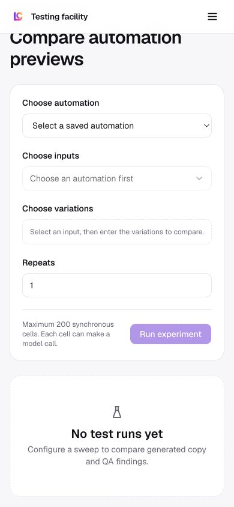

# Testing facility

Route: `/app/testing`

## Purpose

Compare automation output across input variations and repeated runs before changing a production automation.

## Desktop layout

- The form is a two-column panel: automation/variations on the left and inputs/repeats on the right.
- Run experiment is aligned with the maximum-cell warning.
- Results occupy a large bordered region below; the empty state says “No test runs yet”.

## Mobile layout

- Form groups stack in task order.
- Controls become full-width and the empty-state result panel follows the form.

## Interactions

- Choose a saved automation.
- Choose an input and specify variations.
- Set repeat count and run the experiment.
- Compare resulting cells and QA findings.

## MCP support

No dedicated testing-facility/experiment MCP tools are documented in the current registry. An agent can run automations individually, but cannot reproduce this comparison object and result matrix as one first-class MCP operation.

## Audit notes

- Dependency-disabled controls are labelled clearly.
- The 200 synchronous-cell limit is useful, but an estimated model cost/time would be more actionable before running.
