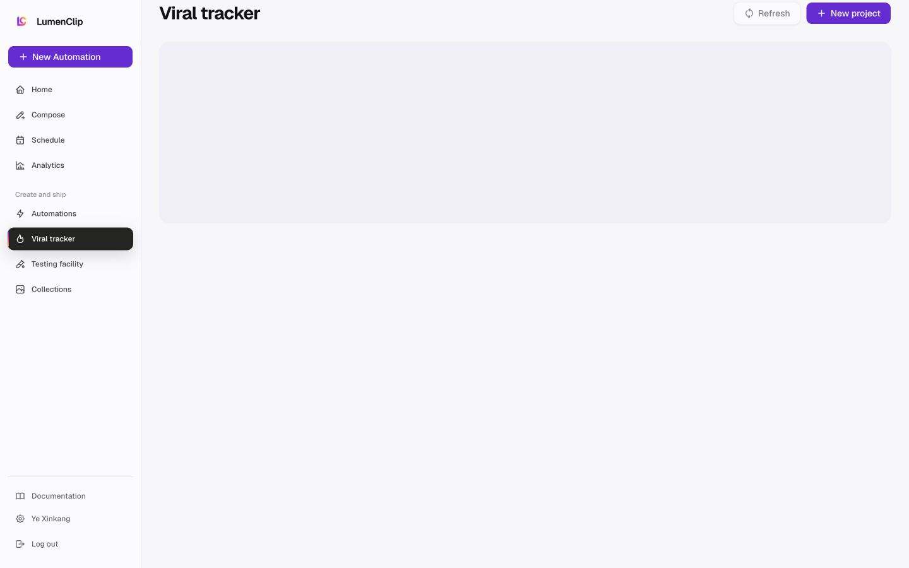
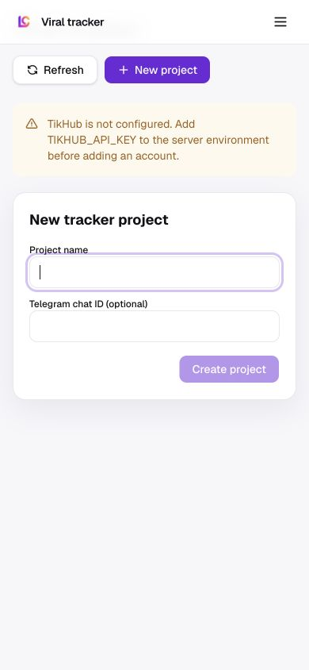

# Viral tracker

Route: `/app/viral-tracker`

## Purpose

Create projects that monitor viral social content and refresh tracked results.

## Desktop layout

- Viral tracker is active in the workspace sidebar.
- Refresh and New project are the primary page actions.
- Configuration/status content appears in the main panel.

## Mobile layout

- The shell becomes the compact header.
- The project form and actions stack in one column.

## Interactions

- Create a tracker project.
- Refresh configured sources/results.
- Inspect project state and provider availability.

## MCP support

Analytics import/report tools cover some downstream social data operations, but no first-class viral-tracker project create/list/update tool is documented in the current MCP registry.

## Audit notes

- Production exposes the technical message “TikHub is not configured. Add TIKHUB_API_KEY…”. Ordinary users cannot resolve a server environment variable; show an availability message and reserve diagnostics for admins.
