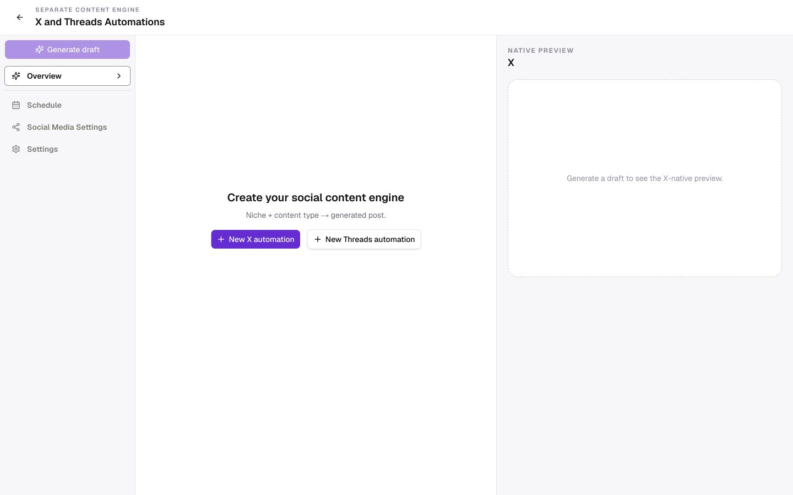
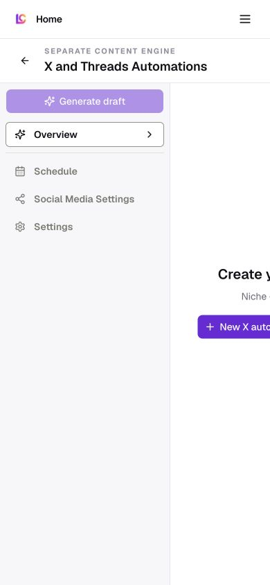

# X and Threads automations

Route: `/app/x-automations`

## Purpose

Configure a niche/content-type social engine, generate a draft, schedule it, and preview X-native output.

## Desktop layout

- This route mounts its own three-column structure: a 246 px local navigation rail, a minimum-width editor, and a native-preview pane.
- Local navigation includes Overview, Schedule, Social Media Settings, and Settings.
- Generate draft is disabled before configuration exists.

## Mobile layout

- The desktop three-column structure does not recompose.
- The document remains about 1,066 px wide at a 390 px viewport, leaving the editor and preview off-screen to the right.
- The standard mobile shell header is layered above the route's separate navigation.

## Interactions

- Create an X or Threads automation.
- Configure overview, schedule, social settings, and general settings.
- Generate a draft and inspect the native preview.

## MCP support

General automation CRUD/run/schedule tools may operate on saved automations, but the X/Threads-specific setup and draft-preview flow is not represented as a dedicated MCP surface.

## Audit notes

- This is a P1 responsive failure and a shell-consistency failure.
- On mobile, replace the three-column canvas with a Setup/Draft/Preview mode switch under the standard workspace shell.
