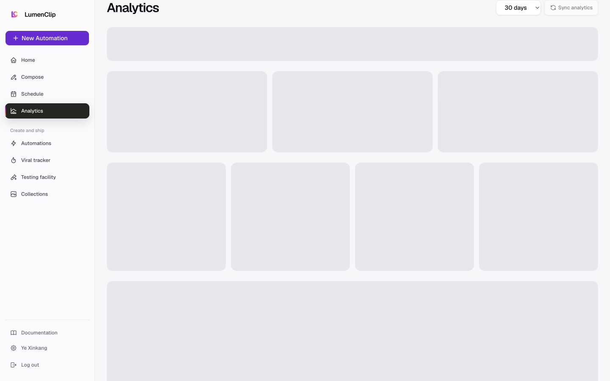
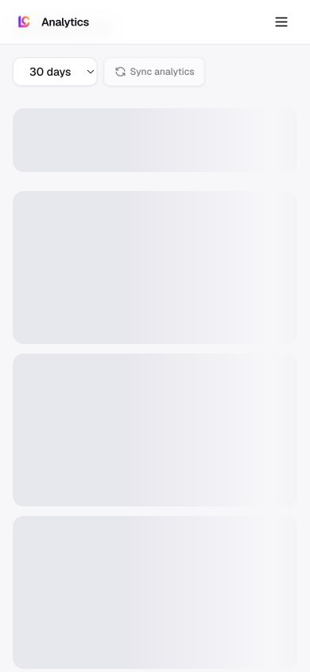

Route: `/app?view=analytics`

## Layout

Owner: `components/realfarm/analytics/analytics-view.tsx`.

Connected accounts use the PostFast profile picture as the primary identity,
with deterministic initials when no picture is available. A smaller provider
badge overlaps the avatar so the account remains the primary object and the
platform remains secondary context.

The overview header contains a 7, 30, 60, or 90 day range and one Sync
analytics action. An account rail defaults to the all-accounts portfolio. Three
cards show total audience from the latest follower snapshot for each selected
account, total impressions from the selected posts, and total engagement from
their canonical interaction totals. Each card shows data coverage and a trend
when more than one dated point is available.

Recent posts appear four at a time with account identity, publication-link
state, content type, primary exposure metric, and engagement rate. The Accounts
table shows the latest followers, summed post impressions, and weighted
engagement rate for eight accounts at a time. Mobile stacks the metric and post
cards, keeps account selectors horizontally scrollable, and gives the account
table its own horizontal scroll area.

The report endpoint combines connected PostFast account metadata with stored
publication records, `postfast_metric_snapshots`, and
`account_follower_snapshots`. The chosen range filters stored snapshots by
capture time and publications by their published, scheduled, or updated time.
Post totals use the latest snapshot for each integration and post pair. Missing
provider values render as unavailable instead of being converted to zero. One
snapshot shows its current value but asks for another sync before drawing a
trend.

TikTok Studio captures join the metric history with `source: "tiktok_studio"`.
Pending single-post imports and account batches are owner-scoped
`permanent_assets` rows. The server persists the parsed capture and typed
snapshot, not the raw TikTok response or signed media URLs.

The current loading layout constrains every skeleton with `min-w-0` and
`max-w-full`, hides overflow at the wrapper, and uses one column on narrow
screens. The general header has only one Sync analytics control. A distinct
Import TikTok posts control appears only inside the TikTok platform drill-down.
No-account and no-snapshot states direct the user to connect accounts or run
the first sync. If a PostFast integration refresh fails temporarily, stored
analytics remain visible with an inline warning.

## Interactions

Changing the range reloads stored report data. Sync analytics requests fresh
PostFast analytics for all accounts, the selected overview account, or the
selected accounts in a platform drill-down, then reloads the report. Selecting
an account avatar or account name filters the overview; selecting it again
restores the portfolio. Recent-post cards open the per-post analytics route.

Compare platform opens an in-place platform drill-down. There the user can
select multiple accounts, choose any metric exposed for those accounts, switch
the comparison chart between absolute values and indexed growth, inspect an
account breakdown, and page through recent posts. TikTok additionally supports
a Chrome companion import for every post visible in TikTok Studio Content.
The extension scrolls the virtualized post list, deduplicates native post URLs,
and restores the user's previous Studio scroll position. LumenClip creates
missing publication records as published external TikTok posts, then captures
the private analytics reports. The user does not paste post URLs or IDs.

Opening Analytics from the companion on TikTok Studio Content carries a
`companion=tiktok-studio` intent. LumenClip opens the import dialog and starts
post discovery immediately. With one connected TikTok account the import
continues without another click. With multiple accounts, the detected TikTok
handle is matched against the account profile; the chooser remains available
when that match is ambiguous. If no TikTok account is connected, the page names
that prerequisite in an inline alert.

## MCP coverage

Partial. `lumenclip_analytics_report` reads the stored account and post report.
`lumenclip_tiktok_studio_analytics_import_start` starts a single-post Studio
capture, `lumenclip_tiktok_studio_analytics_batch_start` starts a batch, and
`lumenclip_tiktok_studio_analytics_report` reads the results. The general
PostFast provider refresh performed by Sync analytics has no registered MCP
tool.
