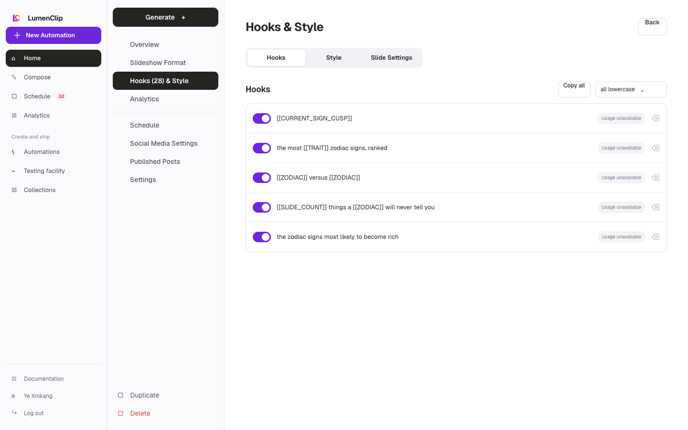
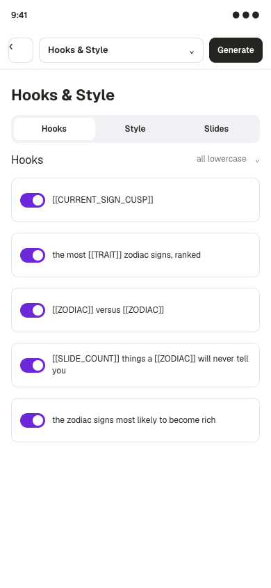

Route: `/app?view=automations&automation=<id>`

## Layout

Owner: `components/realfarm/automation-settings/prompt-settings.tsx`.

The Hooks and Style section contains Hooks, Style, and, for slideshow
automations, Slide Settings tabs. Video automations label the section Hooks and
Voice and omit Slide Settings. The Hooks tab presents one enabled or disabled
row per stable hook, a copy-all action, a casing selector, runtime and word
collection variable badges, and a control that prevents repeated variables from
drawing the same value within one hook.

Published hooks display their usage count and are locked against editing or
deletion so historical attribution remains stable. If usage cannot be loaded,
existing rows are safety-locked and the panel offers a retry. Style controls the
saved tone and video writing style. Slideshow Slide Settings applies one aspect
ratio, font, centered cover crop, and dark-overlay setting across Hook, Content,
and CTA slides.

On mobile, the editor replaces the desktop navigation rail with a sticky bar.
Its section button opens the automation navigation in a bottom sheet, while the
panel content remains vertically scrollable.

## Interactions

Users can add a row, press Enter to insert after a row, toggle an unused hook,
edit it, or delete it. Pasting multiple lines expands them into rows and skips
case-insensitive duplicates. A published hook can instead be duplicated into an
editable variation. Copy all writes non-empty hook text to the clipboard.

Changing casing rewrites only unused hooks. Variable tokens are normalized and
resolved from runtime values or word collections during generation. Cancel
restores the saved schema and returns to Overview; Save Changes persists the
draft and returns to Overview.

## MCP coverage

Yes. `lumenclip_automation_hooks_get`, `lumenclip_automation_hooks_update`,
`lumenclip_automation_hook_upsert`,
`lumenclip_automation_hook_set_enabled`, and
`lumenclip_automation_hook_delete` cover the canonical hook pool.
`lumenclip_automation_schema_update` covers casing, variable bindings, tone, and
shared style fields. Clipboard copying and section navigation are UI-only.
