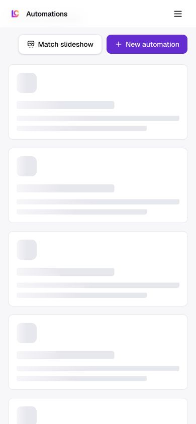
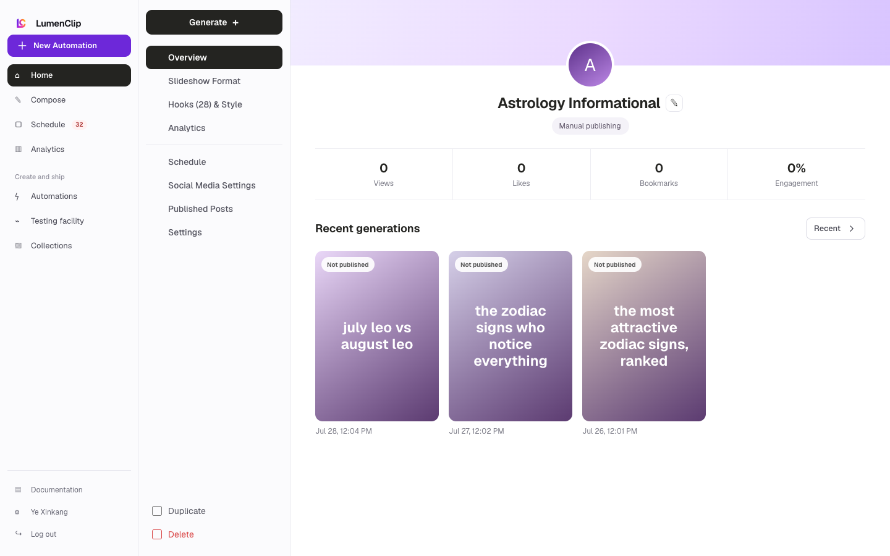
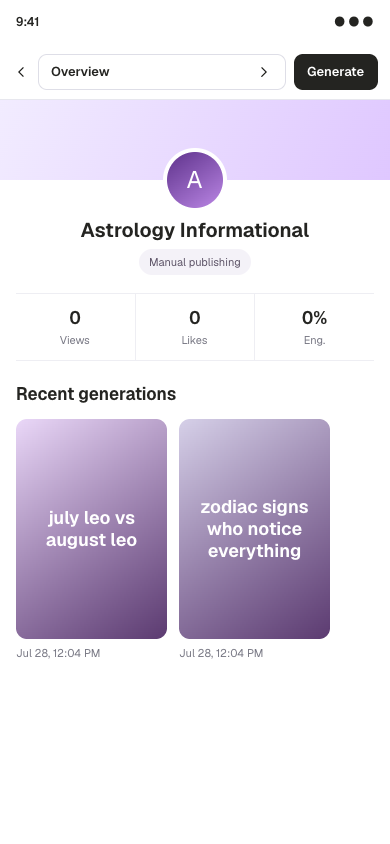

Route: `/app?view=automations`

## Layout

Owner: `components/realfarm/automations-view.tsx`.

The destination places Match slideshow and New automation beside the Automations
heading, followed by a responsive card grid. The grid is one column by default,
two columns from the medium breakpoint, and three columns from the large
breakpoint. The three-column desktop layout therefore collapses to one card per
row on phones.

Slideshow and video cards show live or paused state, favorite state, an editable
name, and three recent-generation slots. A slideshow slot prefers the newest
run's exported thumbnail, then its rendered first slide, then its planned first
slide. A video run with a video URL renders a video thumbnail. Failed runs
remain visible as failures, while missing slots say that there is no recent
generation. A generation blocker adds a destructive border and shows its first
message. Each card also summarizes selected account statuses, projected
upcoming posts, and Pause or Resume plus Edit actions.

X and Threads cards use the same grid but replace media thumbnails with up to
three recent post excerpts, platform, content type, and benchmark score. The
empty destination renders a single dashed No automations yet panel.

Slideshow and video records persist in the `automations` table and their recent
generations in `automation_runs`. X and Threads records use `x_automations`,
while their runs are owner-scoped `outputs` rows with
`source_key=x_automation_run`. Shared template definitions and examples remain
separate `permanent_assets`; using a template creates a user-owned automation
instead of changing the shared record.

## Interactions

Match slideshow opens the tone analyzer, while New automation opens the template
browser. A slideshow or video card can be renamed inline, favorited, paused or
resumed, and opened in the shared automation editor. Selecting its Accounts area
opens the account picker. An automation with generation blockers cannot be
resumed and opens in the editor so the configuration can be corrected.

Selecting a successful preview opens the generated slideshow or video viewer;
failed and empty slots do not open a viewer. The editor can also be addressed at
`/app?view=automations&automation=<id>`, and a specific persisted run can be
requested with `&run=<id>`. Opening a card, viewer, or editor is UI navigation.

## MCP coverage

Yes. `lumenclip_automations_list`, `lumenclip_automation_get`,
`lumenclip_automation_templates_list`, and `lumenclip_outputs_list` read the
card, template, and recent-output data. `lumenclip_automation_create` and
`lumenclip_automation_clone` create user-owned records,
`lumenclip_automation_update` changes names, favorites, lifecycle state, and
schedules, and `lumenclip_automation_run` starts supported manual runs. Opening
the destination, card, or viewer is UI-only navigation.
