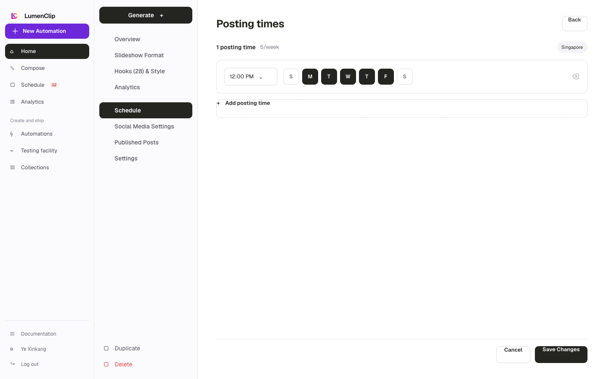

Route: `/app?view=automations&automation=<id>`

## Layout

Owner: `components/realfarm/automation-settings/schedule-settings.tsx`.

The Schedule section is the saved cadence for one automation. It shows the
automation timezone, a frequency summary, total posts per week, and up to five
posting-time rows. Each row combines a time input with Sunday through Saturday
day controls. The first row is always retained; later rows include a remove
action.

Rows stack on smaller screens so the time, wrapped weekday controls, and remove
action remain usable. This editor is distinct from the
[global Schedule destination](/docs/ui/schedule/schedule), which reports and
manages content across the workspace.

## Interactions

Users can change a row's time, toggle its posting days, add rows up to the
five-row limit, and remove rows after the first. Toggling the last selected day
keeps that day selected, so every row retains at least one weekday. Cancel
restores the saved automation schema and returns to Overview; Save Changes
persists the cadence and returns to Overview. Pausing the automation prevents
its projected card slots from remaining active without deleting this schedule.

## MCP coverage

Yes. `lumenclip_schedule_get` reads saved schedules and projected slots, while
`lumenclip_automation_update` changes timezone, posting times, jitter, and
paused or live state. Opening this editor is UI-only navigation.
