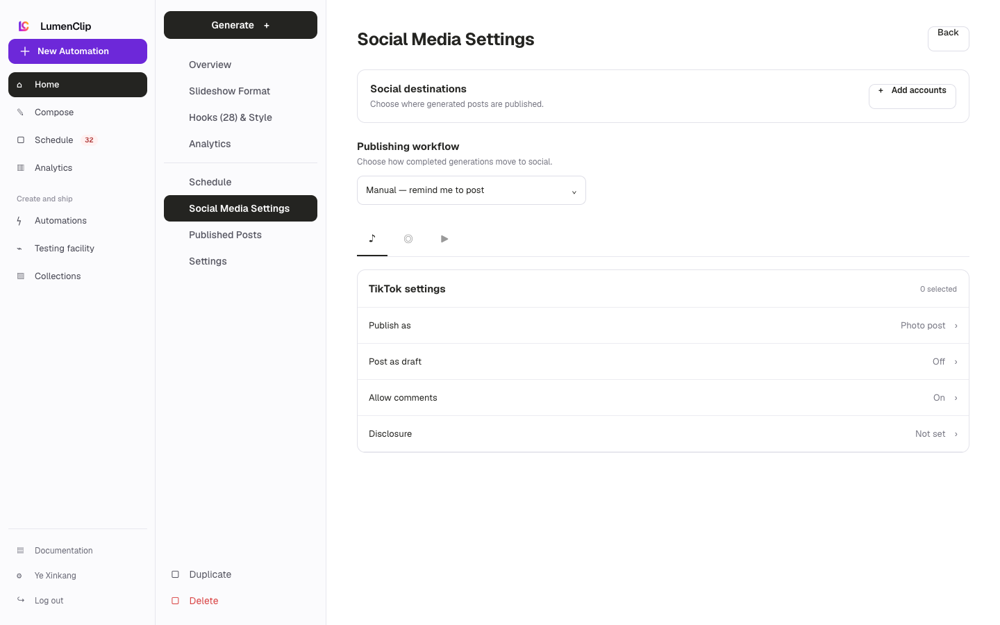
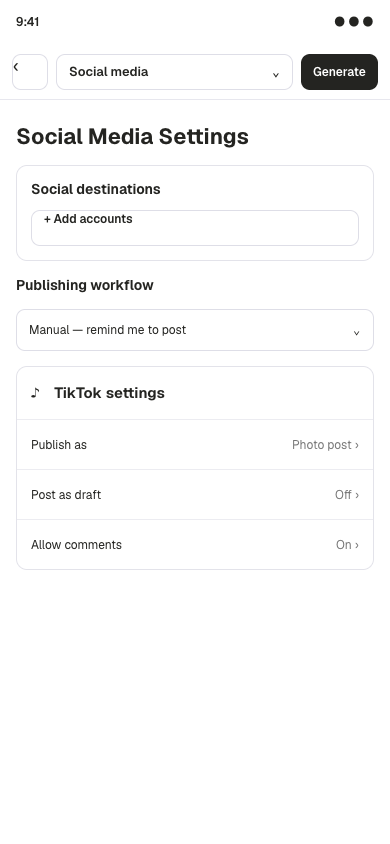

Route: `/app?view=automations&automation=<id>`

## Layout

Owner: `components/realfarm/automation-settings/social-settings.tsx`, with
account selection in `components/realfarm/social-account-picker.tsx` and status
presentation in `components/realfarm/social-account-status.tsx`.

Social Media Settings starts with the selected destination count and Add
accounts or Edit accounts action. Publishing workflow offers manual reminder,
review before publishing, and automatic scheduling. Review mode adds a
generation lead-time control. A horizontally scrollable platform selector opens
settings for TikTok, YouTube, Instagram, Facebook, X, LinkedIn, Pinterest,
Threads, Telegram, or Bluesky.

TikTok exposes slideshow or video publishing where supported, draft upload,
auto-music, comments, duet, stitch, AI-content disclosure, and brand disclosure.
YouTube provides privacy and tags. LinkedIn provides visibility, Pinterest
provides board and destination link fields, and the remaining platform panels
show publish mode where supported plus their selected accounts. Video
automations always publish their rendered video.

The account picker lists compatible connected accounts and the accounts selected
to run this automation. Card and output status badges use platform icons plus
connected, queued, draft, scheduled, published, failed, manual-post, or disabled
state.

## Interactions

Selecting or clearing an account updates the automation's saved integration
selection. Provider settings and publishing workflow remain drafts until Save
Settings; Cancel restores the saved schema and returns to Overview. The account
picker only selects existing compatible integrations. Connecting a new provider
account occurs through the separate account connection flow.

## MCP coverage

Partial. `lumenclip_accounts_list` reads compatible connected accounts and
`lumenclip_automation_schema_update` can persist account IDs, workflow, and
provider settings. The browser OAuth connection step for a new account remains
UI-only.
