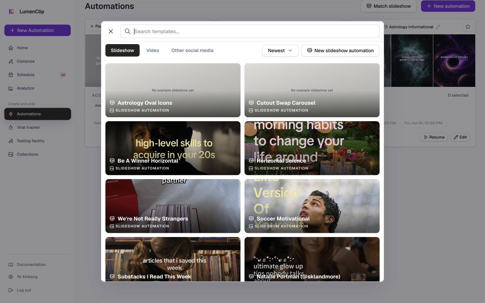
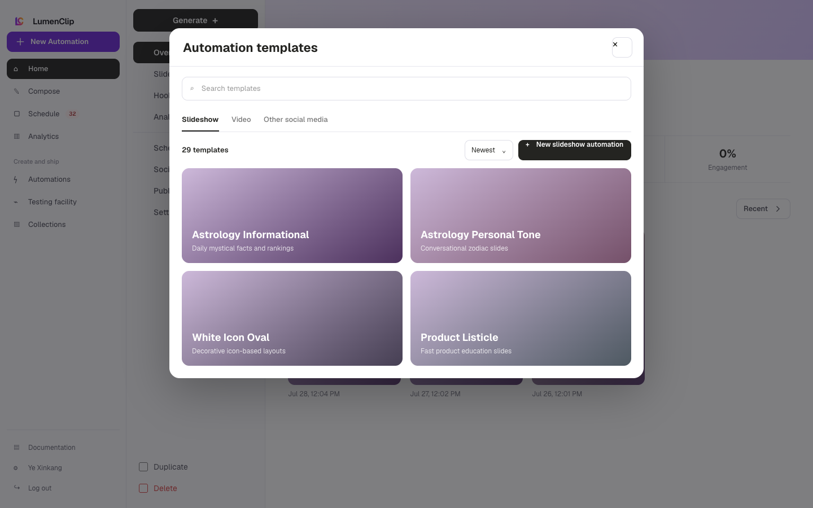
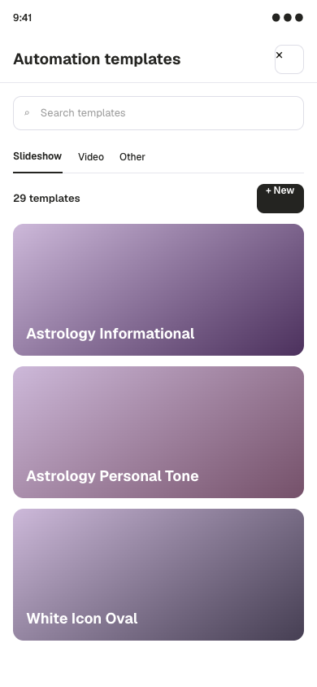

Route: `/app?view=automations`

## Layout

Owner: `components/realfarm/templates.tsx`.

New automation opens a modal with the visible Automation templates title, a
search field, Slideshow, Video, and Other social media filters, a sort control,
and the matching template count. Newest, Oldest, A to Z, and Z to A sorts are
available. The modal is bounded to the viewport and its content scrolls inside
the panel. On phones it uses almost the full viewport height, keeps the type and
sort controls horizontally scrollable, and renders each template as a compact
horizontal card. Desktop uses a two-column image-led grid.

The browser initially shows ten matching templates and adds another batch of up
to ten when Show more is selected. Video also shows repository-owned starting
formats above its saved templates. Empty states distinguish an empty catalog
from a search with no matches.

## Interactions

Changing search, kind, or sort resets the visible batch to ten. Open shows the
selected template's generated examples. Create copies the template settings into
a new user-owned automation and opens its editor. Each kind also offers a blank
automation. Other social media provides separate New X automation and New
Threads automation actions.

Selecting a built-in video format opens a setup dialog for media, hooks,
schedule, and publishing before creation. Its Back action returns to the
template browser and unsaved changes are guarded.

## MCP coverage

Partial. `lumenclip_automation_templates_list` reads reusable templates and
`lumenclip_automation_create` creates slideshow, video, or UGC automations from
a template or blank schema. X and Threads creation in this browser has no
matching registered create tool. Search, sort, example previews, and dialogs are
UI-only.
