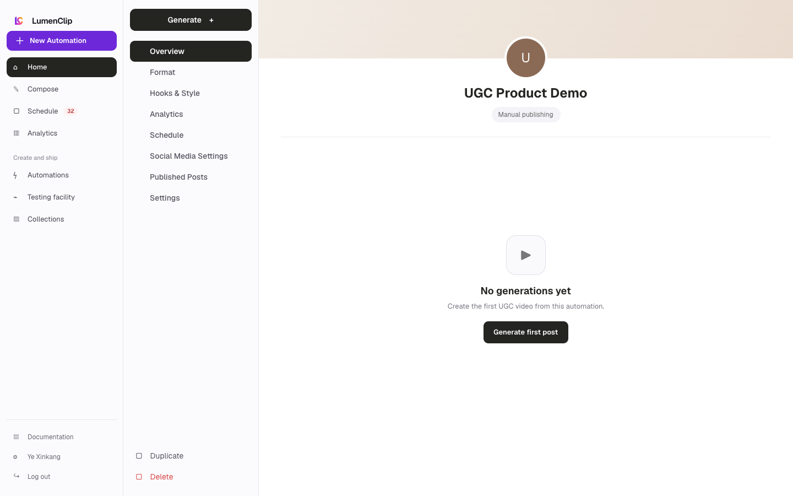
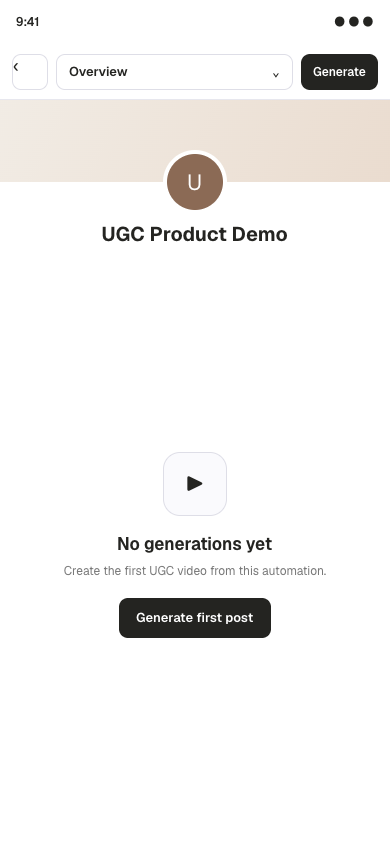

Route: `/app/ugc/[id]`

## Layout

Owner: `app/app/ugc/[id]/page.tsx`, with the status surface in
`components/realfarm/ugc/ugc-run-status.tsx`.

AI UGC is gated off in production and is not a generally available surface.
The authenticated route shell exists, but its data endpoint returns Not Found
unless `ENABLE_UGC_AUTOMATION` is exactly `true`. The automation must also be an
explicitly enabled UGC automation. Its editor states that generation requires
`FAL_KEY` and `ELEVENLABS_API_KEY`, and a live configuration additionally needs
a product URL or brief plus an ElevenLabs voice ID.

When all gates are enabled and a run exists, the centered status card shows its
run ID, ordered analysis, script, actor, voice, motion, lip sync, B-roll,
composite, store, and publish stages, plus cached asset counts. Estimated
provider cost and actual cost so far appear side by side on desktop and stack on
narrow screens. The route polls its run every five seconds.

The supplied desktop and mobile images are Paper design-file exports of the
empty concept state, not evidence that the feature is enabled in production.

## Interactions

The automation editor links each persisted UGC run to this route. Retry from
cache is enabled only after the run or one of its stages fails. Retrying
re-enqueues the deterministic scheduled job, resumes durable cached stages, and
then reloads status. Completed, queued, or active runs cannot be retried from
this control.

## MCP coverage

Partial. `lumenclip_ugc_estimate` estimates a saved or proposed UGC
configuration, `lumenclip_ugc_generate` queues a gated draft, and
`lumenclip_operation_get` reads operation status. The browser's Retry from cache
action has no matching registered tool, and the same production feature flag
still gates MCP generation.
