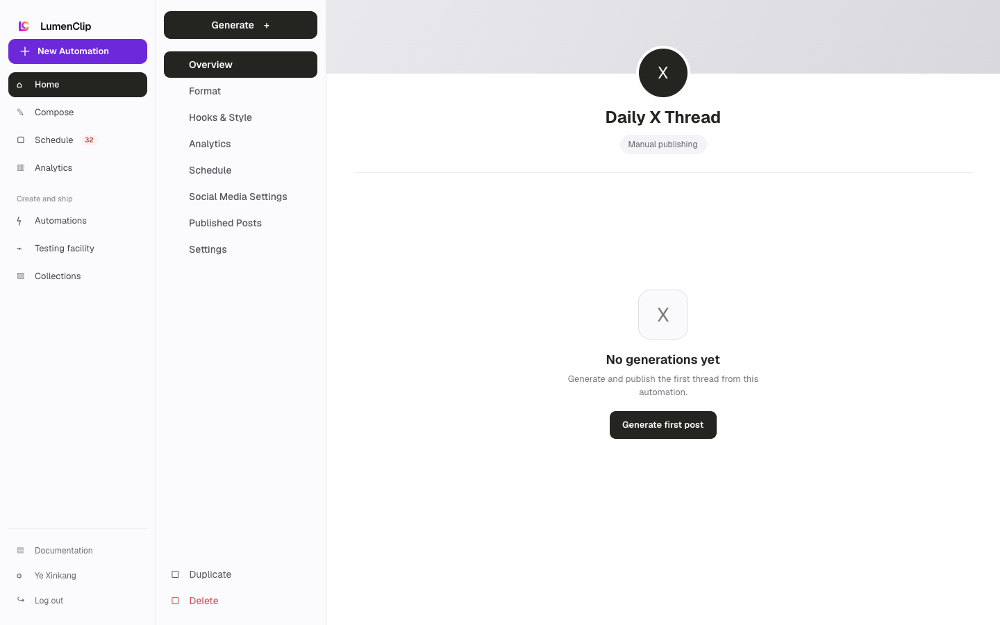
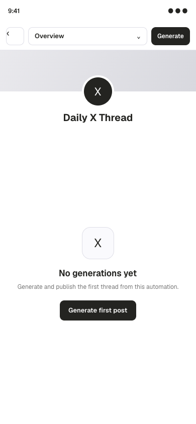

Route: `/app/x-automations`

## Layout

Owner: `app/app/x-automations/page.tsx`, with the workspace in
`components/x-automation-studio.tsx`.

This authenticated standalone route loads all saved X and Threads automations
and runs. Desktop uses a setup rail, a draft workspace, and, when the selected
section supports it, a native preview and benchmark column. The rail links
Overview, Schedule, Social Media Settings, and Settings. An empty workspace
offers separate New X automation and New Threads automation actions.

Overview contains content strategy, niche, topic, hook and voice controls, and a
trend radar with query, lookback, minimum-view, minimum-engagement, and reaction
settings. The preview renders a generated single post, thread, or article,
optional source quote and image, AI or objective benchmark checks, revision
results, factual risks, and publication outcome.

The X and Threads preview is an in-app approximation, not an embedded provider
view. Its avatar, `Automation` display name, `@operator` handle, `now`
timestamp, and interaction glyphs are fixed presentation placeholders.

On mobile a sticky Setup, Draft, and Preview workflow replaces the desktop
columns. Only the active stage is shown. The standalone route also includes the
fixed mobile application navigation.

Saved engines persist in `x_automations`. Their generated runs are owner-scoped
`outputs` rows with `source_key=x_automation_run`. The trend radar calls the
configured Apify actors for X, TikTok, and Instagram, then filters candidates
by lookback, views, engagement, and relevance.

## Interactions

Users create an X or Threads engine, add a niche, generate or regenerate its
strategy, choose hooks and voice, and generate a draft. Trend search returns
candidates that can seed a quote reaction or repost draft. A generated draft can
request an image, open in its native platform, or publish to selected accounts.
The platform is fixed when the engine is created. Saving can derive a missing
strategy from a non-empty niche; generation saves the engine first and moves
the mobile workflow to Preview when the run completes.

Schedule reuses the per-automation cadence editor. Social Media Settings can
open the provider connection URL in a new tab, refresh connected accounts,
filter them to the engine's platform, select accounts, and enable
auto-publishing. Single posts can auto-publish; X reply chains and X Articles
remain drafts because the provider lacks the required safe publishing contract.
Publish skips a multi-post X run because PostFast exposes no reply-chain
publishing, and auto-post generation uses single-post presets only. Settings
controls language, model, voice override, proof, excluded topics, image
generation, and discovery defaults.

## MCP coverage

Partial. `lumenclip_automations_list`, `lumenclip_automation_get`,
`lumenclip_automation_run`, `lumenclip_automation_update`, and
`lumenclip_schedule_get` cover saved X and Threads engines, manual drafts,
common updates, and schedules. `lumenclip_accounts_list` reads connected
accounts. Creating an X or Threads engine, deriving strategy, trend discovery,
and the provider connection redirect have no matching registered tools.
