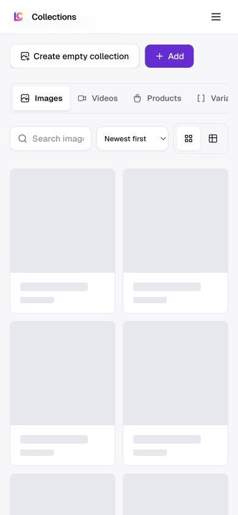

Route: `/app/collections`

## Layout

Owner: `features/collections/ui/collections-view.tsx`.

Desktop places Images, Videos, Products, and Variables in a tab row. Image and
video views add search, sort, and grid or table controls. The grid shows each
collection's lead asset, name, and item count, with pinned collections ordered
first. The table instead shows collection, media type, item count, creation
date, and row actions. Products use a separate read-only card catalog, while
Variables uses its own searchable collection editor.

The media library also projects read-only AI UGC Avatar Videos and Greenscreen
Memes collections. There is no All Images rollup.

Mobile replaces the four collection tabs with a full-width type selector, which
keeps the controls inside the viewport. Search, sort, and the grid or table
toggle share the next row, and the grid uses cards at least 150 pixels wide.

The July 2026 production captures predate this selector. They show an
overflowing tab row and the labels Create empty collection and Add. The shipped
actions are New collection and Import images.

## Interactions

New collection immediately saves an empty image collection named `Empty
collection`. Import images opens a full-screen dialog on mobile and a bounded
dialog on larger screens. It searches Pinterest or Pexels, accepts a Pinterest
board URL, lets the user select results, can generate captions during import,
and saves the imported images as a collection. The dialog can also hide result
labels, select or clear all loaded results, load more results, and recall up to
six recent searches from browser storage. Those search terms are the only
import-dialog state persisted in the browser, under
`lumenclip:pinterest-recent`.

Search filters the active image or video collection list by title. Sort can use
creation date, name, or item count, while the view toggle switches between the
grid and table without saving a preference. Grid mode loads 28 matching
collections at a time. A persisted collection can be opened, pinned, selected
for a bulk deletion, or deleted individually. Deletion first reports dependent
automations and templates, then soft-deletes the collection for 30 days with an
Undo action. Expired rows and unreferenced files are purged later. The projected
avatar-video and greenscreen collections cannot be renamed, edited, pinned, or
deleted.

Persisted media collections are owner-scoped `permanent_assets` rows with
`source_key=image_collection`; imported files use the `image_collections`
Storage bucket. Product collections remain read-only in this surface, while
variable collections support create, edit, and delete.

## MCP coverage

Partial. `lumenclip_collections_list` lists collection summaries,
`lumenclip_product_collection_get` reads product collections,
`lumenclip_assets_list` lists stored assets,
`lumenclip_collection_save` creates empty media collections and updates their
pinned state, `lumenclip_collection_add_assets` imports remote assets, and
`lumenclip_collection_delete` soft-deletes media collections.
`lumenclip_variable_get`, `lumenclip_variable_save`, and
`lumenclip_variable_delete` cover the Variables view. Pinterest and Pexels
search, auto-captioning, grid or table preference, and renaming an existing
media collection have no matching registered tool. Opening a tab or changing
the visible view is UI navigation.
