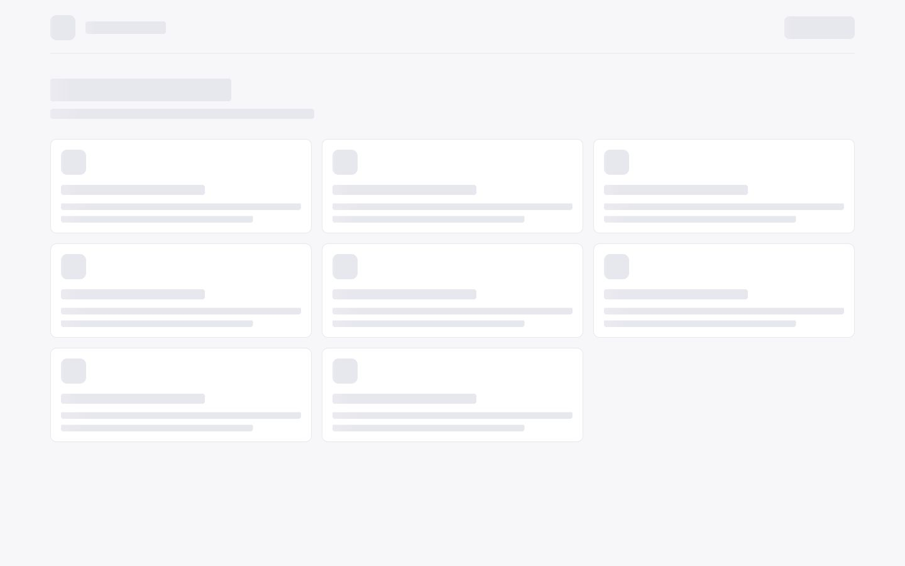
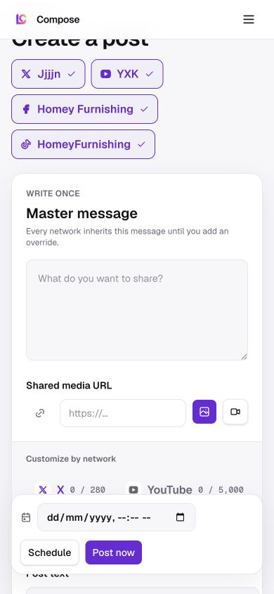

Route: `/app/compose`

## Layout

Owner: `features/composer/ui/composer-screen.tsx`. The editor itself is owned by
`features/composer/ui/post-composer.tsx`.

The header shows every connected publishing account. Desktop renders the
accounts as wrapping selection buttons. Mobile uses a collapsed account summary
that opens a vertical list, so account selection does not widen the page. If no
account is connected, the page replaces the composer with an action that opens
account settings.

The composer begins with a master message and one shared media URL that can be
treated as an image or video. A network-specific area follows with a text
override, media override, provider-specific fields, character count, and live
preview for the active account. Desktop uses a horizontally scrollable tab row
and places the editor beside the preview. Below the `sm` breakpoint, the tab row
is replaced by a full-width network select and the two columns stack, which
keeps the network tabs from overflowing on narrow viewports.

A sticky action panel holds the local date and time field, Schedule, and Post
now. On phones it stacks the date field above the two equal-width actions. The
composer reserves extra bottom padding around this panel so later fields remain
scrollable above it instead of being hidden behind it.

## Interactions

All connected accounts are selected initially. Account buttons add or remove
publish targets. The master message and shared media apply to every selected
network until a network enables custom text or supplies its own media. The
provider field is a video title for YouTube, audience for LinkedIn, visibility
for TikTok, and a first comment for the other registered preview types. Text
limits are validated for every selected network and publishing is disabled when
a limit is exceeded.

Post now uploads referenced media and requests an immediate PostFast
publication for each selected account. Schedule requires a future local date
and time and sends its ISO timestamp with a scheduled PostFast publication for
each target. Success, partial success, and per-network failure results appear as
toasts.

## MCP coverage

Partial. `lumenclip_accounts_list` lists eligible targets and
`lumenclip_output_publish` can publish or schedule an existing generated output.
The freeform master message, per-network overrides, and publication of an
unsaved composer draft have no matching registered tool.
